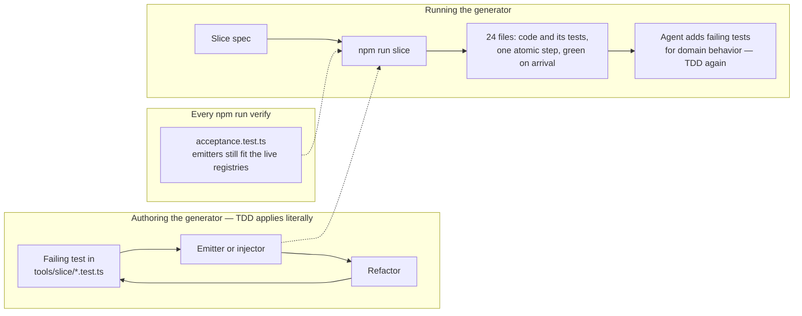

# ADR 0015 — A generated slice satisfies TDD at the generator, not at the slice

- Status: accepted
- Date: 2026-09-18
- Scope: tools/slice, .claude/skills/add-a-feature, .claude/skills/add-an-api-slice, .claude/skills/add-a-screen, .claude/skills/add-a-form

## Context

`npm run slice -- --spec <file>` writes a whole vertical feature from a small JSON spec: ten .NET source files, two .NET test files, six Angular source files, five Angular spec files, one native store, and nine registry edits. It runs in two phases because codegen sits between them — the frontend consumes DTOs the API has not emitted until the .NET half compiles.

Every one of those files arrives written. The tests arrive written too, and they arrive passing.

CLAUDE.md lists TDD as a non-negotiable gate, in these words: "no production line exists before a failing test that demands it." Read literally against the generator's output, twenty-four files appeared at once and not one of them was preceded by a red test. The generator is either a violation of a gate the repo says has no exceptions, or the gate means something the literal reading misses. This ADR says which, because an unstated answer becomes a per-agent judgment call, and half the agents will guess that the right thing to do is delete the generated tests and rewrite them by hand.

This is the same shape as ADR 0010's argument about YAGNI and `frontend/libs/ui`, and the resolution is the same in structure. A gate is a rule with a purpose. When the literal rule and its purpose come apart, the purpose governs, and the boundary where the exemption stops has to be written down in the same breath — otherwise the exemption is a dial anyone can turn.

## Decision

**TDD is satisfied at the generator. A generated slice arrives green, and its tests are not rewritten.**

Concretely:

- Every emitter and injector in `tools/slice/` was built red-green-refactor, and each has a paired `*.test.ts` that drives it against fixtures.
- `tools/slice/acceptance.test.ts` runs on every `npm run verify`: it parses every emitted TypeScript file, asserts every injector still changes the live registries and is idempotent against them, and asserts no emitted path collides with an existing one. A registry whose shape moves fails the gate the same day it moves, not at the next generated slice.
- The generated tests are emitted in the same atomic step as the code they cover. There is no window in which the production line exists without them.
- An agent extends the generated tests for behavior the spec could not express. It does not delete them and start over, and it does not treat their existence as evidence the behavior is covered — CRUD is covered; a domain rule is not.

TDD is not suspended for anything an agent writes by hand, which is every line beyond the generated CRUD. The exemption covers the generator's output and nothing else.

## Why the purpose is met

The gate exists so that no untested production line ships, and so that the test is written by someone reasoning about behavior rather than reverse-engineered from an implementation that already exists. Both hold here, one step up the stack.

The generated `OrderService` is not untested code — it is code whose tests were written first, by a person, against a failing `emit-dotnet-tests.test.ts`, and then emitted together with it forever after. The reasoning that a test is supposed to capture happened once, in `tools/slice/`, instead of being re-performed identically for every slice in every app cloned from this template. That is the same trade ADR 0013 made for control kinds: the thinking goes into the registry once rather than into a branch per kind.

The failure mode TDD guards against is a test written to match whatever the code turned out to do. The generator makes that specific failure impossible for CRUD, because the emitted test and the emitted code are both fixed text — neither can be bent to fit the other after the fact. What TDD-by-hand would add at the slice level is ceremony: an agent writing a failing test for `ListOrders`, watching it fail, then writing the `ListOrders` it already knows because nine other slices have the same one.

## Alternative considered and rejected: emit skeletons for the agent to fill

The obvious way to keep the literal rule is to emit signatures with empty bodies — `throw new NotImplementedException()` — plus the failing tests, and let the agent write each body. TDD then holds at the slice, unmodified.

Rejected on two grounds.

It costs the agent input tokens to read a skeleton whose content the generator already knew. The generator has the spec; the body of `ListOrders` is fully determined by it. Emitting a hole and then asking a model to read the hole, the test, and the surrounding conventions in order to reproduce the exact text the generator could have written is paying a per-slice inference cost for a per-generator decision. Multiplied across nine files and every slice in every clone, that is the dominant cost of the whole tool.

Worse, it does not reliably converge. A skeleton is scaffolding, and scaffolding survives. A `NotImplementedException` left in a branch nobody exercised, a `TODO` in a validator, a method body the agent filled plausibly but differently from the other eight slices — each is a small divergence, and the whole point of a jig is that every part off it comes out identical. A fixture that produces parts needing hand-finishing is not a fixture.

## The risk this does not solve

**The emitters encode the `users` shape as of the day they were written, and nothing detects the exemplar drifting away from them.**

`acceptance.test.ts` catches a registry whose *shape* moved — a renamed const, a restructured object literal, a splice point that no longer exists. It is blind to *style*. Add a lint rule, update `users` to satisfy it, and leave `tools/slice/` alone: the acceptance test stays green, because every anchor still resolves, and the generator quietly starts emitting slices that fail the new rule.

This is not hypothetical. It had already happened before this ADR was written, in the more embarrassing direction. `frontend/src/app/features/users/user-form.ts` hand-wired a field block per field on signal-forms while `add-a-form/SKILL.md` and the generator both said to render through `SchemaForm`; `docs/architecture/forms.md` had been written to endorse the exemplar and contradicted the skill. Three sources, two stories, and a full green gate throughout. Nothing in the repository was capable of noticing, and it was found by a human reading the two files side by side.

The honest mitigations available today are weak. Re-run the generator against the live tree and re-run the full gate whenever the frontend ruleset changes — which depends on someone remembering. Keep the exemplar and the emitters in the same commit when either moves — which depends on the same.

**What would actually close it is `slice --check`:** regenerate the `users` slice from `examples/slices/users.slice.json` into a scratch tree and diff it against the committed `frontend/src/app/features/users` and its .NET counterparts, failing the gate on any difference. That turns the exemplar into the generator's golden output, so the two cannot disagree without something going red. It would also force a real decision about the differences that are legitimate — the submit label on the users form is domain copy the spec does not carry today — which is a feature of the proposal, not an objection to it. It is not built, and until it is, this ADR's risk section is the record that it is missing.

## Consequences

- The four skills that used to spell out a layer's file sequence route to the generator first and keep only what it cannot do: the discover-first checklist, the TDD ordering for behavior beyond CRUD, the codegen handoff, the layer rules, and the review gates. They got shorter, which was the test of whether the generator was really carrying the shape.
- A generated test that fails is a generator bug. Fix `tools/slice/` and regenerate; do not edit the generated file, or the next slice reintroduces it.
- `npm run slice` refreshes the capability catalog before it returns, because every layer it emits is annotated and catalog freshness is the first step of the gate. "Arrives green" is a claim about `npm run verify`, so anything the generator leaves stale makes the claim false.
- The generator is not exempt from review. It is the highest-leverage code in the repository: a defect in an emitter ships to every slice in every clone, which is the reason its own tests are held to the literal rule.
