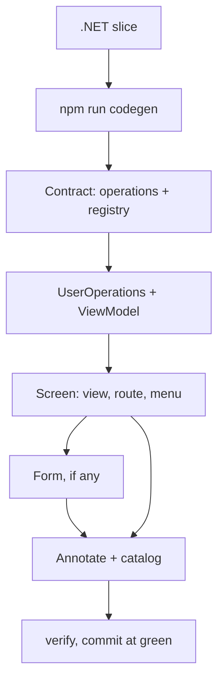

# Add a feature

This skill owns the build order for a whole vertical slice, backend data through to the screen that shows it, and hands each layer to its own spoke skill so this file never repeats their content. The order below is not the one you would reach for by reading top to bottom, because a response type only exists once the API is built and codegen has run against it.

## Where you are

This skill covers the whole slice, front to back; if you only need one layer, skip straight to that spoke instead of working through every step below — `.claude/skills/add-an-api-slice/SKILL.md`, `.claude/skills/add-a-screen/SKILL.md`, `.claude/skills/add-a-form/SKILL.md`, or `.claude/skills/add-a-view-model/SKILL.md`.

## Discover first

The CLAUDE.md prime directive, restated for a feature slice:

1. Read `.bob/registry/CATALOG.md` for the area you are about to touch.
2. LSP-search the concept via workspace-symbol before reaching for grep.
3. Reuse or extend what already exists; a second implementer of the same capability is a defect, not a shortcut.
4. If you still create something that overlaps, record why in an ADR under `.bob/adr/`.

The smell test for each of these is in `CONTRIBUTING.md`.

## The order

Discover (above) is the prerequisite, not a build step, so numbering here starts at 1. Each item states its own step number as text rather than relying on list auto-numbering, so every step keeps the same number whatever the list around it looks like. A gap in the sequence is deliberate; nothing is missing from it.

<!-- thick:start -->
The gap is step 4, which the thin cut removes outright. An ordered list renumbers sequentially from whichever item renders first, so it would silently relabel "step 5" as "step 4" for a thin-client reader.

<!-- thick:end -->
- **Step 1:** .NET slice: domain → application + `Result<T>` → infrastructure → endpoint, TDD at each step — owner: `.claude/skills/add-an-api-slice/SKILL.md`
- **Step 2:** `npm run codegen` — DTOs regenerate. **The trap.** Nothing downstream exists without it — owner: hub
- **Step 3:** Contract: `operations.ts` + `registry.ts` `ROUTES` — owner: `.claude/skills/conduit/SKILL.md`

<!-- thick:start -->
- **Step 4:** Rust command matching the registry, TDD (thick only) — owner: `.claude/skills/add-a-tauri-command/SKILL.md`

<!-- thick:end -->
- **Step 5:** Data access: `UserOperations` facade, then a ViewModel exposing signals — owner: `.claude/skills/conduit/SKILL.md`, `.claude/skills/add-a-view-model/SKILL.md`
- **Step 6:** Screen: view + route + menu command contribution — owner: `.claude/skills/add-a-screen/SKILL.md`
- **Step 7:** Form, when the feature has one: zod schema → `z.infer` → `SchemaForm` — owner: `.claude/skills/add-a-form/SKILL.md`
- **Step 8:** Annotate every reusable unit, then `npm run catalog` — owner: hub
- **Step 9:** `npm run verify`, conventional commit, feature branch — owner: hub

<!-- thick:start -->
Step 3 also fills in `registry.ts`'s `COMMANDS` map, one entry per operation, so the IPC wire has a command to call.

<!-- thick:end -->

<!-- thick:start -->
Thick clients insert step 4 between the contract and data access: a Rust command matching the registry, owned by `.claude/skills/add-a-tauri-command/SKILL.md`, TDD at each step.

<!-- thick:end -->
The trap is step 2. Response types resolve to generated DTOs, so the API shapes exist first, `npm run codegen` runs second, and the contract is written third. Writing the contract first, the order the file names invite, produces a hand-typed interface that compiles and quietly drifts from the API it claims to describe.

## What the hooks will say

- `guard-ruleset` can deny a Write, Edit or Bash outright. It guards `ArchLayers.txt`, `tools/hooks/guard-ruleset.ts` and `services/api/src/Directory.Build.props`. A denial means fix the flagged code, never the rule.
- `check-frontend` returns lint violations with the rule's doc path attached, unasked, after every frontend write. Fix the code. `eslint-disable` does nothing — `noInlineConfig` is on — and stylelint runs with `--ignore-disables`.
- `angular-service-guide` nudges when a new `*.operations.ts`, `*.service.ts`, `*.transport.ts` or anything under capabilities/ is written. It means run the discover checklist before building on it.

## Before you commit

Annotate every new reusable unit with `@capability`, `@intent`, `@reuse` (the shape is in `CONTRIBUTING.md`), run `npm run catalog`, run `npm run verify`, then commit with a conventional message on a feature branch.
