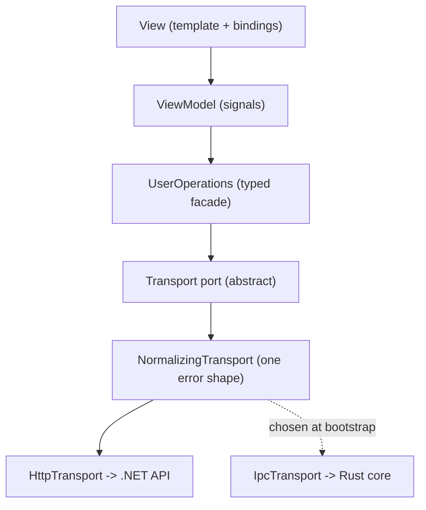

# Conduit: the contract seam

## Where you are

This skill owns the contract and the data-access facade in `.claude/skills/add-a-feature/SKILL.md`. The .NET endpoint whose shapes the contract names belongs to `.claude/skills/add-an-api-slice/SKILL.md`, and the ViewModel that injects the facade belongs to `.claude/skills/add-a-view-model/SKILL.md`. `docs/architecture/conduit.md` is the one-page reference for the same seam; this file is the reasoning behind it.

## What the seam is

Everything above the seam speaks logical operations — `users.list`, `users.get`, `users.save` — and nothing else. No URL, no HTTP verb, no request body shape exists above it. Three files carry the whole thing:

- `frontend/src/app/contracts/operations.ts` — the registry: every operation name with its request and response type.
- `frontend/src/app/contracts/registry.ts` — the descriptors: how each operation turns into a real request.
- `frontend/src/app/transport/transport.port.ts` — the port: an abstract class that doubles as its own Angular DI token, so callers inject `Transport` and get an `Observable` back.

The port is the only object in the frontend that knows how a call actually travels. View, ViewModel, and the operations facade never find out. That is the whole win, and every rule below exists to protect it.

<!-- thick:start -->
It is also what lets one Angular codebase run over two wires. The desktop shell reaches a local Rust core through `invoke` (IPC) and the browser build reaches the .NET API over HTTP, so the port hides not one wire but a choice between two. Left alone that difference smears everywhere: facades learn URLs, ViewModels branch on `isTauri()`, error handling forks in two.

<!-- thick:end -->


## The trap: the response type is not yours to write

Every `res` in the registry resolves to a generated DTO under `frontend/src/app/contracts/generated/`, emitted from the API's OpenAPI document by `npm run codegen`. The endpoint therefore has to exist before the contract can be written, which is the opposite of the order the file names invite. Write the contract first and you get a hand-typed interface that compiles, matches nothing, and drifts from the API it claims to describe with no test able to notice.

If the DTO you want is missing, the endpoint is not built or `npm run codegen` has not run. That is never a reason to write the type by hand. `.claude/skills/add-a-feature/SKILL.md` owns the full order; this is the half of it that bites here.

## Adding an operation

Each item depends on the one above it.

- **Register it.** Add the key to `Operations` in `frontend/src/app/contracts/operations.ts` with its `req` and its `res`. The `res` is an alias of a generated DTO. A request with no fields is typed `Record<string, never>`, not an empty object literal type.
- **Route it.** Add the entry to `ROUTES` in `frontend/src/app/contracts/registry.ts`: the method, a `path` function typed to that operation's request, and `hasBody`. `ROUTES` is a mapped type over `OperationName`, so a forgotten operation is a compile error rather than a 404 in the wild.
<!-- thick:start -->
- **Name the command.** Add the entry to `COMMANDS` in the same file — the Tauri command name the IPC wire invokes. Same mapped type, same compile error when it is missing. The Rust side that answers it belongs to `.claude/skills/add-a-tauri-command/SKILL.md`, and the mapping in depth is in `references/rust-command-side.md`.
<!-- thick:end -->
- **Expose it.** Add one method to the feature's operations facade, below.

No transport is edited to add an operation. If you find yourself opening one, the operation is being added in the wrong place.

## The operations facade

`frontend/src/app/operations/user.operations.ts` is the shape to copy for every feature:

```ts
@Injectable({ providedIn: 'root' })
export class UserOperations {
  private readonly transport = inject(Transport);

  list(): Observable<UserDto[]> {
    return this.transport.request('users.list', {});
  }

  get(id: string): Observable<UserDto> {
    return this.transport.request('users.get', { id });
  }

  save(user: SaveUserInput): Observable<UserDto> {
    return this.transport.request('users.save', user);
  }
}
```

Root-provided, one injected dependency — the `Transport` port — and one method per operation that names the operation and passes the payload through. No caching, no mapping, no branching, no state. A method that has grown a body is a use-case sitting in the wrong layer: move it to the ViewModel if it is presentation, or into the .NET application layer if it is domain.

It is named for what it does, and it is not a repository. It persists nothing and holds no collection — there is no store behind it for it to be the gateway to. The repository pattern does exist in this codebase, at `services/api/src/Jig.Application/IUserRepository.cs`, where there is an actual database on the other side. There is no repositories/ directory under `frontend/src/app`, and the urge to create one is the first symptom of this seam being misread.

ViewModels inject the facade and expose signals; the View binds to the ViewModel and sees none of this. That half belongs to `.claude/skills/add-a-view-model/SKILL.md`.

## Cross-cutting behavior lives at the seam

`frontend/src/app/transport/normalizing.transport.ts` decorates the transport and folds every failure into one `AppError`. `HttpClient` throws `HttpErrorResponse` carrying a status code, a ProblemDetails body, or a bare network failure, and no ViewModel above should ever see those shapes.

<!-- thick:start -->
The second wire turns this from tidy into non-negotiable. A rejected `invoke` throws whatever string or serialized value the Rust command returned, with no interceptor path at all, so the two wires fail in shapes that have nothing in common. Let them leak and every ViewModel grows two error branches, at which point the abstraction is already broken.

<!-- thick:end -->
Uniform retry and logging belong here too, for the same reason: one place, one behavior.

Auth is the other cross-cutting concern, and it belongs to the transport. Attach the bearer token in an `HttpInterceptor` or inside `frontend/src/app/transport/http.transport.ts` — never in a facade or a ViewModel. Token logic above the seam puts wire knowledge back into domain code, which is the exact coupling the port removed.

## Bootstrap

`frontend/src/app/transport/provide-transport.ts` is the only place a concrete transport is constructed; everything else injects the `Transport` port. It takes the API base URL from the app config and wraps the transport in the normalizer, so error shaping has exactly one home.

<!-- thick:start -->
It is also the only place allowed to ask `isTauri()`. Let Angular construct both concrete transports so their own injected dependencies wire up, choose between them with `isTauri()` from `@tauri-apps/api/core` rather than sniffing `window`, then wrap the choice:

```ts
export function provideTransport(apiBaseUrl: string): EnvironmentProviders {
  return makeEnvironmentProviders([
    HttpTransport,
    IpcTransport,
    { provide: API_BASE_URL, useValue: apiBaseUrl },
    { provide: WIRE, useValue: isTauri() ? 'ipc' : 'http' },
    {
      provide: Transport,
      useFactory: () => new NormalizingTransport(isTauri() ? inject(IpcTransport) : inject(HttpTransport)),
    },
  ]);
}
```

## Where the two wires disagree

The skeleton is clean, but three real differences between the wires leak if they are ignored. Handle each at the seam, never above it.

- **Errors.** Covered above. The rule: no `HttpErrorResponse` and no raw `invoke` rejection may reach a facade or a ViewModel. If either type is caught above the normalizer, the abstraction has failed.
- **Auth.** Over IPC there is usually no token to attach — the Rust core holds the real credential and the local origin is already trusted. The port hides that difference, which is correct, and it stays correct only while token logic lives inside the HTTP transport.
- **Native-only capabilities.** The desktop shell grows operations the browser build has no equivalent for: tray control, file watching, reading local config. Do not force these into the shared `Operations` map with a stub that throws on HTTP, because that converts a compile-time guarantee into a runtime surprise. Keep the registry for genuinely symmetric domain calls and put native-only work behind a capability service that is simply not provided in the web bootstrap. ViewModels that need it inject it; the rest never see it.

<!-- thick:end -->
## Smells that mean the seam is breaking

- A URL or an HTTP verb appearing anywhere above `frontend/src/app/transport/`.
- A `catch` above the normalizer that inspects `.status`.
- A method on an operations facade with a body — a `map`, a cache, a conditional.
- A hand-written interface standing in for a response shape instead of a generated DTO.
- An operation added to `Operations` and kept out of `ROUTES` by a cast rather than fixed.
<!-- thick:start -->
- `isTauri()` or any `window` check anywhere above `frontend/src/app/transport/provide-transport.ts`.
- A Tauri command name appearing in a facade or a ViewModel.
- A `catch` above the normalizer that inspects a Rust error string.
- An operation in the shared registry that one wire implements as a throw. That belongs in a capability service instead.
<!-- thick:end -->

## Checklist before calling it done

- Every `OperationName` resolves its `res` to a generated DTO, not a hand-written shape.
- Every `OperationName` has a `ROUTES` entry, and the compiler said so rather than a comment.
- The facade has one no-logic method per operation and injects nothing but `Transport`.
- No `HttpClient` error shape escapes `frontend/src/app/transport/normalizing.transport.ts`.
- Auth is attached inside the transport, never above the seam.
<!-- thick:start -->
- Every `OperationName` has a `COMMANDS` entry too.
- No raw `invoke` rejection escapes the normalizer.
- No shared operation is a stub on either wire; native-only work lives in a capability service absent from the web bootstrap.
- View, ViewModel and facade compile and run unchanged whichever transport is provided.
<!-- thick:end -->
