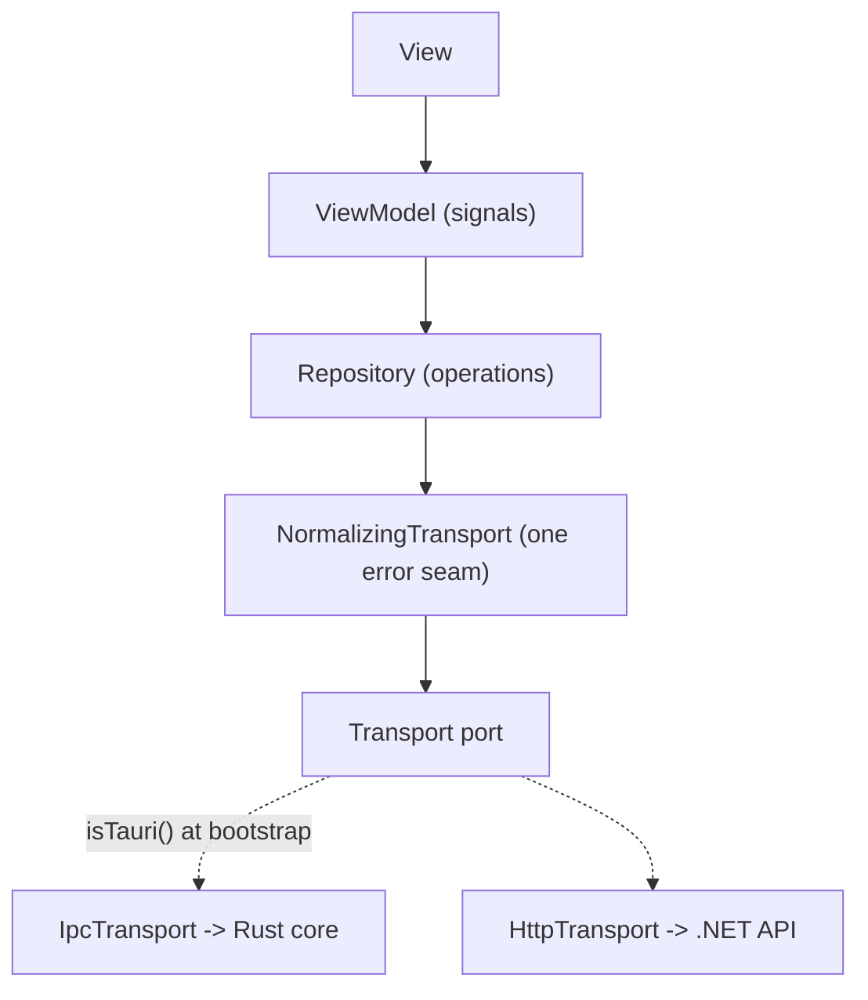

[](https://github.com/satish-krishna/jig/actions/workflows/verify.yml)
[](https://github.com/satish-krishna/kata/jig)

# Jig

A jig is the fixture a maker builds once so every part after it comes out identical and correct without rework. That is this repository's whole job: build the fixture once, and every app cloned from it comes out following the same patterns, gates, and conventions.

Jig is an AI-native desktop template. One Angular SPA runs two ways: as a **thick client** inside a Tauri shell (Rust core, IPC) and as a **thin client** against a remote **.NET FastEndpoints** API (HTTP). One frontend, two wires. It is optimized for agent-driven development: every future agent that opens this repo can discover what exists and extend it rather than reinventing it.

This is a template, not a product. It ships one worked vertical slice, `users`, that exercises every layer end to end. Copy its shape; do not add speculative features.

<!-- template:start -->
## Using this template (start a new app)

"Jig" is threaded through every layer by design — the .NET solution and namespaces, the Rust crate and Tauri bundle id, the npm and Angular project names. So the first thing you do is rename it to your app.

1. **Get your own copy.** On GitHub, click **Use this template** (gives you a repo with fresh history), or `git clone` this one.
2. **Install the toolchain:** `npm run setup`.
3. **Rename to your app** (PascalCase name):

   ```
   node tools/init/init.ts AcmePortal
   node tools/init/init.ts AcmePortal --bundle-id=io.acme.desktop
   ```

   This rewrites every `Jig`/`jig` identifier in the right form (`AcmePortal` for .NET, `acme-portal` for npm/Angular, `acme_portal` for the Rust lib, `com.acmeportal.app` for the bundle), strips the template-only files (this section, the bootstrap prompt, the design specs, and the init tooling), re-inits git with clean history, regenerates the catalog, runs `npm run verify`, and commits. When it finishes, `AcmePortal` is a fresh app with no trace of Jig.

Everything below this line is the app's own documentation and survives the rename.
<!-- template:end -->

<!-- template:start -->
## Web-only: Angular + .NET without the desktop shell

If you only want the web pairing — the Angular SPA against the .NET API over HTTP — you do not touch the application code. The transport already decides the wire at bootstrap: `provideTransport()` calls `isTauri()`, which is `false` in a browser, so a web build runs HTTP-only on its own. Point `API_BASE_URL` in `frontend/src/app/app.config.ts` at your API and the running app is done. There is no registration to flip.

What actually assumes Rust is the **toolchain**, and it fails hard without it: `npm run setup` lists `rustc`, `cargo`, `tauri-cli`, and `rust-analyzer` as required, `npm run verify` runs `cargo test`, and CI installs the Rust toolchain. Do this rip-out **before** `node tools/init/init.ts`, because init ends by running `npm run verify` — leave the Rust step in and init will demand a toolchain you are removing.

1. **Delete the desktop shell:** remove `apps/desktop/`.
2. **`tools/setup/setup.ts`** — drop the `rustc`, `cargo`, `tauri-cli`, and `rust-analyzer (LSP)` entries from the toolchain-check list, and the `cargo fetch` step.
3. **`tools/verify/verify.ts`** — remove the `['rust tests', 'cargo test', SRC_TAURI]` entry from the `steps` array (and the now-unused `SRC_TAURI` constant).
4. **`.github/workflows/verify.yml`** — remove the `dtolnay/rust-toolchain`, `Swatinem/rust-cache`, and `cargo test` steps.
5. **Prerequisites** — drop the Rust toolchain, Tauri CLI, and `rust-analyzer` from the list below.

The frontend still carries `@tauri-apps/api` (used by `provideTransport` and `IpcTransport`). Leaving it is harmless — `isTauri()` is a cheap runtime check and the IPC branch is never taken in a browser. Removing it is the one part that is a code change rather than configuration: drop the dependency from `frontend/package.json`, delete `frontend/src/app/transport/ipc.transport.ts`, and simplify `provide-transport.ts` to register `HttpTransport` unconditionally. Everything else — the architecture analyzer, the forms, the contracts registry, the `users` slice — is wire-agnostic and unaffected.
<!-- template:end -->

## One-command setup

From a fresh clone:

```
npm run setup
```

That verifies the toolchain and language servers, wires the git hooks, installs dependencies (root, frontend, Playwright browser), restores .NET and Rust, and generates the capability catalog. Then confirm everything is green:

```
npm run verify
```

`verify` runs the full build and every test suite across all three languages plus the catalog freshness check. Green here is the definition of the fixture holding.

### Prerequisites

The setup script checks for and fails early without: Node `^22.22.3 || ^24.15.0 || >=26.0.0` (the range the Angular toolchain requires), the .NET 10 SDK, the Rust toolchain, the Tauri CLI, and three language servers (`rust-analyzer`, a TypeScript server, and `csharp-ls`).

## How it fits together



- **Contracts** (`frontend/src/app/contracts`): one typed operation registry is the single source of truth for every request and response shape. Response types are the OpenAPI-generated DTOs, so HTTP and IPC cannot disagree.
- **Transport** (`frontend/src/app/transport`): the only place that knows two wires exist. The wire is chosen once, at bootstrap, by `isTauri()`. Errors from either wire fold into one `AppError` at a single seam.
- **Backend** (`services/api`): .NET FastEndpoints with a Result envelope, FluentValidation, and EF Core, in clean-architecture layers (Api, Application, Domain, Infrastructure).
- **Rust core** (`apps/desktop/src-tauri`): thin Tauri commands over a store that mirrors the API's use-cases, so both wires behave the same.
- **Forms** (`frontend/src/app/forms`): one zod schema per form owns shape, validation, and field metadata; a single renderer turns it into controls.

## Working here

- **`CLAUDE.md`** is the agent constitution: read it first. It carries the discovery gate, the non-negotiables, and a routing table to the deeper docs.
- **`CONTRIBUTING.md`** is the working manual: coding standards, TDD per language, commit conventions, and the gate commands.
- **`docs/architecture/`** holds the task-scoped deep rules (the transport seam, the schema-driven forms).
- **`.bob/registry/CATALOG.md`** is the generated index of every reusable capability. Never hand-edit it; annotate the code and run `npm run catalog`.

## Adding a feature

Follow `.bob/prompts/new-feature.md` and copy the `users` slice end to end. Discover first, annotate what you build, regenerate the catalog, and commit at a green gate with a Conventional Commits message.

## Commands

| Command | What it does |
|---|---|
| `npm run setup` | One-command environment bootstrap for a fresh clone |
| `npm run verify` | Full build, all tests, catalog freshness (the gate) |
| `npm run catalog` | Regenerate the capability catalog |
| `npm run codegen` | Emit OpenAPI from the API and generate the TypeScript DTOs |
| `npm --prefix frontend run e2e` | Playwright smoke over the users slice |
