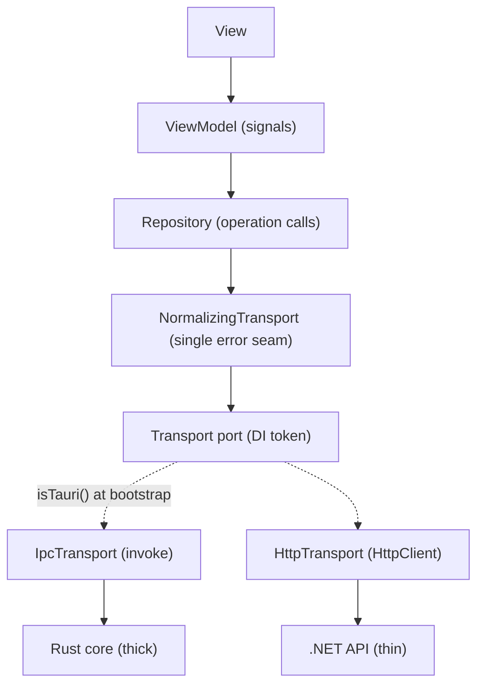

# The Conduit pattern (the transport seam)

Read this before you touch anything in `frontend/src/app/transport/`, add an operation to the registry, or write a repository.

One Angular frontend runs unchanged over two wires: Tauri IPC (invoke) as a thick client, and HTTP to the .NET API as a thin client. The transport seam is the only place in the frontend that knows two worlds exist. View, ViewModel, repository, and domain stay identical regardless of wire.

## Rules that keep it honest

- The **operation registry** in `contracts/` is the single source of truth for every request and response shape. Both transports key off it, so TypeScript forces parity and the contract cannot drift. Every operation appears in both `ROUTES` (HTTP) and `COMMANDS` (IPC); the compiler enforces that.
- Response types resolve to the **OpenAPI-generated DTOs**, so HTTP and IPC cannot disagree about a shape.
- **One error seam.** No `HttpErrorResponse` and no raw `invoke` rejection may reach a repository or ViewModel. `NormalizingTransport` folds both into one `AppError`.

## The three legitimate asymmetries

Everything else is identical across wires. These three are the only sanctioned differences:

1. **Transport selection** happens once, at the bootstrap factory, via `isTauri`. Nowhere above it.
2. **Auth is HTTP-only** (an interceptor). IPC trusts the local origin; the Rust core holds the real credentials.
3. **Native-only capabilities** (tray, file watch, local config) are thick-only. They live behind a capability service that is simply not provided in the web bootstrap. They never enter the shared operation map as "throws on HTTP" stubs.

## Smells that mean it is breaking

- `isTauri()` or `window` checks above the bootstrap factory.
- A URL string or a command name inside a repository.
- A `catch` that inspects `.status`.
- A shared operation implemented as a throw on one wire.

The port is a DI seam: an app that genuinely needs per-operation routing (some operations over HTTP, others over IPC in one build) can supply a composite transport that dispatches per operation, at the cost of the parity guarantee above; record that departure as an ADR.

If you need cross-transport reasoning beyond this file, the `conduit` skill covers the full design rationale.
