# Showcase mini storybook

GENERATED by `tools/showcase-shots/showcase-shots.ts` — do not edit. Run `npm run showcase:shots` to regenerate.

`frontend/libs/ui` is deleted and regenerated wholesale by `npm run ui:style`, so a
hand-written version of this document would be silently false the first time anyone
switches the spartan style. The descriptions below are scraped from each page's own
heading and usage notes, not authored a second time here.

Overlay-based components (dialog, sheet, drawer, popover, tooltip, dropdown-menu, context-menu, alert-dialog, hover-card, command, combobox) render their content in a
portal that does not exist in the DOM until triggered. Their screenshots below show the
trigger only, never the opened state.

## Contents

### Actions

- [Button](#button)
- [Button group](#button-group)
- [Toggle](#toggle)
- [Toggle group](#toggle-group)

### Forms

- [Field](#field)
- [Label](#label)
- [Input](#input)
- [Textarea](#textarea)
- [Native select](#native-select)
- [Select](#select)
- [Combobox](#combobox)
- [Autocomplete](#autocomplete)
- [Checkbox](#checkbox)
- [Radio group](#radio-group)
- [Switch](#switch)
- [Slider](#slider)
- [Input group](#input-group)
- [Input OTP](#input-otp)
- [Date picker](#date-picker)
- [Calendar](#calendar)

### Menus

- [Dropdown menu](#dropdown-menu)
- [Context menu](#context-menu)
- [Menubar](#menubar)
- [Command](#command)

### Overlays

- [Dialog](#dialog)
- [Alert dialog](#alert-dialog)
- [Sheet](#sheet)
- [Drawer](#drawer)
- [Popover](#popover)
- [Hover card](#hover-card)
- [Tooltip](#tooltip)

### Navigation

- [Tabs](#tabs)
- [Breadcrumb](#breadcrumb)
- [Pagination](#pagination)
- [Navigation menu](#navigation-menu)
- [Sidebar](#sidebar)

### Layout

- [Separator](#separator)
- [Accordion](#accordion)
- [Collapsible](#collapsible)
- [Carousel](#carousel)
- [Resizable](#resizable)
- [Scroll area](#scroll-area)

### Data display

- [Table](#table)
- [Card](#card)
- [Badge](#badge)
- [Avatar](#avatar)
- [Kbd](#kbd)
- [Item](#item)
- [Empty](#empty)
- [Typography](#typography)
- [Aspect ratio](#aspect-ratio)

### Feedback

- [Alert](#alert)
- [Progress](#progress)
- [Skeleton](#skeleton)
- [Spinner](#spinner)
- [Sonner](#sonner)

### Patterns

- [Schema form](#schema-form)
- [Signal form](#signal-form)

## Button — `button`

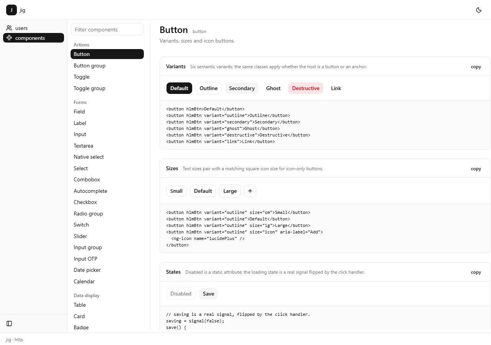

- **Variants** — Six semantic variants; the same classes apply whether the host is a button or an anchor.
- **Sizes** — Text sizes pair with a matching square icon size for icon-only buttons.
- **States** — Disabled is a static attribute; the loading state is a real signal flipped by the click handler.
- **With icons** — The data-icon attribute, inline-start or inline-end, tells the button's own padding utilities which side the icon sits on.

## Button group — `button-group`

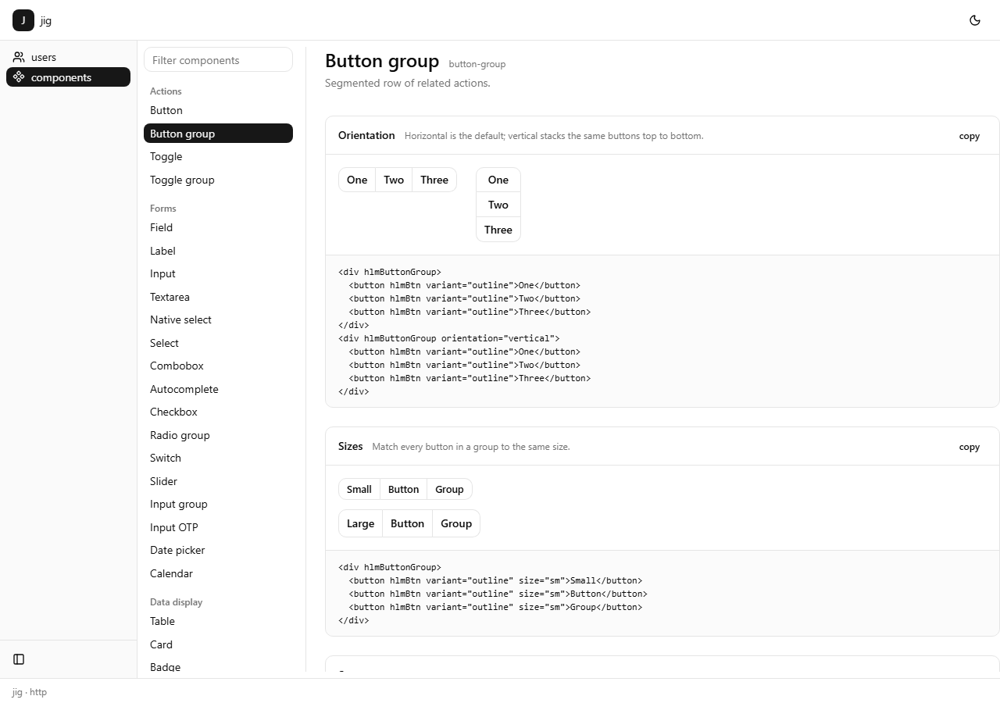

- **Orientation** — Horizontal is the default; vertical stacks the same buttons top to bottom.
- **Sizes** — Match every button in a group to the same size.
- **States** — Locking is real signal state — the Lock button disables every action in the group below it.
- **Composed with text and an input** — hlmButtonGroupText and a plain hlmInput slot into the same row as a button.

## Toggle — `toggle`

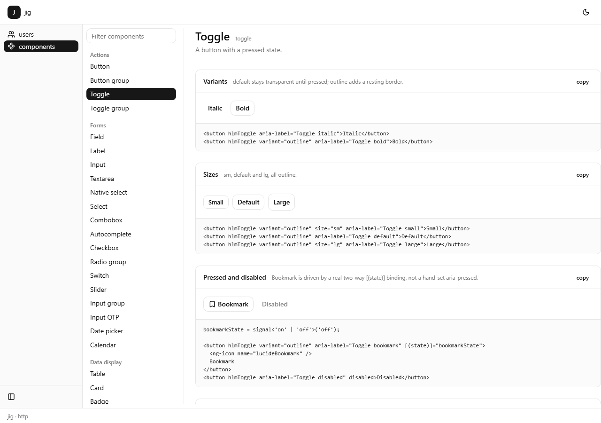

- **Variants** — default stays transparent until pressed; outline adds a resting border.
- **Sizes** — sm, default and lg, all outline.
- **Pressed and disabled** — Bookmark is driven by a real two-way [(state)] binding, not a hand-set aria-pressed.
- **In a field** — Paired with hlmField the same way a checkbox is — the label's for points at the toggle's id.

## Toggle group — `toggle-group`

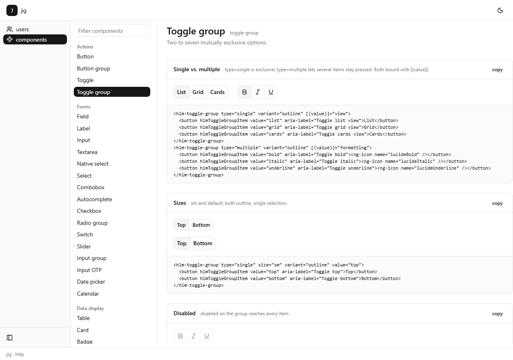

- **Single vs. multiple** — type=single is exclusive; type=multiple lets several items stay pressed. Both bound with [(value)].
- **Sizes** — sm and default, both outline, single selection.
- **Disabled** — disabled on the group reaches every item.
- **In a field** — The description text is read straight off the group's own value signal — no duplicated state.

## Field — `field`

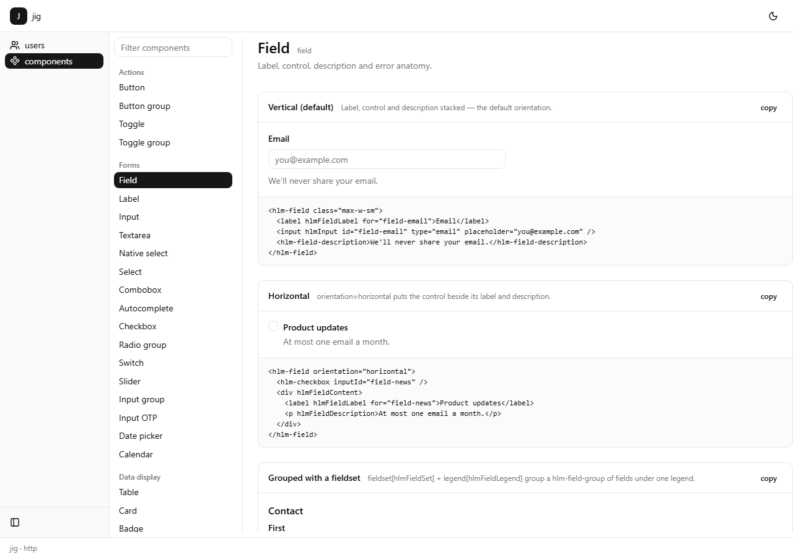

- **Vertical (default)** — Label, control and description stacked — the default orientation.
- **Horizontal** — orientation=horizontal puts the control beside its label and description.
- **Grouped with a fieldset** — fieldset[hlmFieldSet] + legend[hlmFieldLegend] group a hlm-field-group of fields under one legend.
- **Required, with validation** — Driven by a real FormControl — the error clears once a valid email is typed.

## Label — `label`

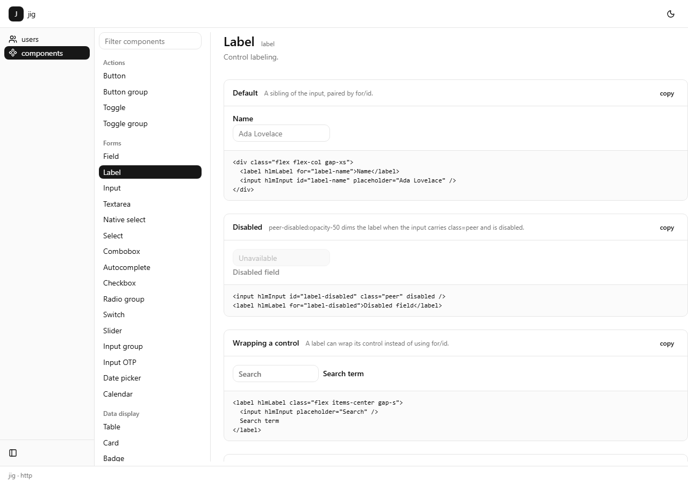

- **Default** — A sibling of the input, paired by for/id.
- **Disabled** — peer-disabled:opacity-50 dims the label when the input carries class=peer and is disabled.
- **Wrapping a control** — A label can wrap its control instead of using for/id.
- **Required, with validation** — Driven by a real FormControl — the error clears once text is entered.

## Input — `input`

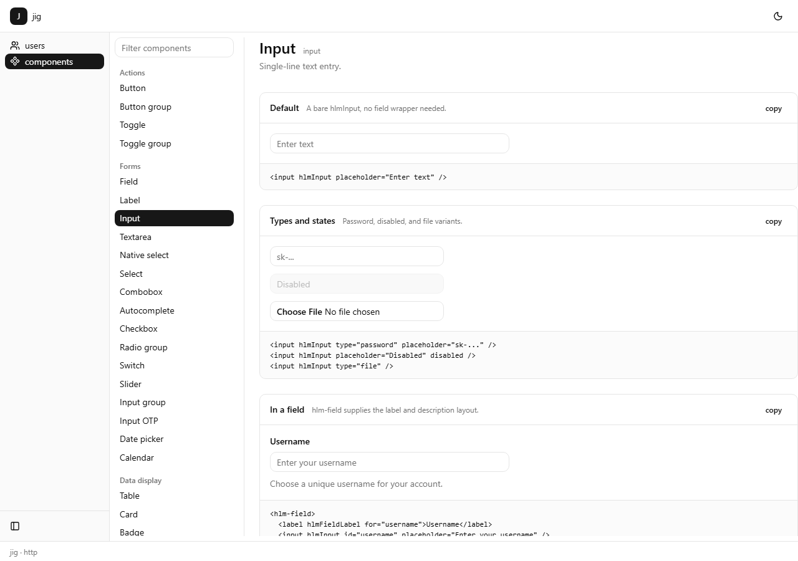

- **Default** — A bare hlmInput, no field wrapper needed.
- **Types and states** — Password, disabled, and file variants.
- **In a field** — hlm-field supplies the label and description layout.
- **Required, with validation** — Driven by a real FormControl — the error clears once a valid email is typed.

## Textarea — `textarea`

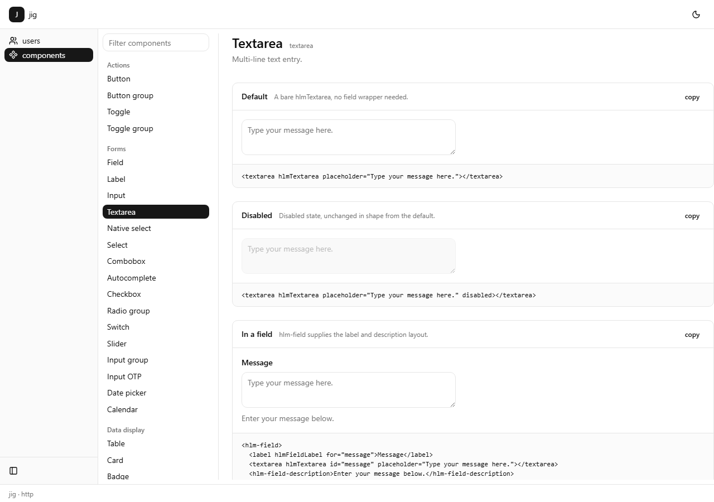

- **Default** — A bare hlmTextarea, no field wrapper needed.
- **Disabled** — Disabled state, unchanged in shape from the default.
- **In a field** — hlm-field supplies the label and description layout.
- **Required, with validation** — Driven by a real FormControl — the error clears once text is entered.

## Native select — `native-select`

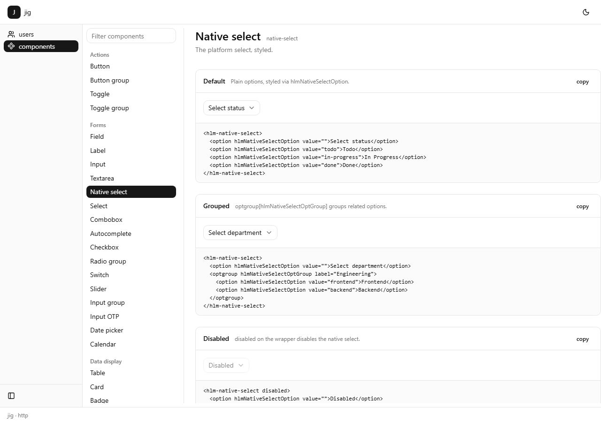

- **Default** — Plain options, styled via hlmNativeSelectOption.
- **Grouped** — optgroup[hlmNativeSelectOptGroup] groups related options.
- **Disabled** — disabled on the wrapper disables the native select.
- **Required, with validation** — Driven by a real FormControl — pick a fruit and the error clears. Note: HlmNativeSelect does not host BrnFieldControlDescribedBy, so unlike input/textarea/select this control's aria-describedby is not auto-wired to the error — a library gap, not a hand-set attribute here.

## Select — `select`

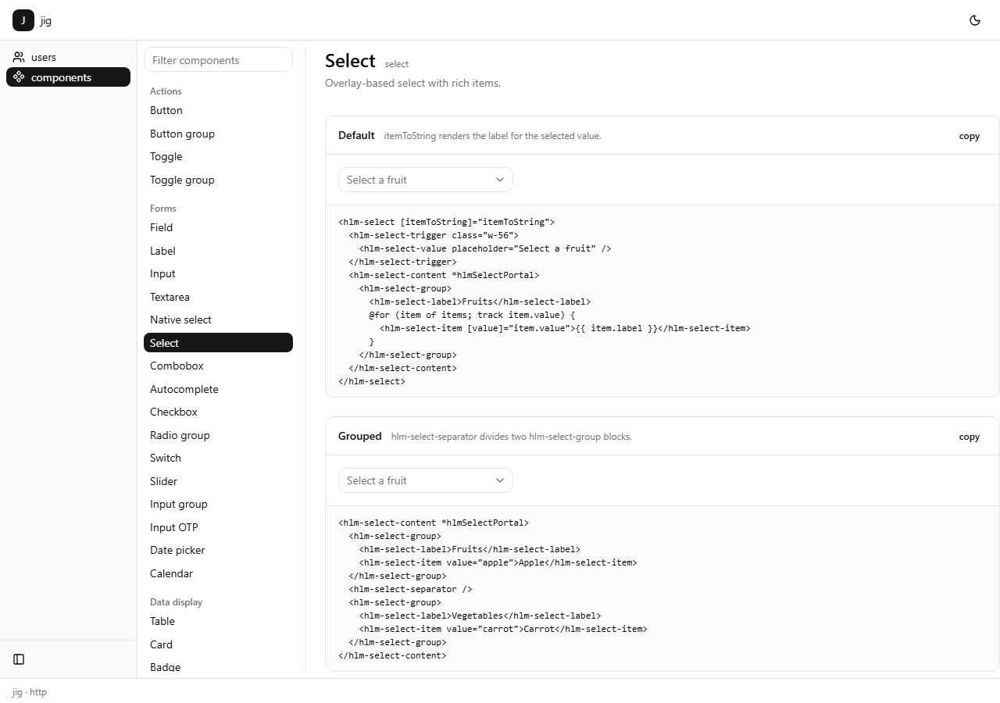

- **Default** — itemToString renders the label for the selected value.
- **Grouped** — hlm-select-separator divides two hlm-select-group blocks.
- **Disabled** — disabled on hlm-select stops the trigger from opening.
- **Required, with validation** — Driven by a real FormControl — pick a fruit and the error clears.

## Combobox — `combobox`

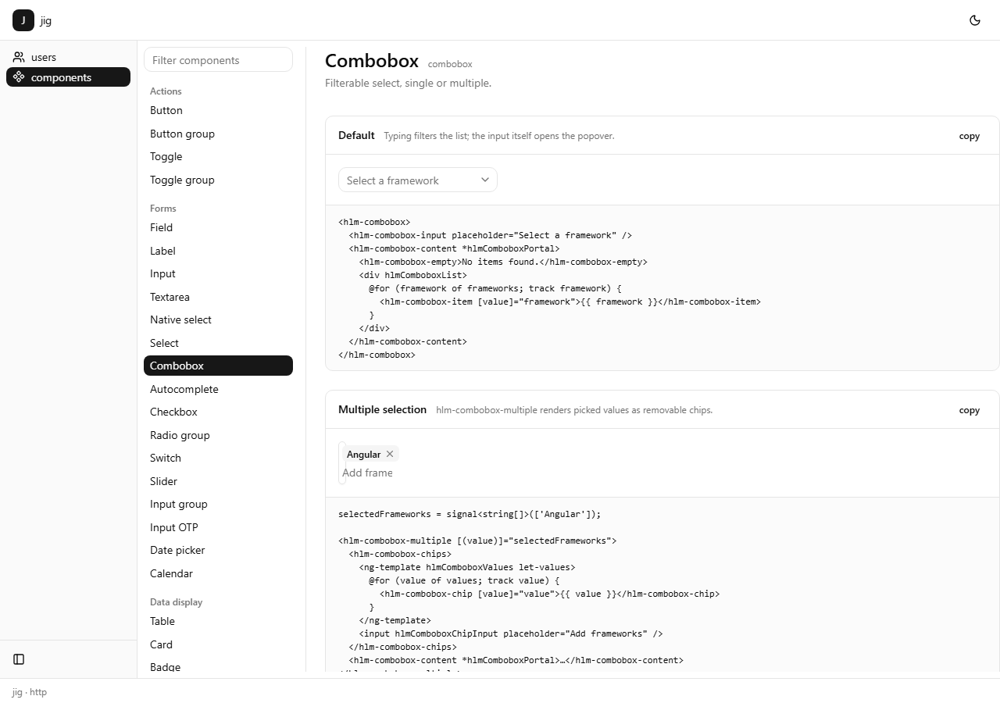

- **Default** — Typing filters the list; the input itself opens the popover.
- **Multiple selection** — hlm-combobox-multiple renders picked values as removable chips.
- **Disabled** — disabled on hlm-combobox stops the input from opening the popover.
- **Required, with validation** — Driven by a real FormControl — pick a framework and the error clears.

## Autocomplete — `autocomplete`

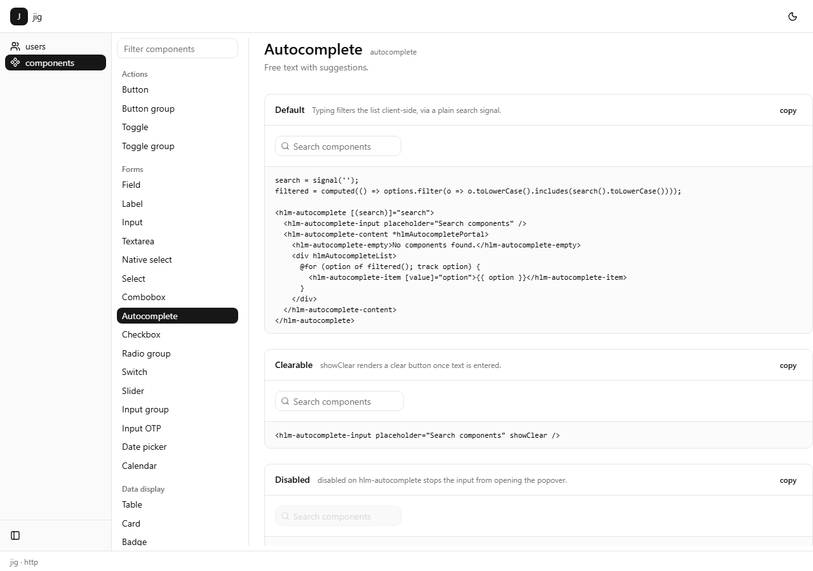

- **Default** — Typing filters the list client-side, via a plain search signal.
- **Clearable** — showClear renders a clear button once text is entered.
- **Disabled** — disabled on hlm-autocomplete stops the input from opening the popover.
- **Required, with validation** — Driven by a real FormControl — pick a component and the error clears.

## Checkbox — `checkbox`

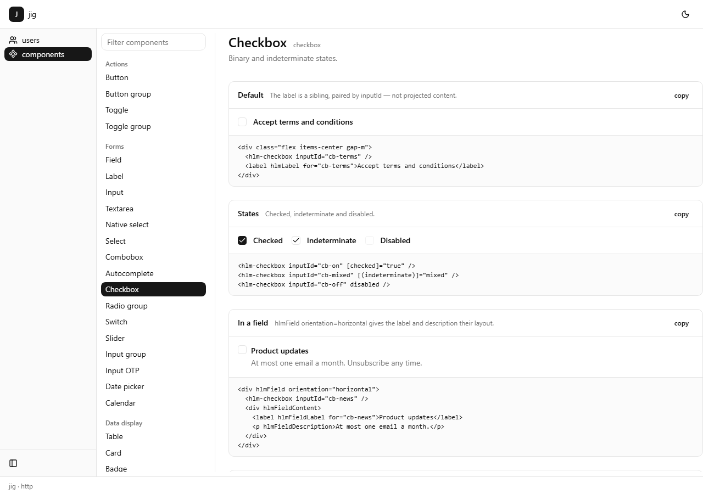

- **Default** — The label is a sibling, paired by inputId — not projected content.
- **States** — Checked, indeterminate and disabled.
- **In a field** — hlmField orientation=horizontal gives the label and description their layout.
- **Required, with validation** — Driven by a real FormControl — tick it and the error clears on its own.

## Radio group — `radio-group`

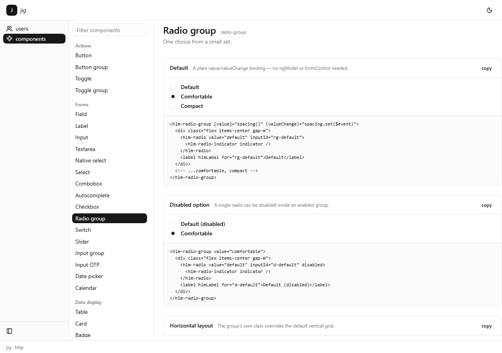

- **Default** — A plain value/valueChange binding — no ngModel or formControl needed.
- **Disabled option** — A single radio can be disabled inside an enabled group.
- **Horizontal layout** — The group's own class overrides the default vertical grid.
- **Required, with validation** — Driven by a real FormControl — pick a plan and the error clears.

## Switch — `switch`

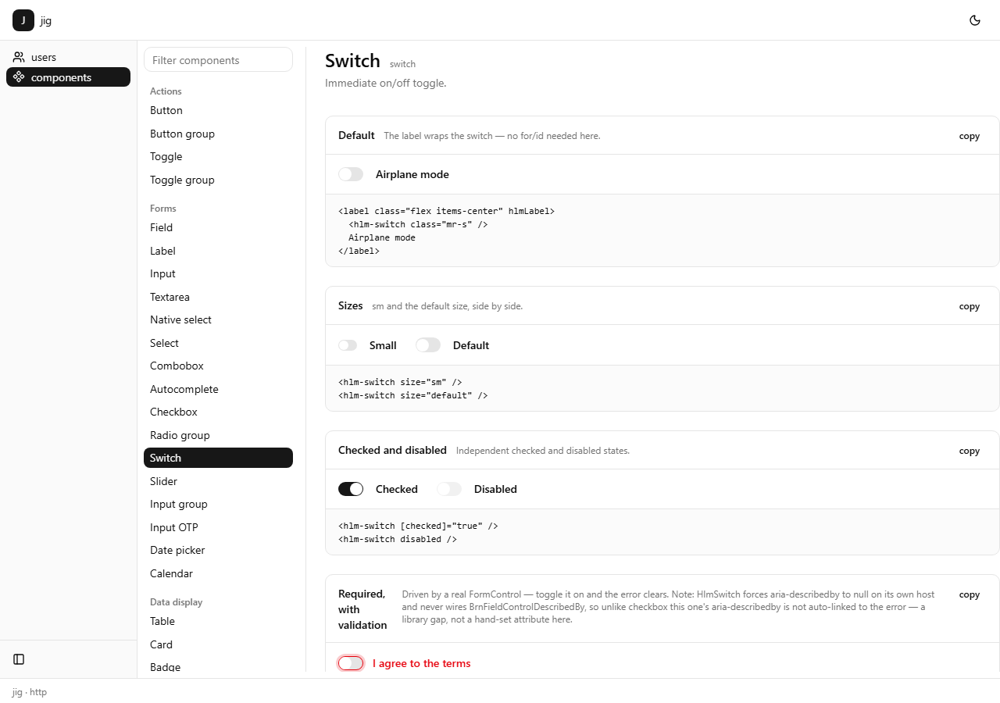

- **Default** — The label wraps the switch — no for/id needed here.
- **Sizes** — sm and the default size, side by side.
- **Checked and disabled** — Independent checked and disabled states.
- **Required, with validation** — Driven by a real FormControl — toggle it on and the error clears. Note: HlmSwitch forces aria-describedby to null on its own host and never wires BrnFieldControlDescribedBy, so unlike checkbox this one's aria-describedby is not auto-linked to the error — a library gap, not a hand-set attribute here.

## Slider — `slider`

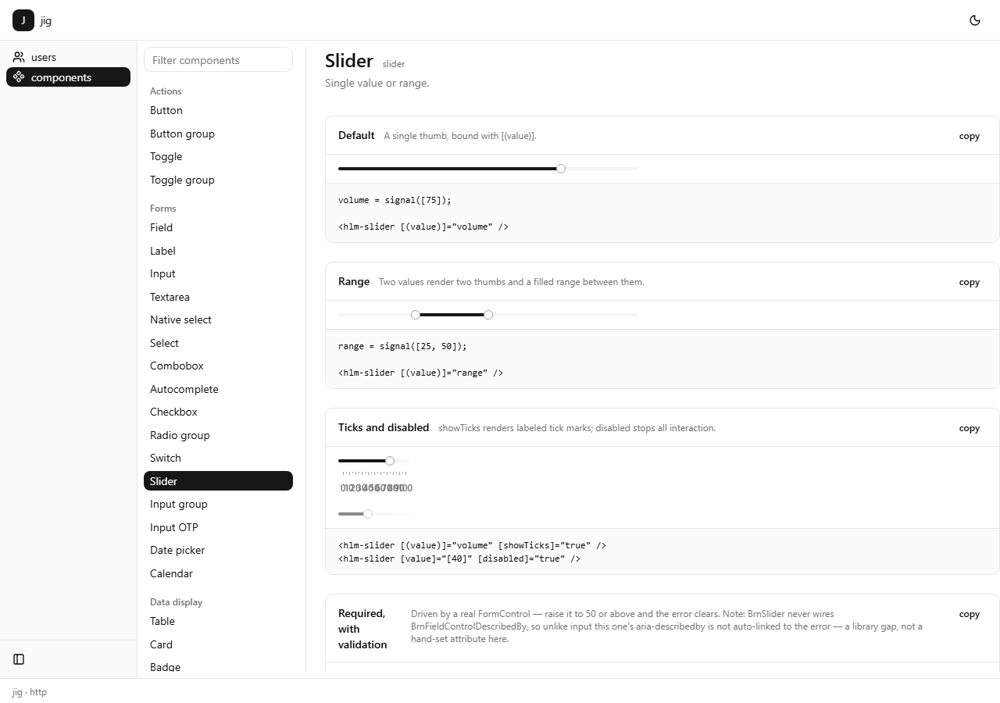

- **Default** — A single thumb, bound with [(value)].
- **Range** — Two values render two thumbs and a filled range between them.
- **Ticks and disabled** — showTicks renders labeled tick marks; disabled stops all interaction.
- **Required, with validation** — Driven by a real FormControl — raise it to 50 or above and the error clears. Note: BrnSlider never wires BrnFieldControlDescribedBy, so unlike input this one's aria-describedby is not auto-linked to the error — a library gap, not a hand-set attribute here.

## Input group — `input-group`

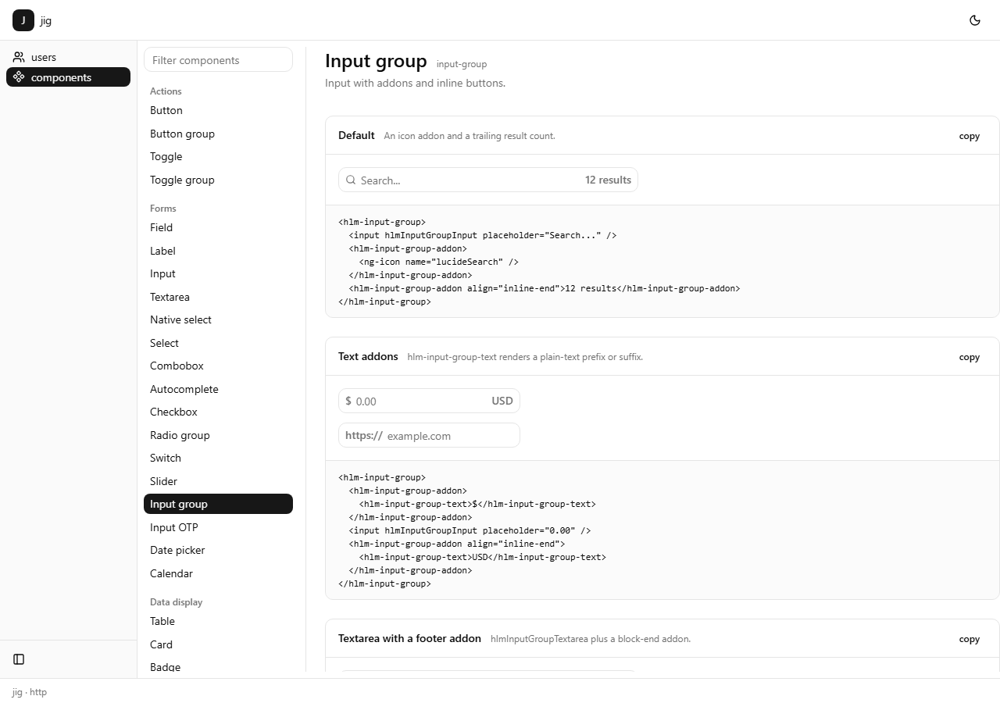

- **Default** — An icon addon and a trailing result count.
- **Text addons** — hlm-input-group-text renders a plain-text prefix or suffix.
- **Textarea with a footer addon** — hlmInputGroupTextarea plus a block-end addon.
- **Required, with validation** — Driven by a real FormControl — the error clears once a URL is typed.

## Input OTP — `input-otp`

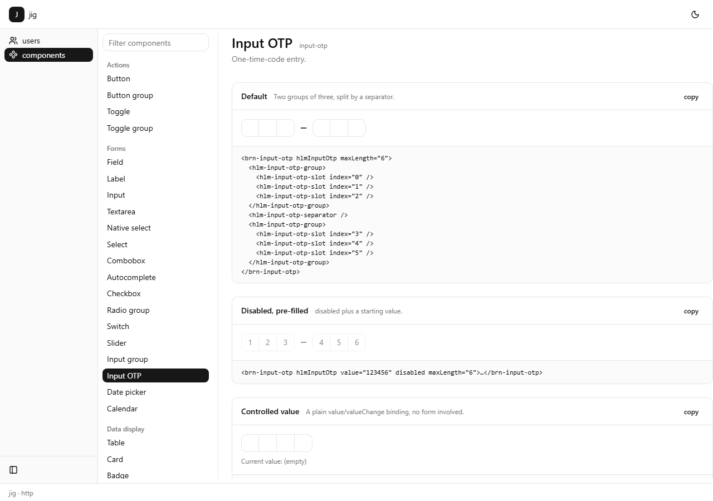

- **Default** — Two groups of three, split by a separator.
- **Disabled, pre-filled** — disabled plus a starting value.
- **Controlled value** — A plain value/valueChange binding, no form involved.
- **Required, with validation** — Driven by a real FormControl — the button enables once all 6 digits are entered. Note: BrnInputOtp has no BrnFieldControl at all, so it cannot register with an ancestor hlm-field — hlm-field-error would silently never display here, so this usage disables the submit button off real control validity instead, the same shape spartan's own form example uses.

## Date picker — `date-picker`

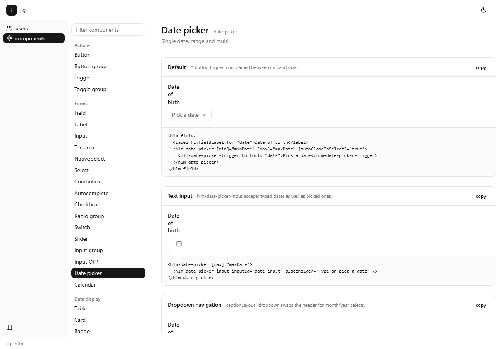

- **Default** — A button trigger, constrained between min and max.
- **Text input** — hlm-date-picker-input accepts typed dates as well as picked ones.
- **Dropdown navigation** — captionLayout=dropdown swaps the header for month/year selects.
- **Required, with validation** — Driven by a real FormControl — pick a date and the error clears.

## Calendar — `calendar`

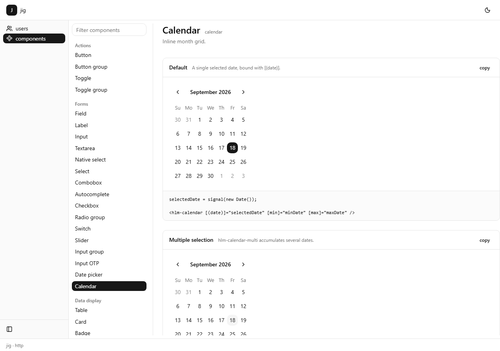

- **Default** — A single selected date, bound with [(date)].
- **Multiple selection** — hlm-calendar-multi accumulates several dates.
- **Range** — hlm-calendar-range tracks a start and an end date independently.
- **Required, with validation** — Driven by real signal state — Confirm without picking a date and the error appears.

## Dropdown menu — `dropdown-menu`

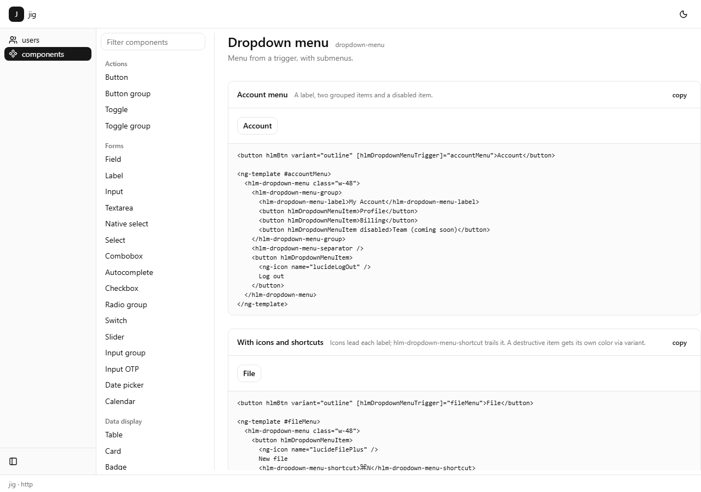

- **Account menu** — A label, two grouped items and a disabled item.
- **With icons and shortcuts** — Icons lead each label; hlm-dropdown-menu-shortcut trails it. A destructive item gets its own color via variant.
- **Checkboxes, a radio group and a submenu** — Theme: system · status bar on — every check is a real signal.
- **Composition: notification settings** — Email on, SMS off.

## Context menu — `context-menu`

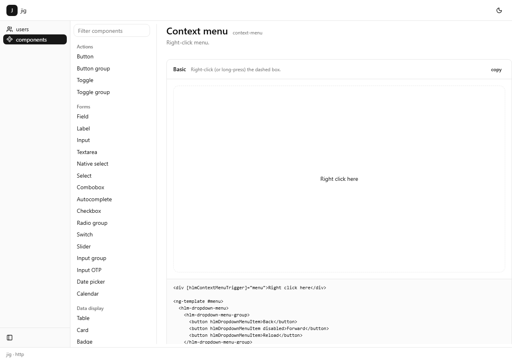

- **Basic** — Right-click (or long-press) the dashed box.
- **With icons and shortcuts** — Editor-style edit actions, each with an icon and a keyboard shortcut.
- **Checkboxes, a radio group and a submenu** — Full URLs hidden · sort by name.
- **Composition: a file row** — No action yet — right-click the row.

## Menubar — `menubar`

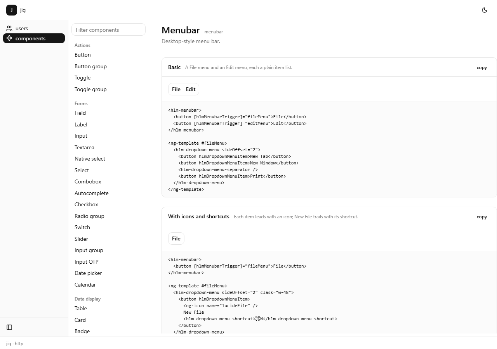

- **Basic** — A File menu and an Edit menu, each a plain item list.
- **With icons and shortcuts** — Each item leads with an icon; New File trails with its shortcut.
- **Checkboxes and a radio group** — Full URLs hidden · profile benoit.
- **Composition: a small app menubar** — Word wrap off.

## Command — `command`

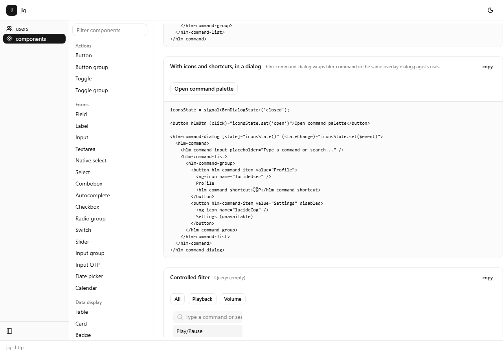

- **Inline command list** — Nothing selected yet — try typing 'cal'.
- **With icons and shortcuts, in a dialog** — hlm-command-dialog wraps hlm-command in the same overlay dialog.page.ts uses.
- **Controlled filter** — Query: (empty)
- **Composition: full command palette** — Multiple groups, icons, shortcuts and a disabled item, opened from a button.

## Dialog — `dialog`

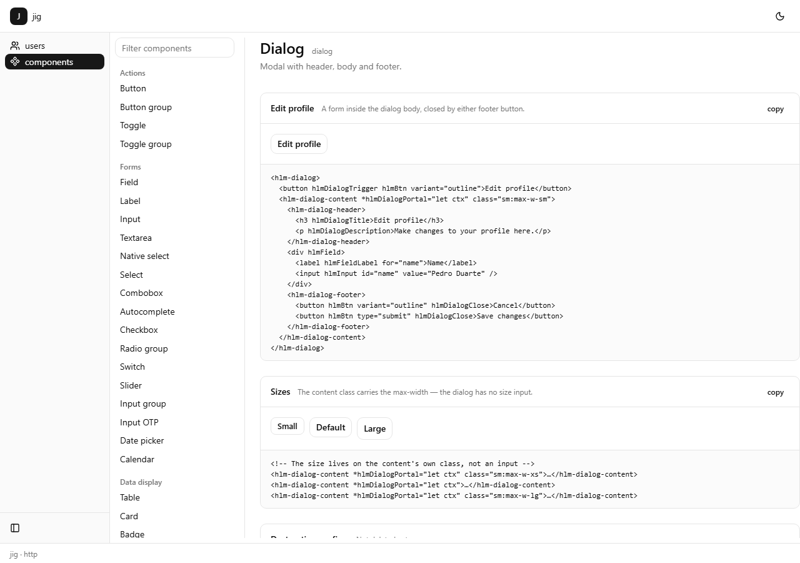

- **Edit profile** — A form inside the dialog body, closed by either footer button.
- **Sizes** — The content class carries the max-width — the dialog has no size input.
- **Destructive confirm** — Not deleted yet.
- **Tracked open count** — stateChanged is a real BrnDialog output — the counter increments only when the overlay actually reports 'open'.

## Alert dialog — `alert-dialog`

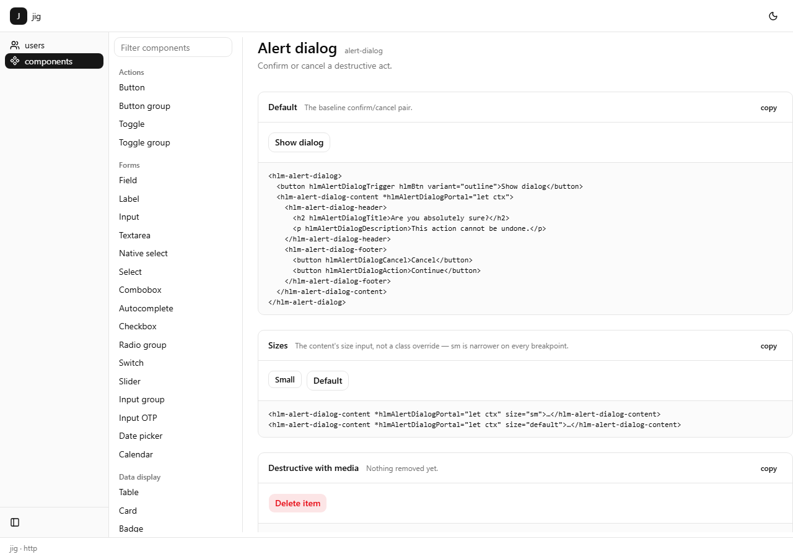

- **Default** — The baseline confirm/cancel pair.
- **Sizes** — The content's size input, not a class override — sm is narrower on every breakpoint.
- **Destructive with media** — Nothing removed yet.
- **Leave workspace** — Still a member.

## Sheet — `sheet`

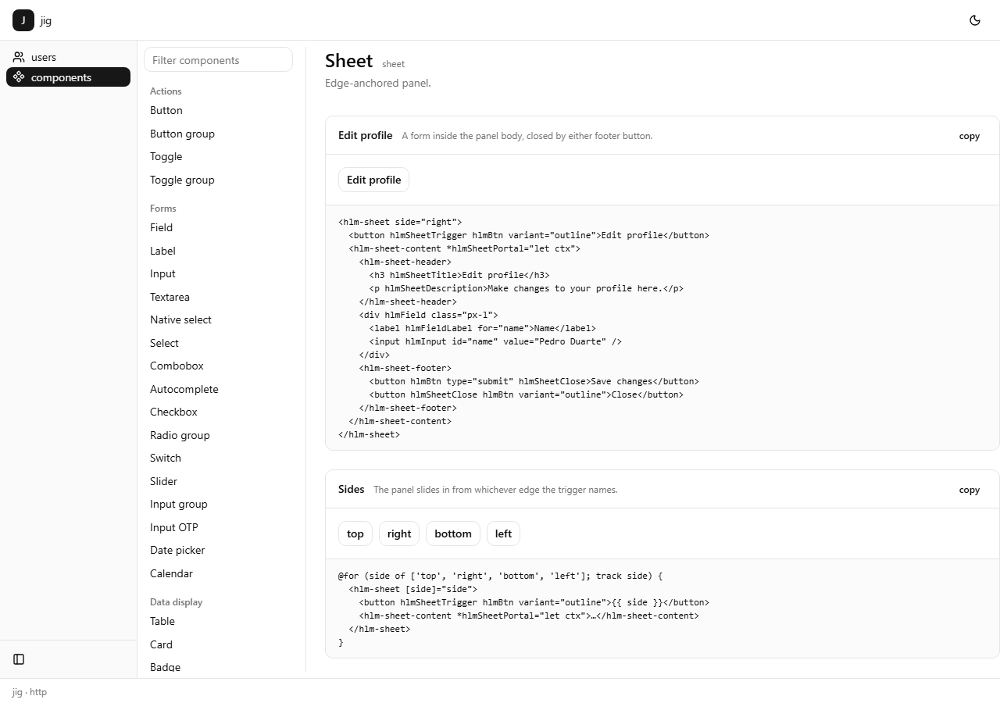

- **Edit profile** — A form inside the panel body, closed by either footer button.
- **Sides** — The panel slides in from whichever edge the trigger names.
- **Cart** — 2 item(s), $50 total.
- **Notifications** — 2 unread notification(s).

## Drawer — `drawer`

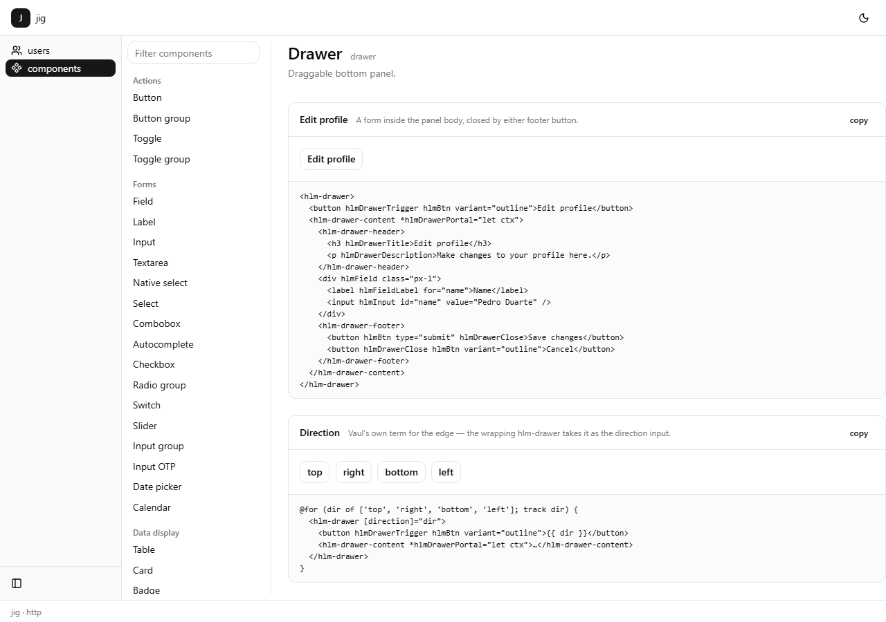

- **Edit profile** — A form inside the panel body, closed by either footer button.
- **Direction** — Vaul's own term for the edge — the wrapping hlm-drawer takes it as the direction input.
- **Delete conversation** — Conversation still here.
- **Filter results** — 12 of 12 shown.

## Popover — `popover`

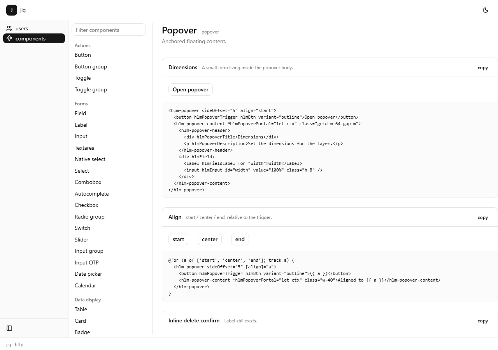

- **Dimensions** — A small form living inside the popover body.
- **Align** — start / center / end, relative to the trigger.
- **Inline delete confirm** — Label still exists.
- **Notifications** — 2 unread.

## Hover card — `hover-card`

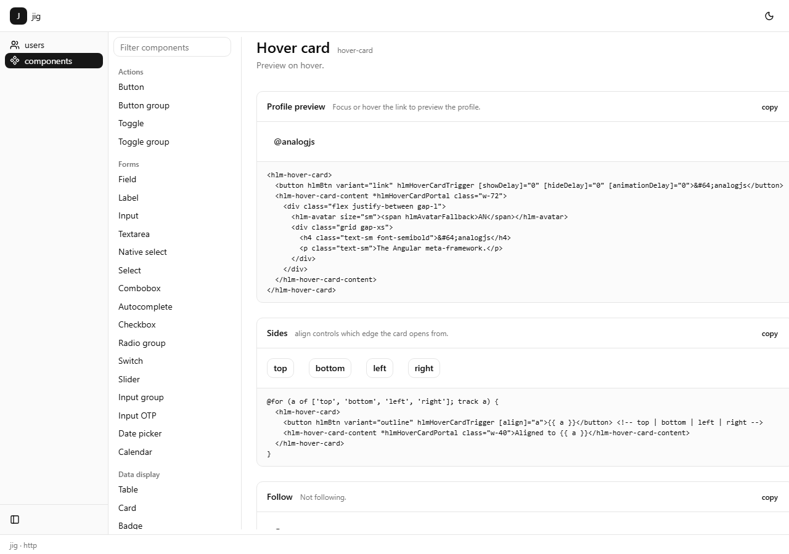

- **Profile preview** — Focus or hover the link to preview the profile.
- **Sides** — align controls which edge the card opens from.
- **Follow** — Not following.
- **Custom delay** — showDelay/hideDelay tuned per trigger — this one opens and closes instantly.

## Tooltip — `tooltip`

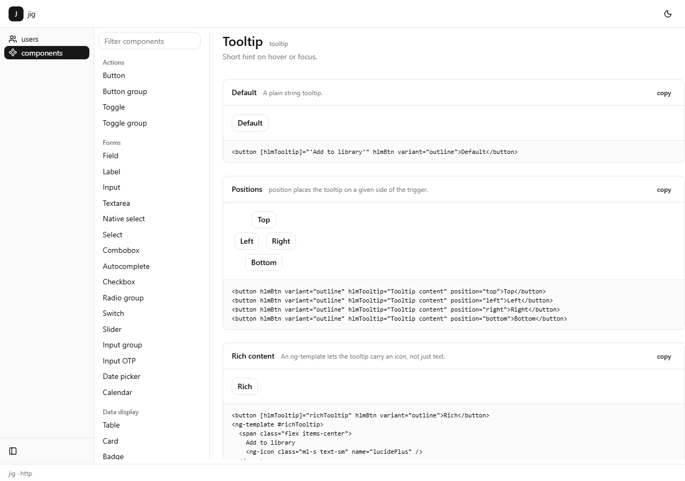

- **Default** — A plain string tooltip.
- **Positions** — position places the tooltip on a given side of the trigger.
- **Rich content** — An ng-template lets the tooltip carry an icon, not just text.
- **Disabled button** — Tooltip enabled.

## Tabs — `tabs`

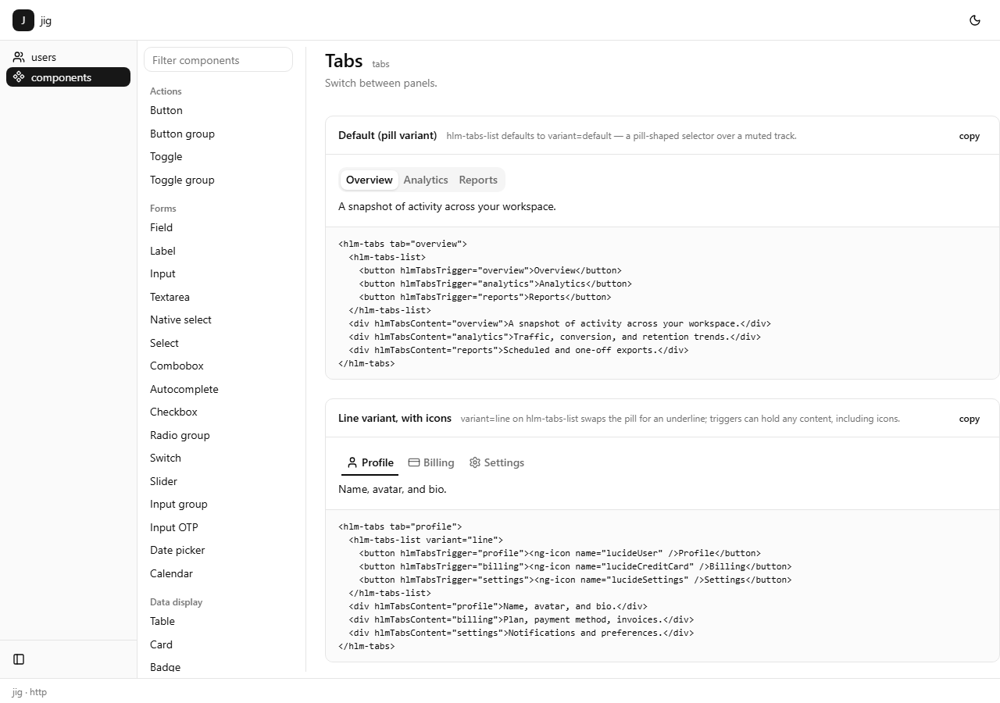

- **Default (pill variant)** — hlm-tabs-list defaults to variant=default — a pill-shaped selector over a muted track.
- **Line variant, with icons** — variant=line on hlm-tabs-list swaps the pill for an underline; triggers can hold any content, including icons.
- **State-driven** — [tab] and (tabActivated) are wired to a real signal — an external button can jump the active tab too.
- **Composition: account settings** — Each panel is a full hlmCard — the common settings-page layout.

## Breadcrumb — `breadcrumb`

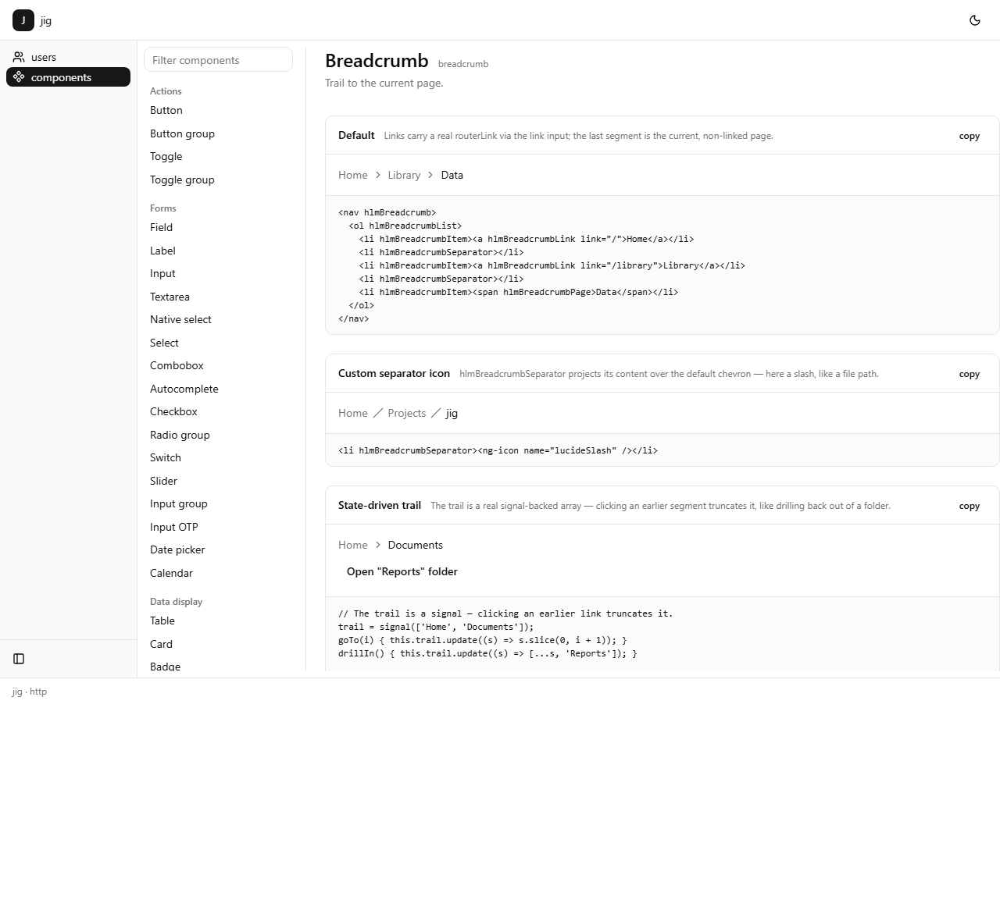

- **Default** — Links carry a real routerLink via the link input; the last segment is the current, non-linked page.
- **Custom separator icon** — hlmBreadcrumbSeparator projects its content over the default chevron — here a slash, like a file path.
- **State-driven trail** — The trail is a real signal-backed array — clicking an earlier segment truncates it, like drilling back out of a folder.
- **Composition: collapsed long path** — hlm-breadcrumb-ellipsis stands in for the segments a deep path would otherwise spell out in full.

## Pagination — `pagination`

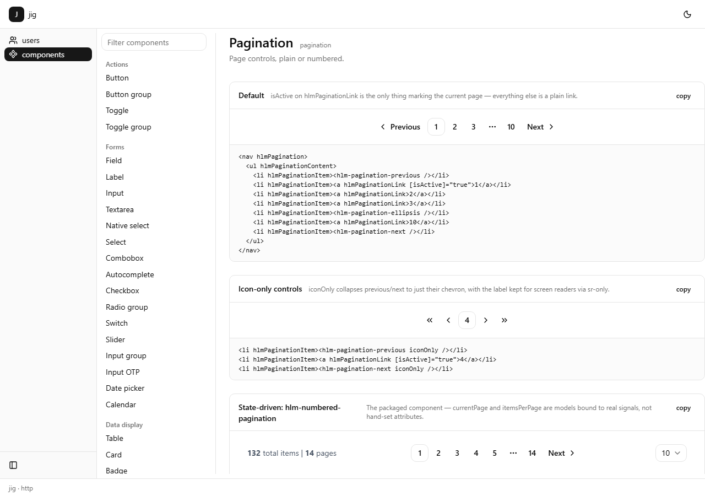

- **Default** — isActive on hlmPaginationLink is the only thing marking the current page — everything else is a plain link.
- **Icon-only controls** — iconOnly collapses previous/next to just their chevron, with the label kept for screen readers via sr-only.
- **State-driven: hlm-numbered-pagination** — The packaged component — currentPage and itemsPerPage are models bound to real signals, not hand-set attributes.
- **Composition: hand-built from the primitives** — The same current-page state, wired by hand across plain hlmPaginationLink items instead of the packaged component.

## Navigation menu — `navigation-menu`

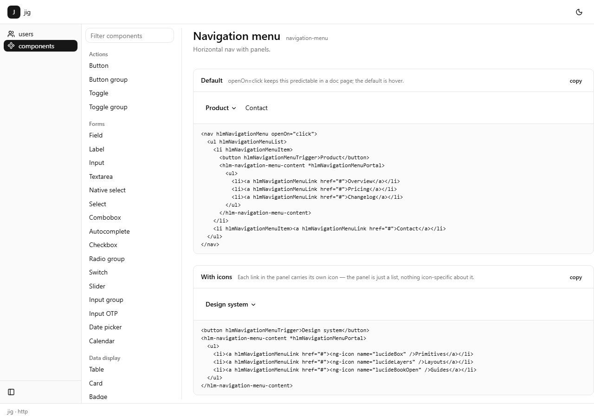

- **Default** — openOn=click keeps this predictable in a doc page; the default is hover.
- **With icons** — Each link in the panel carries its own icon — the panel is just a list, nothing icon-specific about it.
- **State-driven** — [value]/(valueChange) are wired to a real signal — the open item's id is displayed, not hand-set.
- **Composition: docs nav with an active link** — A realistic top bar: a dropdown trigger alongside plain links, one marked active via BrnNavigationMenuLink's active input.

## Sidebar — `sidebar`

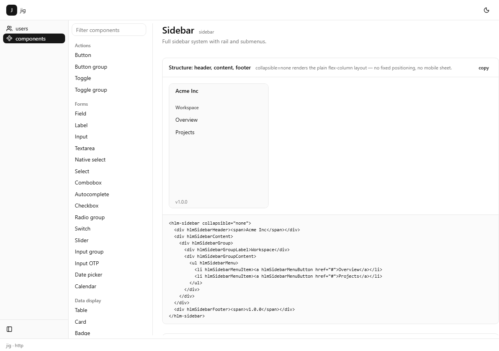

- **Structure: header, content, footer** — collapsible=none renders the plain flex-column layout — no fixed positioning, no mobile sheet.
- **Menu items with icons and badges** — hlm-sidebar-menu-badge is a sibling of the button, positioned by the button's own peer classes.
- **State-driven: active item** — isActive is bound to a real signal, flipped by (click) — not a hand-set attribute.
- **Composition: groups, a submenu, and a group action** — Two groups split by hlmSidebarSeparator; Settings expands into a real hlmSidebarMenuSub.

## Separator — `separator`

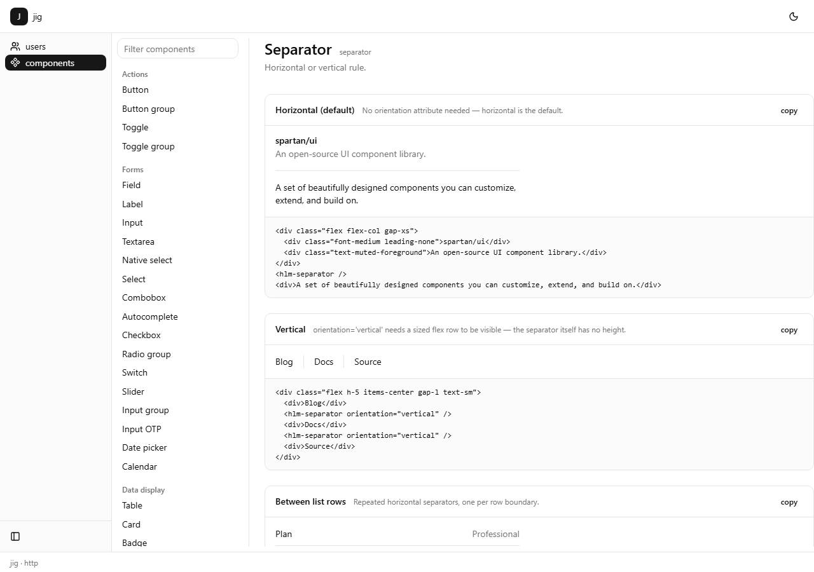

- **Horizontal (default)** — No orientation attribute needed — horizontal is the default.
- **Vertical** — orientation='vertical' needs a sized flex row to be visible — the separator itself has no height.
- **Between list rows** — Repeated horizontal separators, one per row boundary.
- **Composition: settings menu** — Horizontal groups stacked, each pair of groups divided by a vertical separator — the layout a settings header would use.

## Accordion — `accordion`

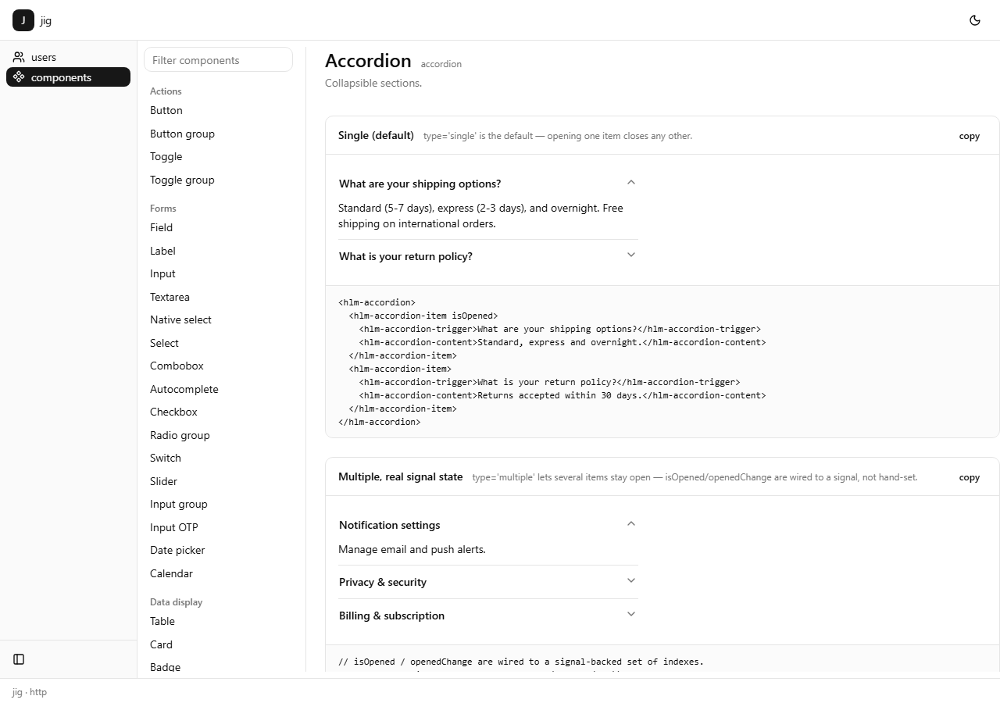

- **Single (default)** — type='single' is the default — opening one item closes any other.
- **Multiple, real signal state** — type='multiple' lets several items stay open — isOpened/openedChange are wired to a signal, not hand-set.
- **Disabled item** — The middle item is disabled — its trigger is inert while the others still open and close.
- **Composition: card with dynamic content** — An accordion inside a card, and the open item's own content toggles a detail list via a real signal.

## Collapsible — `collapsible`

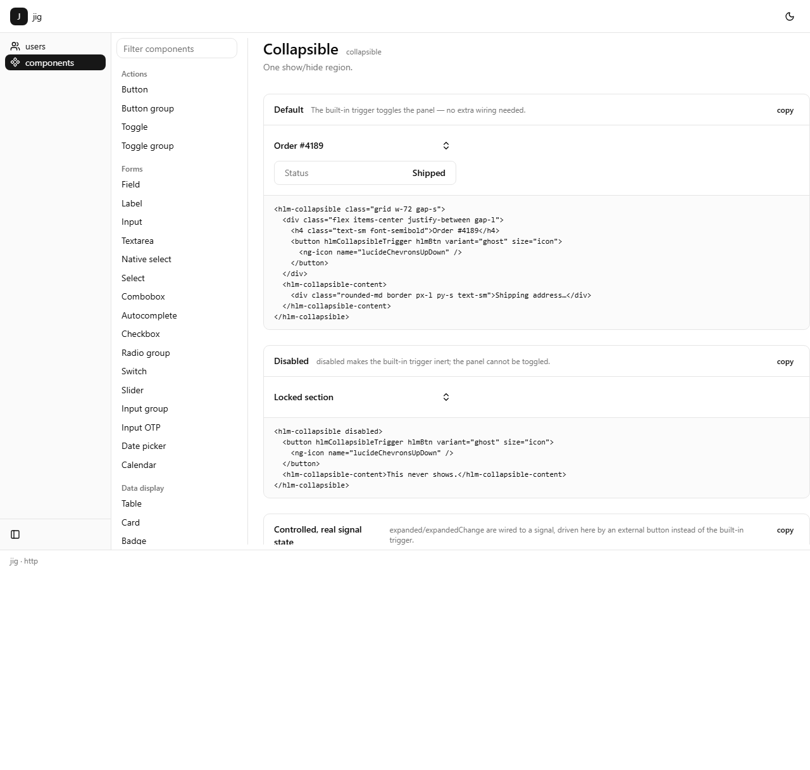

- **Default** — The built-in trigger toggles the panel — no extra wiring needed.
- **Disabled** — disabled makes the built-in trigger inert; the panel cannot be toggled.
- **Controlled, real signal state** — expanded/expandedChange are wired to a signal, driven here by an external button instead of the built-in trigger.
- **Composition: dynamic team list** — Adding or clearing members mutates a real signal, and the panel height animates to fit.

## Carousel — `carousel`

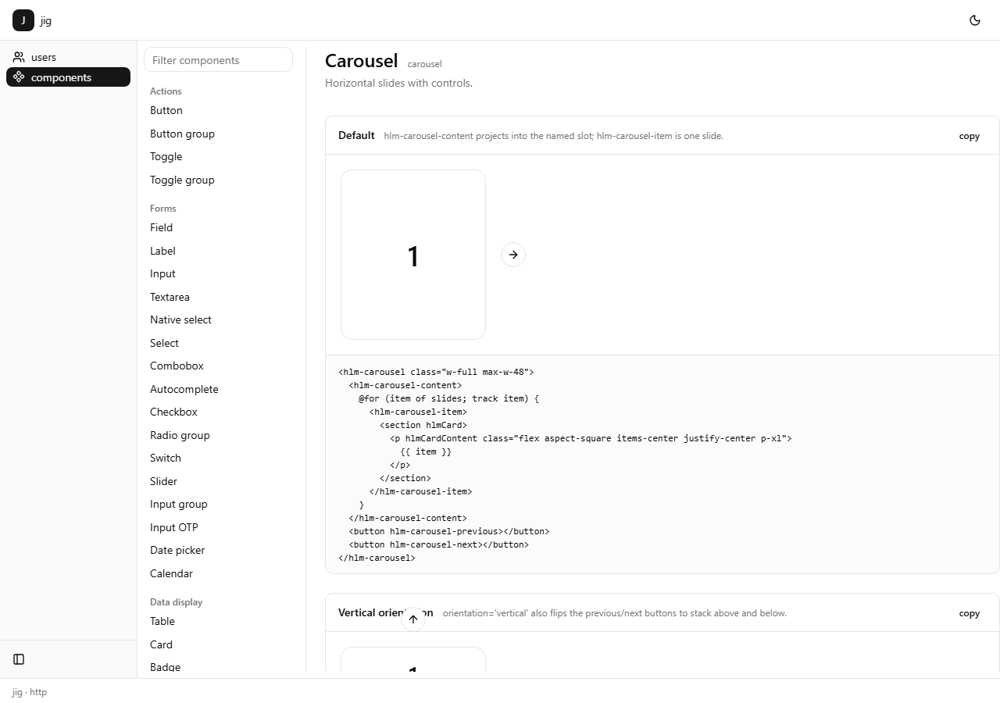

- **Default** — hlm-carousel-content projects into the named slot; hlm-carousel-item is one slide.
- **Vertical orientation** — orientation='vertical' also flips the previous/next buttons to stack above and below.
- **Multiple per view, with slide count** — hlm-carousel-slide-display reads the carousel's own currentSlide/slideCount signals — no separate state to keep in sync.
- **Composition: testimonials** — Each slide is a full card composition rather than a bare number.

## Resizable — `resizable`

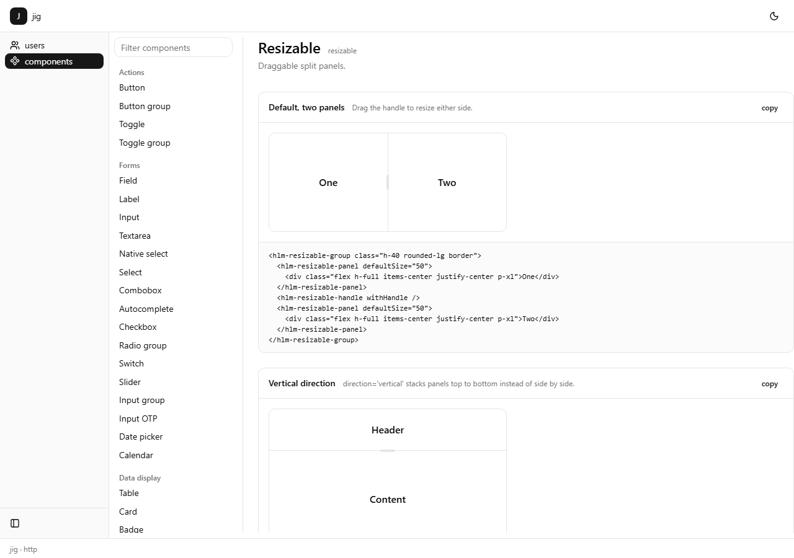

- **Default, two panels** — Drag the handle to resize either side.
- **Vertical direction** — direction='vertical' stacks panels top to bottom instead of side by side.
- **Nested groups** — A vertical group sits inside one panel of a horizontal group — the composition every split-pane layout needs.
- **Controlled layout, real signal state** — layout/layoutChange are wired to a signal — the reset button writes to it directly, the drag handle writes back.

## Scroll area — `scroll-area`

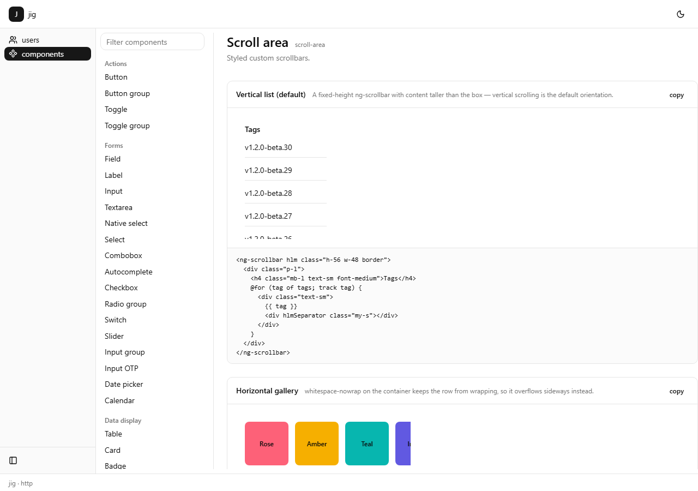

- **Vertical list (default)** — A fixed-height ng-scrollbar with content taller than the box — vertical scrolling is the default orientation.
- **Horizontal gallery** — whitespace-nowrap on the container keeps the row from wrapping, so it overflows sideways instead.
- **Compact appearance** — appearance='compact' overlays the scrollbar instead of reserving track space for it.
- **Composition: selectable list** — Clicking a row updates a real signal that drives the checkmark — nothing here is hand-set.

## Table — `table`

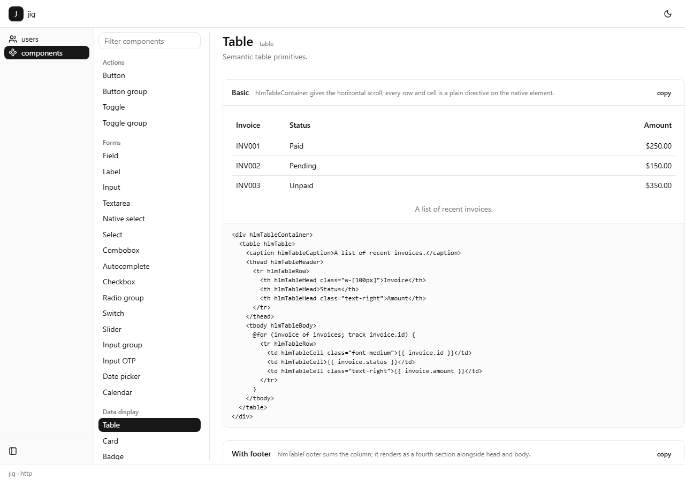

- **Basic** — hlmTableContainer gives the horizontal scroll; every row and cell is a plain directive on the native element.
- **With footer** — hlmTableFooter sums the column; it renders as a fourth section alongside head and body.
- **Selectable rows** — Clicking a row flips a real signal; hlmTableRow's own data-[state=selected] class does the highlighting.
- **Row actions** — The delete button mutates the real products signal — the row it belongs to disappears, nothing is hand-set.

## Card — `card`

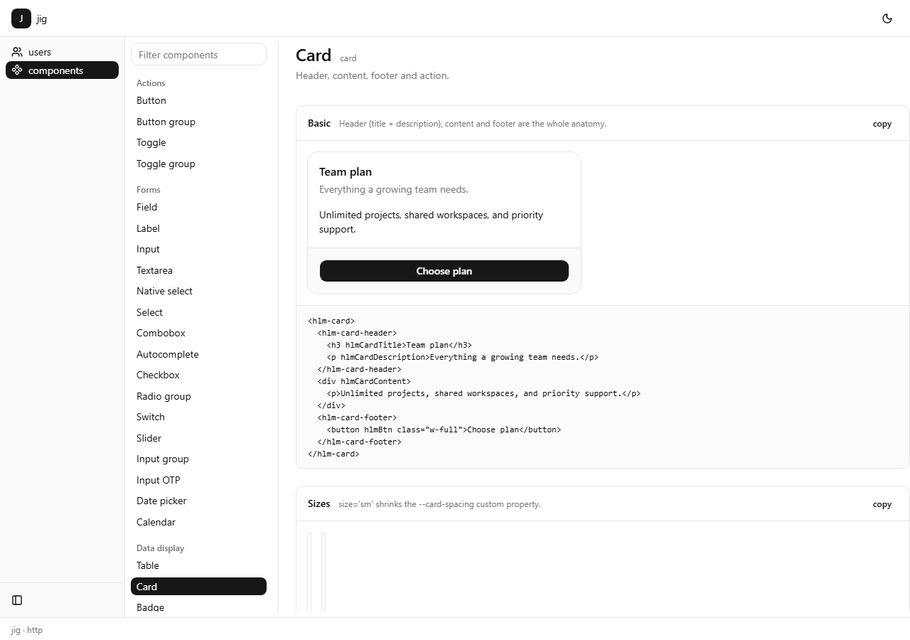

- **Basic** — Header (title + description), content and footer are the whole anatomy.
- **Sizes** — size='sm' shrinks the --card-spacing custom property.
- **With action** — hlmCardAction sits in the header's second grid column, right of the title.
- **Stateful composition** — The seat count is a real signal; the footer buttons increment and decrement it.

## Badge — `badge`

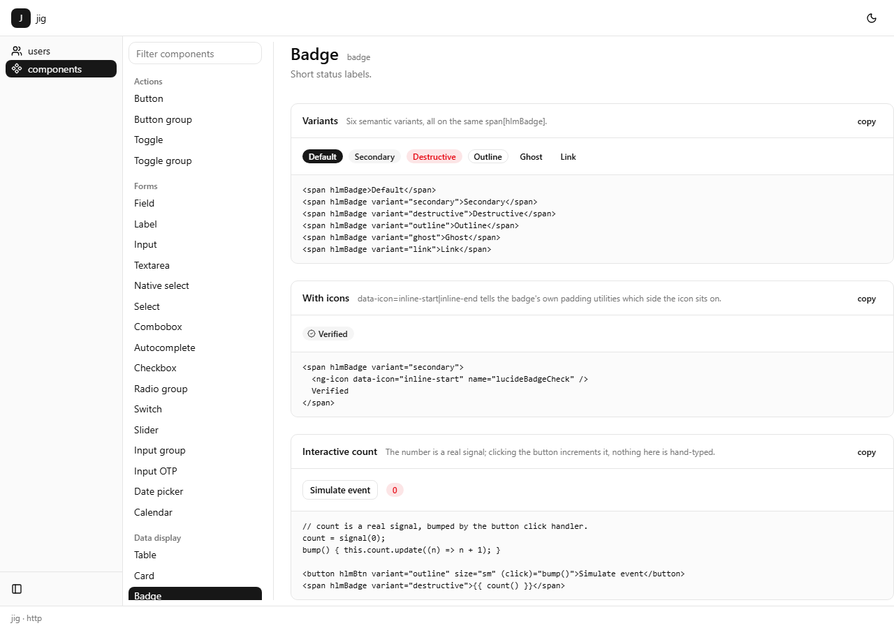

- **Variants** — Six semantic variants, all on the same span[hlmBadge].
- **With icons** — data-icon=inline-start|inline-end tells the badge's own padding utilities which side the icon sits on.
- **Interactive count** — The number is a real signal; clicking the button increments it, nothing here is hand-typed.
- **In context** — A badge anchored to the corner of an icon button — the common notification-count pattern.

## Avatar — `avatar`

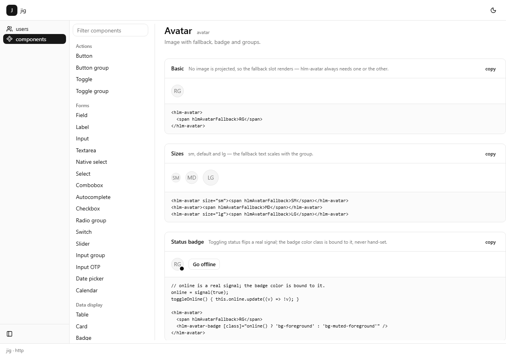

- **Basic** — No image is projected, so the fallback slot renders — hlm-avatar always needs one or the other.
- **Sizes** — sm, default and lg — the fallback text scales with the group.
- **Status badge** — Toggling status flips a real signal; the badge color class is bound to it, never hand-set.
- **Group with overflow count** — hlm-avatar-group overlaps the ring; hlm-avatar-group-count is the +N overflow indicator.

## Kbd — `kbd`

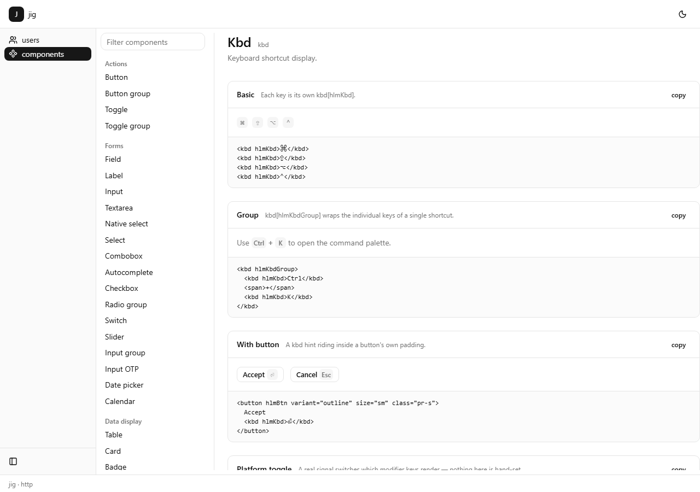

- **Basic** — Each key is its own kbd[hlmKbd].
- **Group** — kbd[hlmKbdGroup] wraps the individual keys of a single shortcut.
- **With button** — A kbd hint riding inside a button's own padding.
- **Platform toggle** — A real signal switches which modifier keys render — nothing here is hand-set.

## Item — `item`

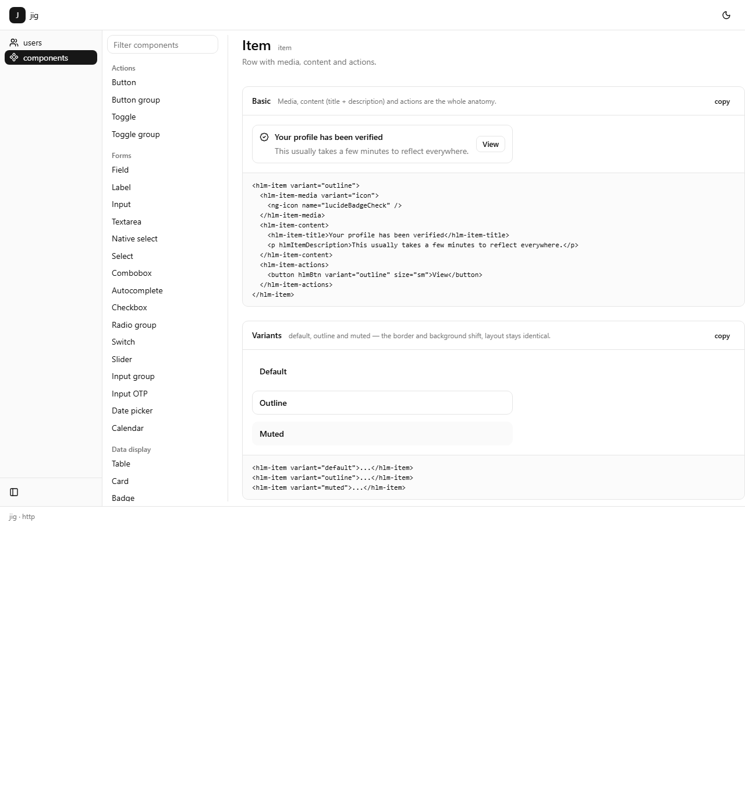

- **Basic** — Media, content (title + description) and actions are the whole anatomy.
- **Variants** — default, outline and muted — the border and background shift, layout stays identical.
- **Sizes** — default, sm and xs tighten the padding and gap together.
- **Removable group** — hlm-item-group holds a real signal-backed list; each dismiss button mutates it directly.

## Empty — `empty`

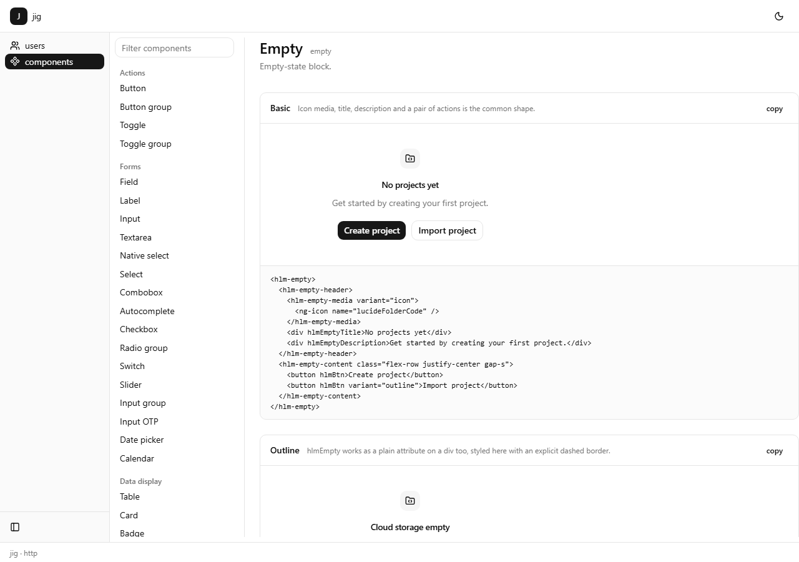

- **Basic** — Icon media, title, description and a pair of actions is the common shape.
- **Outline** — hlmEmpty works as a plain attribute on a div too, styled here with an explicit dashed border.
- **With avatar** — hlm-empty-media accepts any content, including a full hlm-avatar with its own fallback slot.
- **Retry with real state** — The description reflects a real attempts signal; each click increments it — nothing is hand-typed.

## Typography — `typography`

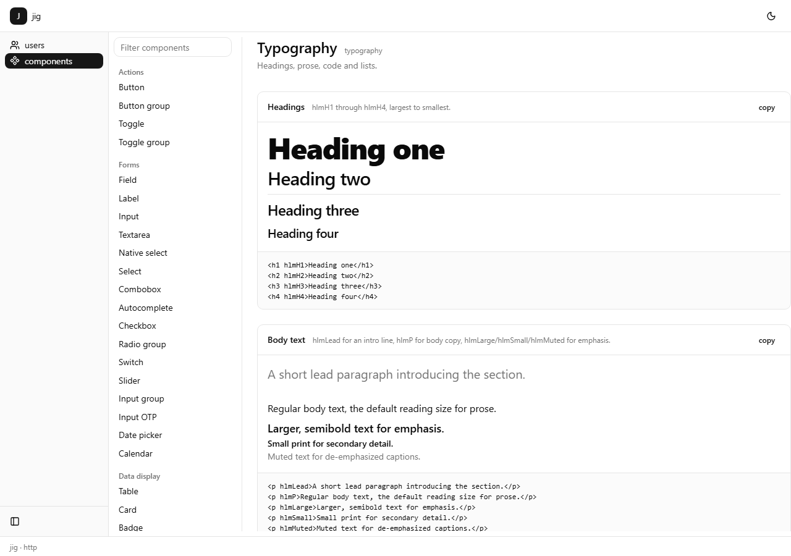

- **Headings** — hlmH1 through hlmH4, largest to smallest.
- **Body text** — hlmLead for an intro line, hlmP for body copy, hlmLarge/hlmSmall/hlmMuted for emphasis.
- **Blockquote and code** — hlmBlockquote for quoted text, hlmCode for inline code spans.
- **Article composition** — Heading, lead, paragraph and list together, the realistic combination.

## Aspect ratio — `aspect-ratio`

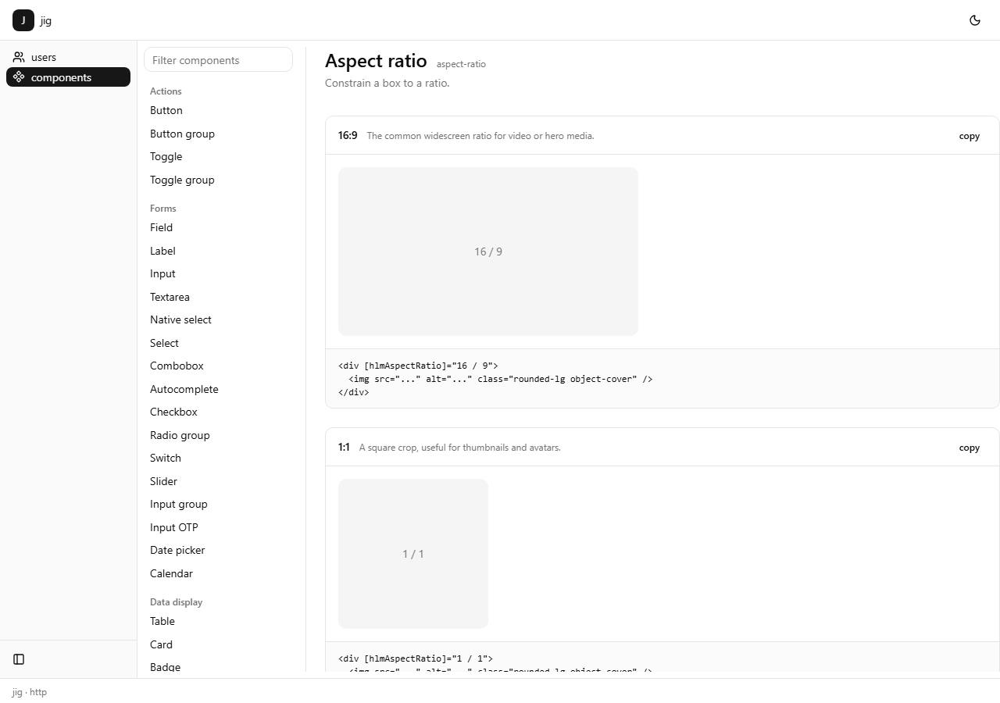

- **16:9** — The common widescreen ratio for video or hero media.
- **1:1** — A square crop, useful for thumbnails and avatars.
- **9:16** — A portrait ratio, the mirror of 16:9.
- **Dynamic ratio** — The ratio input is bound to a real signal; the button cycles it, nothing here is hand-set.

## Alert — `alert`

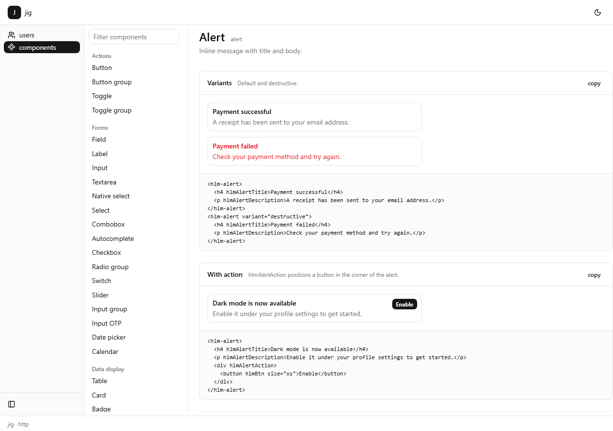

- **Variants** — Default and destructive.
- **With action** — hlmAlertAction positions a button in the corner of the alert.
- **Dismissible** — A real signal drives visibility — this is not a cosmetic toggle.
- **Form validation** — Driven by a real FormControl — submit an empty field to see it appear.

## Progress — `progress`

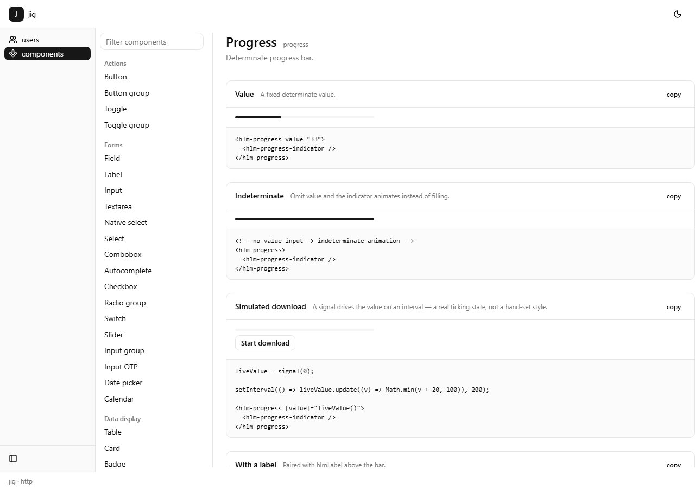

- **Value** — A fixed determinate value.
- **Indeterminate** — Omit value and the indicator animates instead of filling.
- **Simulated download** — A signal drives the value on an interval — a real ticking state, not a hand-set style.
- **With a label** — Paired with hlmLabel above the bar.

## Skeleton — `skeleton`

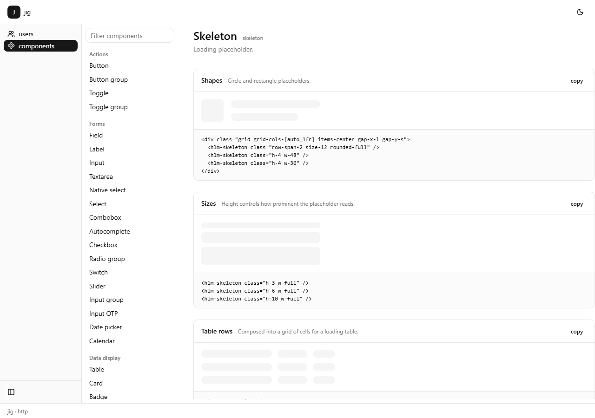

- **Shapes** — Circle and rectangle placeholders.
- **Sizes** — Height controls how prominent the placeholder reads.
- **Table rows** — Composed into a grid of cells for a loading table.
- **Loading toggle** — Driven by a real signal — the skeleton is swapped for actual content, never forced.

## Spinner — `spinner`

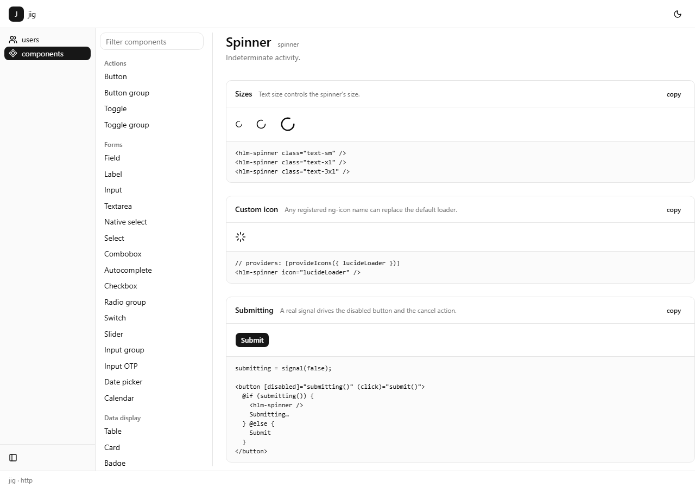

- **Sizes** — Text size controls the spinner's size.
- **Custom icon** — Any registered ng-icon name can replace the default loader.
- **Submitting** — A real signal drives the disabled button and the cancel action.
- **Status row** — Composed alongside text in a bordered row.

## Sonner — `sonner`

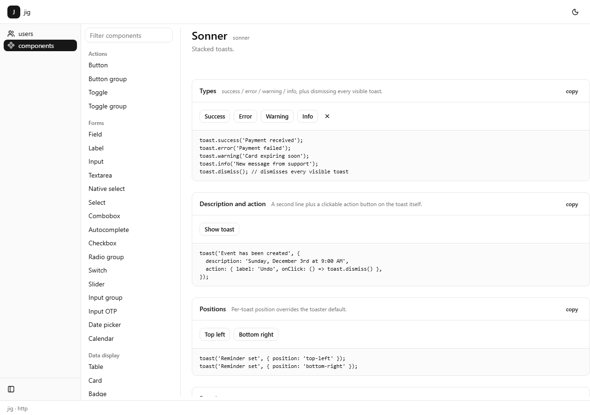

- **Types** — success / error / warning / info, plus dismissing every visible toast.
- **Description and action** — A second line plus a clickable action button on the toast itself.
- **Positions** — Per-toast position overrides the toaster default.
- **Promise** — Loading, then success or error, tracked from a real async task.

## Schema form — `schema-form`

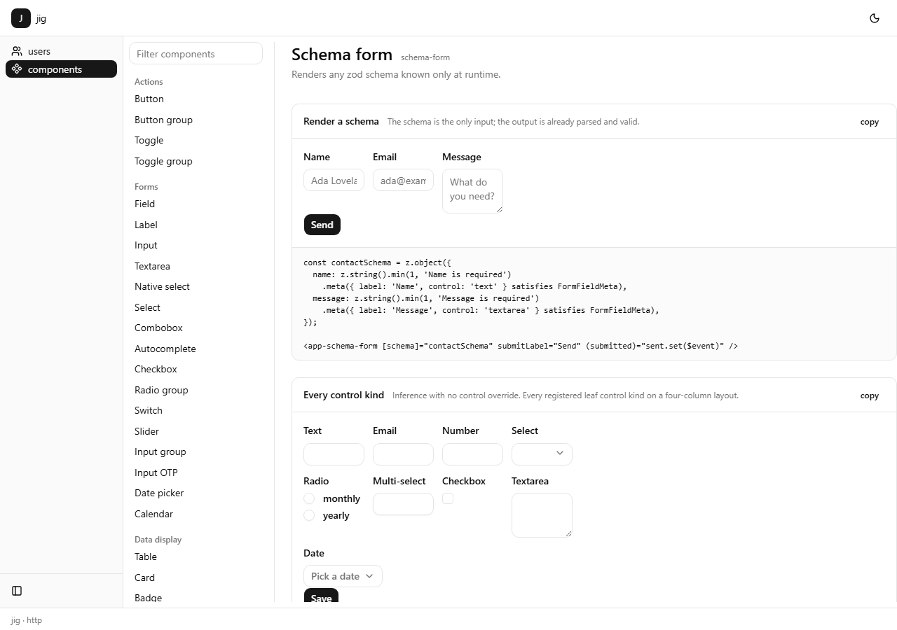

- **Render a schema** — The schema is the only input; the output is already parsed and valid.
- **Every control kind** — Inference with no control override. Every registered leaf control kind on a four-column layout.
- **Nested objects and arrays** — A group control nesting an address form, and an array-of-objects repeater for contact entries.
- **Validation folds back onto the fields** — Press Send with the form empty — each zod message lands under the field that raised it.
- **The schema is an input** — Swap it and the whole form is rebuilt. This is what separates the renderer from a hand-written form.

## Signal form — `signal-form`

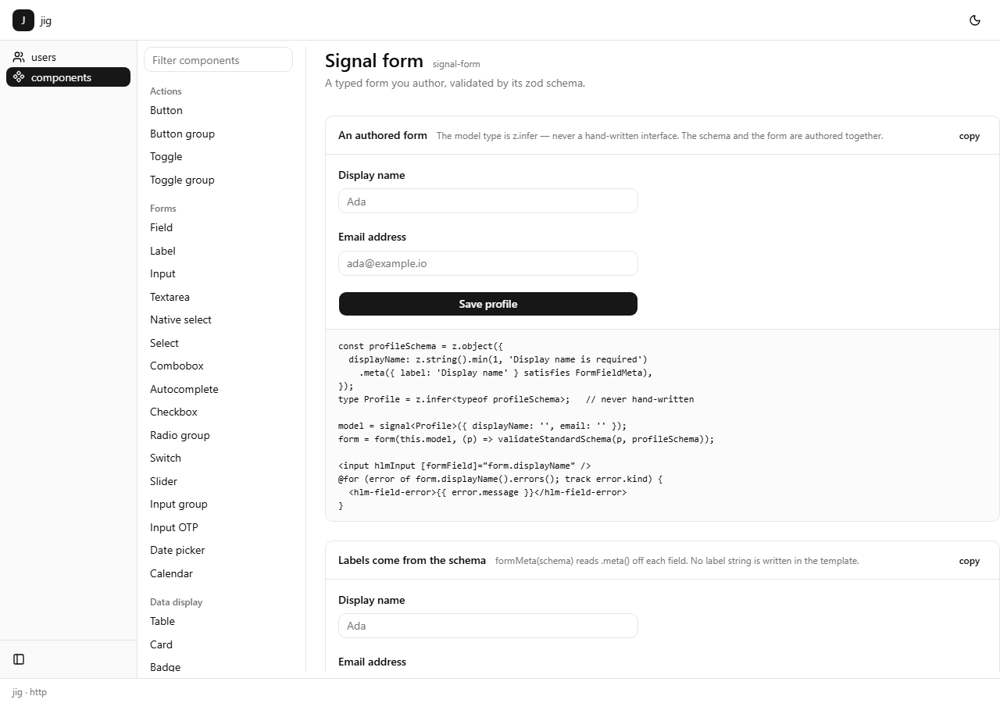

- **An authored form** — The model type is z.infer — never a hand-written interface. Reference: features/users/user-form.ts.
- **Labels come from the schema** — formMeta(schema) reads .meta() off each field. No label string is written in the template.
- **Validation is native zod** — Pre-filled with a bad address and touched, so the schema's own message is on screen.
- **Submit runs only when valid** — submit() never invokes its callback on an invalid form, so there is no guard to forget.
