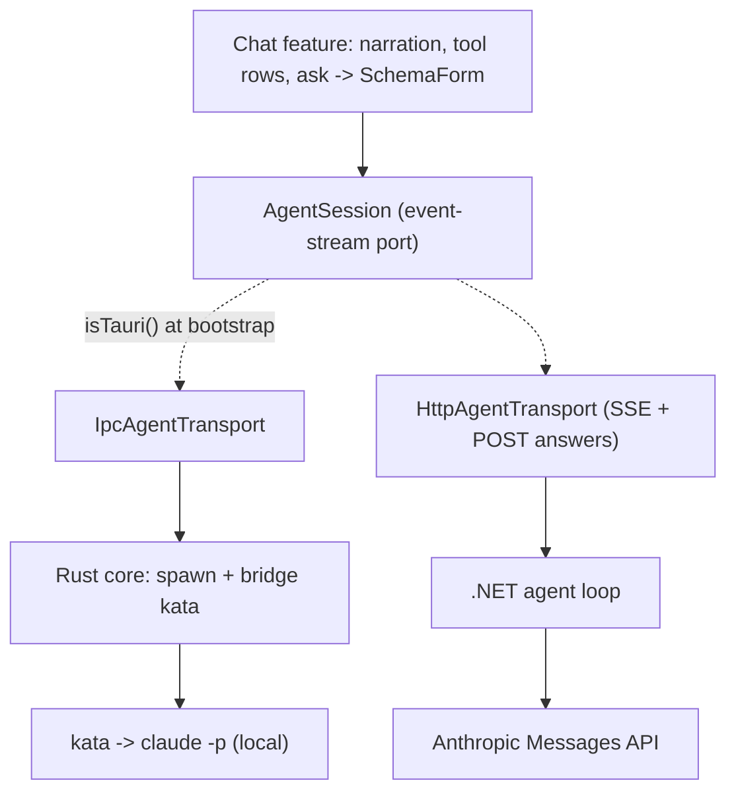

# Jig agent streaming — design

- Date: 2026-07-03
- Status: design (implementation deferred; depends on the Kata schema enhancement)
- Scope: `transport`, `contracts`, `api`, `shell`, frontend chat feature

## Goal

Make "AI chat" a first-class, reusable capability of the Jig template, working over **both** wires: the desktop (thick) build talks to a local `claude -p` agent via Kata over IPC; the web (thin) build talks to a server-side agent loop over HTTP/SSE. One frontend, two providers, and the frontend never learns which is behind it.

The experience is **agent-task interaction** (Kata-style), not token-streaming chat: start a task, watch a coarse event stream (narration, tool calls), answer the agent's questions inline, see it complete. Token streaming and the AG-UI protocol are explicitly out of scope (see Non-goals).

## The contract

The wire-crossing contract is **Kata's normalized event protocol** (`KataEvent`): four families already emitted by Kata today —

- **Lifecycle:** `run.started`, `run.completed`, `run.error`, `run.cancelled`, `run.diff`, `turn`.
- **Narration:** `assistant.text`, `log`.
- **Tool calls:** `tool.use`, `tool.result`.
- **Interaction:** `ask.requested` (blocking), `ask.answered`.

Both providers emit this exact protocol; the answer back-channel is `answer <id> <json>` where `<json>` is `{ answers: string[][] }`, correlated to an `ask.requested` id.

Types are **generated, not hand-written**: Jig codegens TypeScript `AgentEvent` types from the JSON Schema Kata publishes (see the companion Kata spec). This gives the streaming side the same no-drift guarantee the request/response side gets from OpenAPI. **Hard dependency:** this feature cannot start until Kata publishes that schema.

## Architecture

The streaming path is a **second Conduit seam, parallel to the request/response `Transport`** — a long-lived bidirectional event stream is a different shape than one-shot req/res, so it is its own port, not a method on the existing one.

## Components

**Frontend (`frontend/src/app/`):**
- `contracts/generated/agent-events.ts` — generated `AgentEvent` union from Kata's schema.
- `agent/agent-session.port.ts` — abstract `AgentSession`: `start(spec): Observable<AgentEvent>` and `answer(id, answers): void`. The only place that knows two providers exist.
- `agent/ipc-agent.transport.ts` — subscribes to Tauri IPC events, sends answers over IPC.
- `agent/http-agent.transport.ts` — consumes SSE, POSTs answers.
- `agent/provide-agent-session.ts` — picks the provider at bootstrap with `isTauri()`, wrapped in a normalizer (one place for reconnect/error shaping), mirroring `provideTransport`.
- `features/chat/` — the chat view: renders narration and tool rows from the event stream; on `ask.requested`, adapts the `Question[]` to a zod schema + `FormFieldMeta` and renders it through the existing **`SchemaForm`** (this is the generative-UI payoff), then adapts the form result back to Kata's `answers` matrix.

**Desktop provider (`apps/desktop/src-tauri`):** a thin bridge — spawn `kata`, read its stdout JSON-lines, forward each as a typed Tauri IPC event; write `answer <id> <json>` to Kata's stdin. No agent logic; Kata owns it.

**Web provider (`services/api`):** the heavy piece — a **.NET agent loop** that runs the Anthropic Messages API directly: streams the model, executes tools, and exposes an `ask_user` tool it correlates back over SSE + a POST answer endpoint. It emits the **same** `KataEvent` protocol so the frontend cannot tell it apart from Kata. This is the effort center of gravity; it is arguably its own sub-project (see Sequencing).

**Codegen (`tools/codegen`):** extend the pipeline to fetch Kata's published JSON Schema and generate the TS `AgentEvent` types (and, for the web loop, C# types).

## The three asymmetries (design for them at the seam)

1. **Provider selection** happens once, at bootstrap, via `isTauri()`. Nowhere above it.
2. **Credentials.** Desktop runs the user's own local `claude` with their credentials on their machine. Web runs a server-side loop with a service API key. Auth lives on the web side only, exactly like the request/response Conduit rule.
3. **Ask correlation.** Desktop answers travel Kata's stdin back-channel (process-local). Web answers are a separate POST correlated by `ask` id to a server-held session. Both resolve the same `ask.requested`; the frontend sees one `answer(id, …)` call.

## Error handling

`run.error` / `run.cancelled` carry an exit code and surface as a terminal chat state. Stream disconnects (SSE drop, IPC channel close, Kata process exit) fold into one `AgentError` at the normalizer, never reaching the chat view raw. Answer deadlines (Kata exit 123) render as a timed-out ask.

## Testing

- **Chat feature:** a fake `AgentSession` that emits a scripted `AgentEvent[]`; assert narration/tool rows render and that an `ask.requested` renders through `SchemaForm` and produces the right `answers` matrix. No real agent.
- **Desktop bridge:** feed canned Kata stdout lines; assert IPC events out and stdin answers in.
- **Web loop:** drive the agent loop against a fake LLM transport; assert it emits the `KataEvent` protocol and that an `ask_user` tool call blocks and resolves on a POSTed answer.

## Sequencing

1. **Upstream (Kata, separate session):** publish the schema (companion spec).
2. **Contract + codegen:** generate `AgentEvent` types in Jig.
3. **Web loop** (thin client, the hard part — likely splits into its own spec).
4. **Desktop bridge.**
5. **Chat feature + ask→SchemaForm adapter.**

## Non-goals

- Token-streaming chat and live token deltas.
- The AG-UI protocol (Kata's coarse protocol already carries tool calls, which was AG-UI's only draw here).
- Generative UI beyond adapting `ask.requested` through `SchemaForm`.
- Multi-agent orchestration.

## Open risks

- The web agent loop is a real agent runtime (tool execution, streaming, ask correlation, concurrency, sandboxing). Size the project around it, not the chat UI.
- Kata's `tool.result` currently lacks the tool name (correlation TODO); tool rows render better once the companion Kata spec fixes it.
