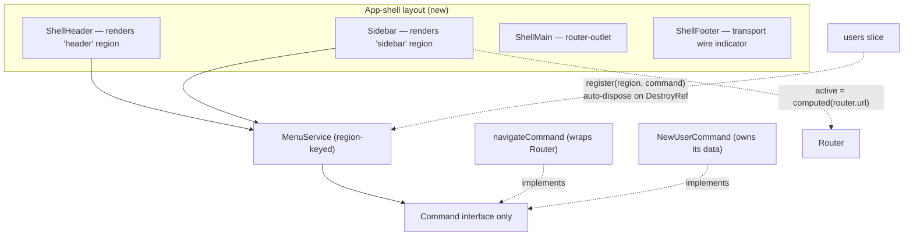

# App-shell layout + command-driven menu system

Status: approved (design). Author: Bob (with Satish). Date: 2026-07-03.

## Problem

The default frontend shell is a bare `<main><router-outlet/></main>`. It does not match the jig-design full-page layout (the full-width app shell: sticky blurred header, collapsible multi-tier sidebar, scrollable content, status footer), and there is no mechanism for feature slices to contribute menu items. Navigating to `/` renders the unstyled `users` view with no chrome.

Two coupled goals:

1. Adopt the jig-design **full-width app shell** as the default layout.
2. Provide a **command-driven menu system** so slices contribute sidebar navigation and header actions through a single `Command` interface, registered at runtime and rendered by the shell.

## Constraints (the repo gates)

- SOLID / YAGNI / DRY / TDD are gates, not preferences (see CONTRIBUTING.md).
- Discover before build: reuse `libs/ui` helm components; generate new ones via `@spartan-ng/cli`, do not hand-roll.
- Feature-branch workflow; commits land only at a green `npm run verify`.
- The `users` slice is the one worked example. No speculative slices (billing/audit/settings exist only in the mockup, not the template).

## Decisions (locked with the user)

1. **One `Command` interface for both navigation and actions.** A navigation item is a `Command` that *wraps* the Angular Router; it does not reimplement routing. Active-item highlight derives from `router.url` via a computed signal; deep links and back/forward stay owned by the Router (the URL is the source of truth).
2. **Runtime registration** via `MenuService.register(region, command)`, which **auto-unregisters on the caller's `DestroyRef`**. No feature code writes a manual `unregister` in `ngOnDestroy`.
3. **One `MenuService`, keyed by region** (`'sidebar' | 'header'`). The "header menu service" is the `'header'` region, not a second class.
4. **`canExecute` is a `Signal<boolean>`** (reactive), so the menu re-renders when a command becomes enabled/disabled.
5. **Icons via `@ng-icons/lucide`**, rendered with `NgIcon` from `@ng-icons/core` directly (`<ng-icon [name]="…"/>`). This spartan version (`@spartan-ng/cli` 1.0.4) has no `hlm-icon` wrapper — it ships a `migrate-icon` generator that converts `hlm-icon` → `ng-icon`, so `ng-icon` is the current spartan-native path. `Command.icon` is the registered ng-icon name string (e.g. `'lucideUsers'`). Not the standalone `lucide-angular` package.
6. **Scope stops at two `users` commands** — one nav, one action — proving both command shapes. No other menu entries.

## Architecture



The menu service knows only `Command`. Both transports/wires and routing stay untouched; this feature sits entirely in the frontend presentation layer.

## The core contract

```ts
// menu/command.ts — the only thing MenuService knows
export interface Command {
  readonly id: string;
  readonly label: string;
  readonly icon?: string;               // registered @ng-icons/lucide name, e.g. 'lucideUsers'
  readonly canExecute: Signal<boolean>; // reactive -> menu shows disabled/hidden live
  execute(): void | Promise<void>;
}

// menu/menu.service.ts
type Region = 'sidebar' | 'header';
class MenuService {
  register(region: Region, command: Command): void; // auto-unregisters on inject(DestroyRef)
  items(region: Region): Signal<readonly Command[]>; // for the shell to render
}

// menu/navigate-command.ts — navigation = a Command that WRAPS the router
navigateCommand(opts: {
  id: string; label: string; icon?: string; route: string;
}): Command; // execute -> router.navigate([route]); canExecute -> true (or guard)
```

Active-state note: the sidebar computes the active item from `router.url`; a nav command never stores "am I active" and never bypasses `canActivate`.

## Components (new)

Built to match the jig-design full-width shell, using generated helm components where they exist and the design system's `layout.css` (app-shell grid + sidebar) ported into the app styles. None of these exist in `libs/ui` today (only button/input/field/label/separator do), so they are created here:

- `AppShell` (CSS grid container) with `ShellHeader`, `Sidebar`, `ShellMain` (`router-outlet`), `ShellFooter`.
- `SidebarNavItem` — renders a sidebar-region `Command`; active highlight from `router.url`.
- The header renders header-region `Command`s as buttons (`hlmBtn`) with `<ng-icon>`, disabled when `!canExecute()`.

## The worked example

The `users` slice contributes exactly two commands in its providers:

- `navigateCommand({ id: 'nav-users', route: '/users', label: 'users', icon: 'lucideUsers' })` -> `'sidebar'` region.
- `NewUserCommand` — a real action command; `execute()` opens the user form, `canExecute` is `false` while a save is in flight -> `'header'` region.

Routing gains an explicit `/users` path (today `''` maps to the view); `''` redirects to `/users`.

## Testing (TDD, red first)

- `MenuService`: register adds to the right region; items() excludes other regions; DestroyRef disposal removes the command; ordering is stable.
- `navigateCommand`: `execute()` calls `router.navigate([route])`; `canExecute` reflects the guard/true.
- Shell rendering: given a fake `MenuService` exposing commands, the header renders enabled/disabled buttons and the sidebar renders nav items with the active one marked (fake `router.url`).

All specs written red before the implementation that satisfies them.

## Build sequence

1. Add `@ng-icons/core` + `@ng-icons/lucide` (rendered via `<ng-icon>`; no helm wrapper). Port the design system's `layout.css` (app-shell grid + sidebar) into the app styles; adopt tokens.
2. Build the static app-shell components (header/sidebar/main/footer) matching jig-design — hardcoded nav, no menu service yet. Visual checkpoint.
3. Build `Command` + `MenuService` + `navigateCommand` (TDD, red-green).
4. Swap the shell to render from `MenuService`; wire the two `users` commands; add the `/users` route and `'' -> /users` redirect.
5. `npm run verify` green; commit at the gate.

## Out of scope

- Billing/audit/settings sidebar entries (mockup only).
- A static DI multi-provider registration path (runtime registration chosen).
- Any change to the transport seam, repositories, or the .NET API.
- Sidebar collapse persistence beyond in-session signal state (can follow later).

## Non-obvious risks

- **Highlight/URL drift**: if a nav command ever stores active-state instead of deriving it from `router.url`, the sidebar and the address bar will disagree. The computed-from-URL rule prevents this.
- **Registration leaks**: runtime `register` without disposal leaves ghost menu items. Auto-dispose via `DestroyRef` is mandatory, not optional.
