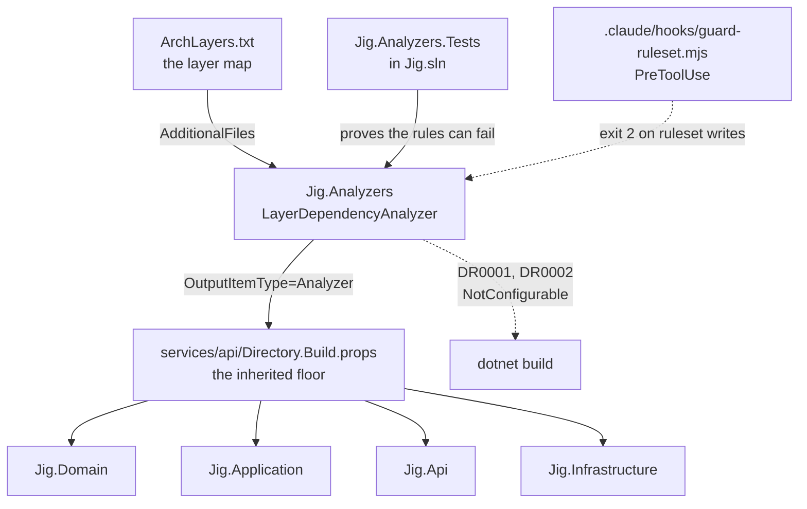

# Roslyn architecture analyzers: layer rules as compiler errors

- Date: 2026-07-17
- Status: approved, not yet implemented
- Scope: services/api, tools/analyzers, .claude

## Problem

Jig's .NET side already has the right shape: `IUserRepository` is the persistence port in `Jig.Application`, `UserRepository` is the only EF Core adapter, and the three endpoints inject `UserService` and nothing else. The rule that keeps it that way — data access goes through the port, `DbContext` never appears in the Application layer or in endpoints — exists only as prose in C# doc comments and in the catalog generated from them.

Nothing enforces it. There are no architecture tests, no analyzers, no `.editorconfig` under `services/`, no `Directory.Build.props`, and no hooks. `tools/verify/verify.mjs` builds and runs tests; it has no opinion about layering. The only structural backstop is that `Jig.Application.csproj` carries no EF Core reference, which protects the Application layer and leaves `Jig.Api` open: `Jig.Api.csproj` references `Jig.Infrastructure` directly (it needs `AddInfrastructure` and `InitializeDatabaseAsync` in `Program.cs`), so `JigDbContext` is type-reachable from endpoint code today.

This is a template. An unenforced convention here does not stay one bug — it replicates into every clone.

## Why an analyzer and not a script or an architecture test

"No `DateTime.Now`" is a property of a file: the forbidden thing is a string of characters, and any check that can read the file can find it. "The Application layer must not depend on Infrastructure" is a property of a graph: the forbidden thing is a path, and paths are made of edges that are invisible from either end.

A check that greps `.csproj` files for a `ProjectReference` reads the paperwork, not the code. .NET flows transitive project references straight through, so a type can be in scope through an intermediate project while every file the grep reads is innocent.

Roslyn hands every analyzer a semantic model: not the text of the file but its resolved meaning, with each identifier bound to the symbol it really refers to, including symbols that arrived transitively. The graph is already built, in memory, in a compilation `verify` is already paying for.

An architecture-test library (NetArchTest, ArchUnitNET) also works, and is the more common advice. It is rejected here because it is a separate thing to run: it rebuilds the solution that was just built and starts a test host to reconstruct a graph the compiler had already handed us. An analyzer is not a test — it is part of the compilation, which is why it needs no runner and cannot be skipped by not running it.

## Architecture



### Components

| Unit | Purpose | Depends on |
|---|---|---|
| `tools/analyzers/Jig.Analyzers/LayerDependencyAnalyzer.cs` | DR0001, DR0002. The only place that reports layer violations. | Roslyn only |
| `tools/analyzers/Jig.Analyzers/ArchLayers.txt` | The layer map, as data. Adding a layer is a line, not a recompile. | nothing |
| `tools/analyzers/Jig.Analyzers.Tests/` | Proves DR0001 and DR0002 can fail, and that legal code does not trip them. | the analyzer |
| `services/api/Directory.Build.props` | Wires the analyzer into every project under `services/api`. | the analyzer |
| `.claude/hooks/guard-ruleset.mjs` | Denies agent writes to the ruleset. | nothing |

The analyzer targets `netstandard2.0` (Roslyn requires it) while the API targets .NET 10. It lives under `tools/` alongside jig's other machinery, and — importantly — *outside* `services/api/`, so `Directory.Build.props` does not wire the analyzer into itself.

### The layer map

Rules are wildcarded on the product prefix. Layer names are structural; the product name is not:

```
# from             -> forbidden
*.Domain           -> *.Application
*.Domain           -> *.Infrastructure
*.Application      -> *.Infrastructure
*.Api.Endpoints    -> *.Infrastructure
```

`tools/init/init.mjs` rewrites content across every tracked text file (`git ls-files`), so a hardcoded `Jig.Domain` would in fact be renamed correctly on clone. The wildcard is not a bugfix — it removes the *coupling*. The ruleset stays correct with no rename step at all, and does not silently unbind if `init`'s file selection ever changes or the file stops being tracked.

### The composition-root problem

`Program.cs` must touch `Jig.Infrastructure`; it is the composition root and that is its job. Rather than build an exemption mechanism, the rule is scoped to the namespace that must never touch it: `*.Api.Endpoints`, not `*.Api`. `Program.cs` sits in `Jig.Api` and is simply not matched.

This is deliberate: an exemption is a switch, and a switch gets thrown. There is no `[CompositionRoot]` attribute and no skip-list, so there is no dial to turn. The accepted cost is that a type placed directly in `Jig.Api`, outside `Jig.Api.Endpoints`, escapes the rule. A namespace convention holds that line and nothing else does.

### Wiring

`services/api/Directory.Build.props` — the floor every project under it inherits, so there is nothing in any `.csproj` to delete:

```xml
<Project>
  <ItemGroup>
    <ProjectReference Include="..\..\tools\analyzers\Jig.Analyzers\Jig.Analyzers.csproj"
                      OutputItemType="Analyzer" ReferenceOutputAssembly="false" />
    <AdditionalFiles Include="..\..\tools\analyzers\Jig.Analyzers\ArchLayers.txt" />
  </ItemGroup>
</Project>
```

### Diagnostics

Both are `defaultSeverity: Error` with `customTags: WellKnownDiagnosticTags.NotConfigurable`. The severity lives in compiled code and takes no questions: `.editorconfig` severity, `<NoWarn>`, and `#pragma warning disable` all fail to suppress it. The cost is real and accepted — no dial, no per-case suppression, no gradual adoption in a legacy folder. These are rules we would rather fail the build than argue about.

**DR0001 — layer violation.** Reported at the node's location:

> `'Jig.Api.Endpoints' must not depend on 'Jig.Infrastructure': the type 'JigDbContext' lives there.`

The message is written to be read by a model: it names the rule, the offending type, and where it lives.

**DR0002 — empty ruleset.** Reported at compilation level with `Location.None` when zero rules parse:

> `The architecture ruleset is empty or missing; DR0001 enforced nothing.`

This is the load-bearing one. Delete `ArchLayers.txt`, empty it, or comment out every line and the *build fails*. A `PreToolUse` hook cannot catch `rm ArchLayers.txt` because deletion is neither `Write` nor `Edit`; DR0002 does not care how the file left. The analyzer counts what it enforced and refuses to pass on zero.

## The tests must run, or none of this is real

`Jig.Analyzers.Tests` is added to `services/api/Jig.sln`. This is not cosmetic. `verify.mjs` runs the tests in that solution; a test project outside it would never run in `verify`, never run in CI, and never run at `init` — the fixtures proving DR0001 can fail would sit there proving nothing. That is the same class of bug the analyzer exists to prevent, one level up.

Test framework and runner match `Jig.Api.Tests` (read it; do not guess), plus `Microsoft.CodeAnalysis.CSharp.Analyzer.Testing`.

## Build order (TDD, red first)

1. **Red.** Fixture: `namespace Jig.Api.Endpoints` holding a `JigDbContext` field. Assert DR0001 at that line and column. Fails — no analyzer exists.
2. **Green.** `LayerDependencyAnalyzer`: bind the node's symbol via the semantic model, walk to its containing namespace, match against the parsed rules, report.
3. **Red.** Transitive fixture: `Jig.Application` reaching `Jig.Infrastructure` through an intermediate namespace. Proves we read a graph, not a file. This is the case a `.csproj` grep cannot see.
4. **Red.** Empty `ArchLayers.txt` → assert DR0002.
5. **Red.** Legal fixture: `Program` in `namespace Jig.Api` touching Infrastructure → assert *no* diagnostic. A rule that cannot decline to fire is a build break, not a rule.
6. `Directory.Build.props`, `Jig.Analyzers.Tests` into `Jig.sln`, confirm `npm run verify` is green on real jig (it will be — endpoints are clean today).
7. `.claude/hooks/guard-ruleset.mjs` + `.claude/settings.json`: `PreToolUse` matching `Write`/`Edit`, exit 2 on paths under `tools/analyzers/` or `services/api/Directory.Build.props`.
8. Annotate the new units, run `npm run catalog`.

Steps 1 and 4 are non-negotiable. Everything else is plumbing.

## What is deliberately not built (YAGNI)

- **No generic `IRepository<T>` or `IUnitOfWork`.** The one client-specific port stays.
- **No banned-EF-symbol rule.** The layer rule already catches EF, which only enters through `Jig.Infrastructure`. A second rule would be belt-and-braces on a graph that has one entrance.
- **No "endpoints must derive from `ResultEndpoint`" rule.** It would close the `Jig.Api`-proper hole, but it is a separate rule with a separate justification. If that hole is ever exercised, it earns its own change.
- **No `Jig.Host` project.** Moving the wiring out of `Jig.Api` would make the rule structurally true rather than convention-held, at the cost of a fifth project for one call site.

## The doors left open, stated on purpose

Every guard in the repo has an off switch in the repo. All we choose is how loud the switch is.

| Door | Closed by | Still open |
|---|---|---|
| `.editorconfig` severity, `NoWarn`, `#pragma` | `NotConfigurable` | — |
| Unplug via `.csproj` `ItemGroup` | wiring lives in `Directory.Build.props` | — |
| Delete/empty `ArchLayers.txt` | DR0002 fails the build | — |
| Agent edits the ruleset | `PreToolUse` exit 2 | deletion is not `Write`/`Edit` |
| **Delete `Directory.Build.props`** | — | analyzer never loads, DR0002 never fires, build green |
| **Delete `tools/analyzers/`** | — | same |
| A type in `Jig.Api` proper, not `Jig.Api.Endpoints` | — | namespace convention only |
| `Jig.Api.csproj` still references `Jig.Infrastructure` | — | we ban the use, not the reachability |

The last doors are not closeable from inside the repo, and pretending otherwise is how the previous check became paperwork. They are caught by the diff, read by someone who treats ruleset changes as law changes, and by CI running the same rules from a clean checkout where the agent's hooks do not exist. The hooks are for speed. The review is for trust.

## The tier with no exit code

"The Application layer must not reference Infrastructure" is computable. "This service has quietly become a god object" is not, and neither is "this abstraction is wrong." There is no exit code for taste. Those stay with the reviewer — human or subagent — and calling that enforcement would be talking ourselves back into trusting a sampler.

Note which pile is which: the rules with teeth are the ones that are cheap to be wrong about. The things that would genuinely embarrass us in review sit in the pile with no exit code.
