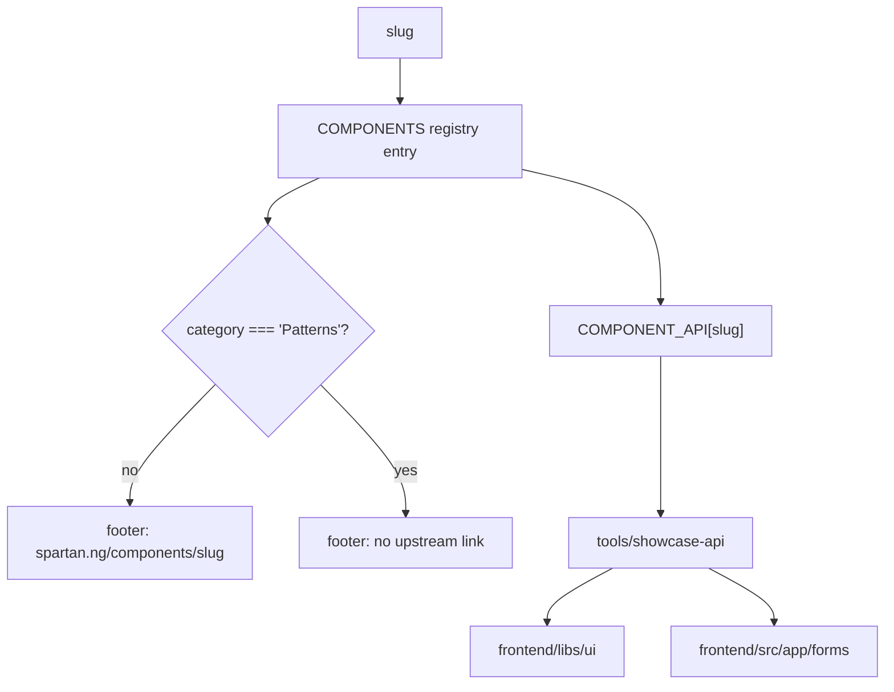

# Showcase pages for the two form systems

## Problem

`docs/architecture/forms.md` names two form systems — the dynamic `SchemaForm` renderer for runtime schemas, and Angular signal-forms for schemas known at compile time. Neither has a page in the showcase. Every spartan control that a form is *built from* is documented; the two things that assemble those controls into a working form are not, so the showcase teaches the parts and not the pattern.

The showcase currently documents 56 vendored spartan components. Its frame assumes that is all it will ever document.

## Scope

Two new showcase pages, a new nav category to hold them, a seam in the page frame so non-spartan pages render correctly, and a second source root for the API generator.

Out of scope: changes to `SchemaForm`, `UserForm`, `zod-meta`, or `form-field-meta`. This documents what exists. It does not alter it. `docs/architecture/forms.md` is also left untouched by explicit decision — its routing table already sends a reader to the right system, and adding showcase links would state the same fact in a second place.

## The frame problem

`ComponentPage` derives two things from the slug alone, and both are wrong for a Jig-authored component.

`component-page.ts` builds the footer link as `https://www.spartan.ng/components/<slug>`. For `schema-form` that resolves to a page that does not exist upstream, because the component is ours.

`component-page.ts` reads its API table from `COMPONENT_API[slug]`, generated by `tools/showcase-api` from `frontend/libs/ui`. `SchemaForm` does not live there, so the table would render its empty state on a component that has three public members.

Both are fixed by making the frame ask the registry what kind of page it is, rather than assuming.



The discriminator is `category`, not a per-entry field. A per-entry `docsUrl?: string` would mean 56 spartan entries omit it and rely on absence meaning "spartan", which inverts the moment someone adds a 57th non-spartan page. One rule keyed on a value the registry already carries cannot drift.

## Registry changes

`Category` gains `'Patterns'`, appended to `CATEGORY_ORDER` so it sorts last in the sidebar.

Two entries:

| slug | name | blurb |
|---|---|---|
| `schema-form` | Schema form | Renders any zod schema known only at runtime. |
| `signal-form` | Signal form | Typed form you author, validated by its zod schema. |

`FIRST_COMPONENT` is unaffected — it reads `COMPONENTS[0]`, which stays `button`.

Both pages register one line each in `page-loaders.ts`, under a new `// Patterns` heading.

## Generator changes

`tools/showcase-api` walks a single root today. It gains a second.

`buildApi` currently takes `uiRoot` and iterates its directories, treating each directory name as a slug and reading `<slug>/src/lib`. The forms directory has no such nesting: it is a flat folder of files whose slugs do not match filenames.

So the second root is expressed as an explicit slug-to-path map rather than a directory scan:

```
const APP_SOURCES: Record<string, string> = {
  'schema-form': join('frontend', 'src', 'app', 'forms', 'schema-form.ts'),
};
```

`buildApi` parses each mapped file with the existing `parseFile` and merges the result into the same `Record<string, ApiClass[]>`. `parseFile` needs no change: it already matches `readonly x = input.required<T>(` and `output<T>(`, which is exactly how `SchemaForm` declares `schema`, `submitLabel`, and `submitted`.

`--check` freshness is unchanged and now covers the new entry, because it compares the whole rendered file.

`tools/showcase-api/showcase-api.test.ts` gains a case asserting the app source is parsed and keyed by slug.

`signal-form` is deliberately absent from the map. Its page authors its own example form inline rather than importing `features/users/user-form.ts`, because the showcase must not depend on a feature slice, and because a reader copying the pattern copies an authored form rather than reusing one. The page states that `features/users/user-form.ts` is the canonical reference and renders no API table.

## Page: schema-form

Four usages, each a live form driven by a real schema declared in the page component.

**Render a schema.** A contact schema with a few fields, rendered by `<app-schema-form [schema]="..." (submitted)="...">`, with the emitted parsed value shown beneath. Establishes that the component takes a schema and gives back validated data.

**Every control kind.** One schema exercising all six `ControlKind` values. The `@switch` in `schema-form.ts` has four branches — `textarea`, `select`, `checkbox`, and a default that renders `<input [type]>` — so `text`, `email`, and `number` share the default branch. The usage makes that mapping visible in one place, since it is the only thing a reader needs in order to know what a control kind will produce.

**Validation folds back onto fields.** Submitting an empty required form runs `safeParse`, and `applyZodIssues` writes each zod message onto the matching control. The usage shows the messages appearing under their own fields, which is the behaviour that distinguishes this from a form that reports one error at the top.

**The schema is an input.** A toggle swaps between two different schemas on the same rendered component. This is the usage that justifies the component existing: a static example is indistinguishable from a hand-written form, and the runtime-schema case is the whole reason `SchemaForm` is not signal-forms.

## Page: signal-form

Four usages, built on a small schema declared in the page.

**An authored form.** `form(model, path => validateStandardSchema(path, schema))` bound through `[formField]`, with the submitted model shown beneath.

**Labels come from the schema.** `formMeta(schema)` supplies label and placeholder; the usage shows no hardcoded label strings in the template it displays.

**Validation is native zod.** A bad email surfaces the message written in the schema, through `validateStandardSchema` — not through a restated Angular validator.

**Submit runs only when valid.** `submit()` refuses to invoke its callback while the form is invalid; the payload readout stays empty until it passes.

## Testing

TDD, specs before pages, matching the pattern in `checkbox.page.spec.ts`: assert rendered DOM, never that the component merely mounted.

Each page spec asserts the usage count, that every `[data-slot="usage-stage"]` contains a real `<form>`, and that no `hlm-field-error` uses `forceShow`.

`schema-form.page.spec.ts` additionally asserts that the control-kinds usage renders a `textarea`, an `hlm-native-select`, an `hlm-checkbox`, and a plain `input`; that submitting the invalid usage puts `data-matches-spartan-invalid="true"` on a field and renders a zod message; that swapping the schema changes the rendered field set; and that the generated API table shows `SchemaForm` with a `schema` member, which fails if the generator change is missing.

`signal-form.page.spec.ts` additionally asserts that field labels match the schema's `.meta()` values rather than literals, and that the page renders no `spartan.ng` link.

A spec on the frame asserts that a `Patterns` page renders no upstream link while a spartan page still does.

## Verification

`npm run showcase:api` regenerates `component-api.generated.ts` with the new entry, then `npm run verify` runs the full gate including `--check` freshness.

## Risks

The generator's `parseFile` splits on `@Component(`/`@Directive(` decorators and matches members by regex. It was written against generated helm sources, which are uniform. `schema-form.ts` is hand-written, so its formatting is the first non-generated input this parser has seen. The API-table assertion in the page spec is what catches a parse that silently yields nothing.
