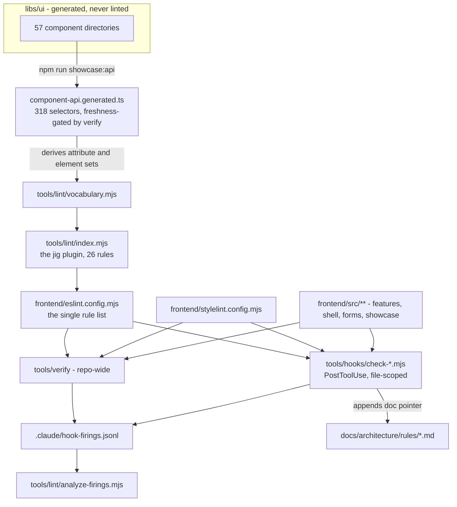

# Frontend enforcement: the design language as a gate

- Date: 2026-09-06
- Status: designed
- Scope: frontend, tools/lint, tools/hooks, docs/architecture, .bob/adr

## Problem

`frontend/` has no linter. There is no `eslint.config.*` and no `.eslintrc*` anywhere in the repo, no `eslint` in `frontend/package.json`, and the only quality-adjacent script is `"e2e": "playwright test"`. The `prettier` block in `frontend/package.json` is dead configuration: prettier is not installed at the root or in the frontend, and no script or gate invokes it. The vendored `frontend/libs/ui` carries five `eslint-disable-next-line` comments inherited from upstream, which are suppression pragmas for a linter that does not exist here.

Meanwhile the template hands every clone 56 spartan components and 318 selectors, and states its design rules in prose. `docs/architecture/design.md` forbids hand-rolled controls, mandates grid over nested flex, bans literal colors, and declares a "non-negotiable feel". Nothing checks any of it.

The drift is not hypothetical, and the template teaches it. `frontend/src/app/features/users/user-list.view.ts`, the file whose own doc comment reads "This is the reference view to copy for a new feature", renders raw `<h1>`, `
`, `<ul>`, and `<li>` while `libs/ui/typography` ships `[hlmH1]`, `[hlmP]`, `[hlmUl]`, and `[hlmMuted]`. Its sibling `user-form.ts` composes helm correctly. The exemplar every future feature is copied from breaks the rule it exists to demonstrate.

ADR 0009 already made this argument and stopped at a boundary it named out loud: "Scope is the .NET API only. The Conduit transport seam, the Angular repository layer, and the Rust core are unaffected." That was honest scoping at the time. This spec closes the frontend half of the same hole, with the same reasoning: an unenforced rule and an enforced rule are different objects, and in a template the hole replicates into every clone.

An audit of the "non-negotiable feel" section of `design.md` found seven of its eleven claims false. The section is not merely unenforced; parts of it are untrue, and have been for months, because nothing could tell anyone.

## The audit that changed the scope

Every row below was measured against the checked-in tree, not inferred.

| Claim in design.md | Verdict | Evidence |
|---|---|---|
| Zero-chroma palette, `--destructive` the only chromatic token | True | The only non-zero chroma values in `styles.css` are `0.245` and `0.191`, both on `--destructive` |
| `--radius: 0.625rem`, preset derives md at 0.8x and xl at 1.4x | True | `@spartan-ng/brain/hlm-tailwind-preset.css` lines 111-114. The preset also derives `--radius-sm` at 0.6x, which `shell.layout.css` uses and design.md never mentions |
| Flat backgrounds, no gradients | True | Zero `bg-gradient`, `bg-linear`, or `bg-radial` in `libs/ui` or `src` |
| "compact 32px (`h-8`) controls" | Partly false | `h-8` appears 17 times in `libs/ui`, but so do `h-9` (3), `h-7` (6), `h-6` (4), and `h-5` (4) |
| "4px base" stated alongside `px-2.5` | Self-contradictory | `px-2.5` is 10px. `libs/ui` carries 77 half-step spacing utilities off any 4px grid |
| "`shadow-sm` at most" | False | `shadow-md` appears 6 times and `shadow-lg` twice, across eight overlay components |
| "Motion: quick and functional (120-150ms)", in `libs/ui` | False | `duration-100` (13) and `duration-150` (2), but also `duration-200` (4), `duration-300` (1), and `duration-1000` (1) |
| "Motion: quick and functional (120-150ms)", in app CSS | False | `shell.layout.css` animates the sidebar collapse at `.2s`, alongside `.12s` and `.15s` transitions. The 200ms is deliberate and is asserted by `e2e/shell.layout.spec.ts` |
| "no bounces or loops" | False | `animate-spin` (2), `animate-pulse`, `animate-caret-blink`, and `animate-indeterminate` |
| "system mono (Consolas)" | True, by inheritance | Tailwind 4's default `--font-mono` stack includes Consolas, and app code uses `font-mono` 13 times. Satisfied by a default the doc does not mention rather than by a jig token |
| "Body 14px" | False | No `font-size` declaration exists in `styles.css`, `app.css`, or `index.html`, and Tailwind's base is 16px. The app reaches 14px per element through `text-sm`, used 78 times, so the base the doc describes does not exist |

Seven of the eleven claims fail. Five of those failures describe generated `libs/ui`, which jig must not author and which `npm run ui:style` reasserts, so making `libs/ui` obey is not an available fix. Two are app-authored and are jig's own to correct. The section reads in one voice while governing two codebases with different rules, and that conflation is the actual defect.

The two type claims are the instructive pair. "system mono (Consolas)" is satisfied, but by a Tailwind default rather than by anything jig wrote, so the doc credits a decision nobody made. "Body 14px" is not satisfied at all, and the mechanism the app actually uses — `text-sm` on 78 individual elements — is the smell of a missing base rather than an implementation of one. Setting a 14px root now would double-apply against those 78 utilities and render body text at 12.25px, so the type scale is corrected in the documentation here and rebased, if ever, in its own branch. See the exclusions below.

## Why ESLint, despite the dial

ESLint carries `eslint-disable`, which is exactly the suppression dial ADR 0009 refused for the Roslyn analyzers: a rule that has been switched off cannot report that it has been switched off. Adopting ESLint without neutralizing that would add a gate class this repo has already reasoned its way out of, and it would be worse than the honest prose it replaces, because it launders "we enforce this" without enforcing it.

Three guards close the hole, and this design is conditional on all three.

`linterOptions.noInlineConfig: true` switches off every inline directive wholesale. This is a native ESLint capability rather than a convention, and it cannot be turned back on from inside a linted file.

A zero-files-linted check fails the run. ESLint whose config matches no files exits 0, which is DR0002 in a different language: a check that reports success because it found nothing to check is paperwork. The lint step reads `--format json` and fails when the linted-file count is zero.

`tools/hooks/protect-enforcement.mjs` denies agent writes to the configs and to itself, in the shape of the existing `guard-ruleset.mjs`. The angular-jig capstone recorded an agent under test editing `stylelint.config.mjs` to add its own values to `ignoreValues` so its code would pass, and a third trial inventing a `var(--color-scheme)` indirection to dodge the same rule. A gate the subject can edit is not a gate.

The alternative, a bespoke checker with no dial at all, is rejected. `angular-eslint` supplies the Angular template parser and the `processInlineTemplates` processor, which is precisely what a hand-rolled checker would have to reimplement, and jig's components are almost entirely inline templates: `app.html` is the only template file in the application.

## Why not port the counter

angular-jig ships an independent structural counter alongside its gate: 1,745 lines across `counter.mjs`, `component-shape-counter.mjs`, `layout-counter.mjs`, `freeloader-counter.mjs`, `responsive-auditor.mjs`, and `strict-template-check.mjs`. It is larger than the 1,409-line gate it audits, parses with `@angular/compiler` rather than angular-eslint, and shares no code with the gate by design.

Its purpose is stated in that repo's own harness README: "If drift is whatever the gate flags, the gate reduces it to zero by construction and proves nothing. So drift is counted by an audit the gate does not touch." That is an anti-circularity instrument for a measured agent experiment with gate-off and gate-on conditions, a run driver, and a coding-agent subject.

jig runs no such experiment. Porting the counter would mean encoding every rule twice, in two parsers, forever, to defeat an objection nobody will raise against a project template. It is excluded.

What is not excluded is measurement. The question "how often does the machinery fire, and on what" is answered by a 44-line append log, and "did the correction land" is answered by streak analysis over that same log. Neither needs a second engine.

## Architecture

### One config, two readers

`frontend/eslint.config.mjs` is the single rule list. `tools/verify` runs it repo-wide, and the PostToolUse hooks run the same config scoped to the edited file. angular-jig splits these, with its baseline config carrying the sealing rules while its hooks carry the shape rules in a self-contained config, because the experiment needed a dormant gate-off condition. jig has no such condition, so the split would buy two rule lists that must agree by hand, which is the DRY violation this repo's constitution names first.

Stylelint mirrors the arrangement: one `frontend/stylelint.config.mjs`, read by both.

### Tiers

Tier membership is decided by path. There is no marker, attribute, or naming convention, because a marker is something an agent can add to escape a rule.

| Tier | Paths | May declare `signal`, `linkedSignal`, `form` | May import `repositories/` or `transport/` |
|---|---|---|---|
| Container | `features/**`, `shell/**` | No, a component-provided ViewModel owns it | No, the ViewModel does |
| Presentational | `showcase/**`, `forms/**`, `app.ts` | Yes | No |
| Generated | `libs/**` | Not linted | Not linted |

`showcase/**` is exempt from the MVVM state rules only. Every other rule, meaning sealing, layout, freeloader, and stylelint, applies to it in full. It is application code, it survives `init.mjs`, and it is the largest body of code a future agent will read as a pattern, so leaving it unchecked would put 68 unlinted files in front of exactly the reader this template exists to steer.

The data discriminator is a path, not the `*Service` suffix angular-jig uses. jig's data access is `repositories/` and `transport/`, so the rule forbids importing from those directories in a `@Component`. This is exact rather than heuristic, and it behaves better than the suffix rule in both directions: `MenuService` and `ThemeService` are UI registries and pass automatically, while the `inject(WIRE, { optional: true })` in `app-shell.ts`, a transport token reached from a component to print the wire name in the footer, is caught, which the suffix rule misses entirely.

### Rule inventory

Twenty-five rules port from angular-jig, being twenty-six minus one merge, and jig adds one of its own.

Twenty port unchanged: `no-appearance-on-primitive`, `no-style-attribute`, `no-raw-icon`, `no-missing-composition-part`, `no-raw-control`, `no-explicit-standalone`, `no-hand-set-change-detection`, `no-component-subscribe`, `no-forms-module`, `no-ng-model`, `no-orphan-ng-submit`, `no-reactive-form`, `no-restated-validator`, `no-legacy-icon-module`, `no-unregistered-icon`, `no-root-provided-view-model`, `no-unprovided-view-model`, `no-legacy-control-flow`, `no-ng-class-style`, and `no-space-utility`.

Two of those fire zero times against the checked-in tree and are carried as prevention rather than remediation. `no-unregistered-icon` finds nothing because all thirty files importing `@ng-icons/lucide` glyphs already call `provideIcons`, and `no-space-utility` finds nothing because app templates use no `space-x-*` or `space-y-*` utilities at all. They are kept because this is a template and the cost of a rule that never fires is one file, while the cost of the drift it prevents is paid by every clone.

`no-space-utility` and `no-literal-spacing` do not overlap. The first bans the `space-*` family outright as a layout-grammar rule, on the grounds that a gap belongs on the container. The second constrains the value on the families that remain legal.

Six carry a jig-specific delta, one of which is a merge that removes a rule. Twenty unchanged plus six touched accounts for all twenty-six reference rules and yields twenty-five, and `no-literal-spacing` brings the plugin back to twenty-six.

`no-state-outside-view-model` flags `signal`, `linkedSignal`, and `form`, but not `computed`. A `computed` is derived by definition. When it derives from owned state, the owning `signal` is already reported, and reporting both is two errors for one defect, which is the same once-per-defect call the reference rule already makes for a `form` and its backing model. When it derives from `input()` or `toSignal()`, it is view logic sitting exactly where it belongs. Two real files confirm the narrowing is correct rather than merely convenient: `sidebar-nav-item.ts` holds one `computed` over an `input()` and a `toSignal()`, and `forms/schema-form.ts` is built entirely from `input`, `output`, and `computed`. Under the literal rule both would demand ViewModels that hold no state.

`no-state-outside-view-model` also takes jig's tier table in place of the `src/app/ui/` path split, which does not exist here.

`no-feature-inject-data` becomes a path rule as described above, and `no-presentational-inject` merges into it. Without a `ui/` split there are no longer two inverted rules; there is one rule with one predicate applied to every component.

`no-unknown-primitive` derives its attribute and element sets from the same generated data and does not assume they are disjoint. The angular-jig rule doc asserts that every helm primitive is either an attribute directive or an element and never both. That is false under the nova style: 138 of jig's 318 selectors declare both forms, such as `[hlmAccordion], hlm-accordion`, and some are element-qualified, such as `button[hlmAlertDialogAction]`. The wrong-form check survives, so writing `hlmSelectTrigger` as an attribute when only `hlm-select-trigger` is declared still fails, but disjointness cannot be assumed.

`no-nested-flex-grid` and `no-raw-palette-color` port with no logic change and are simply scoped away from `libs/**`. Both genuinely apply, because app templates carry 235 `flex` and 73 `grid` utilities.

jig adds `no-literal-spacing`, which has no counterpart in the reference set and is required by the spacing decision below.

### Vocabulary derivation

`no-raw-control` and `no-unknown-primitive` read `frontend/src/app/showcase/component-api.generated.ts`. That file already exists, is already generated from `libs/ui` by `tools/showcase-api`, already carries all 318 selectors with their class names, and is already checked for freshness by `npm run verify`. No new generator is built, and the vocabulary cannot rot without the existing gate noticing.

The hand-written part is small and stays small: a map from native element to suggested primitive, covering `button` to `hlmBtn`, `h1` to `hlmH1`, `ul` to `hlmUl`, and roughly nine more. That map changes when HTML changes, which is to say never.

`tools/lint/vocabulary.mjs` asserts at load that every primitive named in the map still exists in the generated set. A spartan upgrade or a `npm run ui:style` that removes one fails the lint run loudly rather than letting a rule go quietly dead. This is the DR0002 lesson in its third application.

### Spacing becomes a token scale

ADR 0010 decided that control size and spacing are not tokens, because the spartan style inlines literals into `libs/ui` at generation time. That reasoning holds for `libs/ui` and is untouched. It does not hold for app-authored code, and applying it there produced the self-contradiction the audit found: `design.md` claims a 4px base in the same sentence that cites `px-2.5`, which is 10px.

A new ADR supersedes the spacing half of ADR 0010. ADR 0010 remains the record of what was decided and why it changed, and its generated-not-authored half is the mechanism that creates the split described below.

The scale is derived from what the application already uses, not invented. App templates use nine distinct spacing magnitudes, and six map exactly onto a 4px grid.

| Token | rem | px | Absorbs (usage count) |
|---|---|---|---|
| `--spacing-xs` | 0.25 | 4 | `gap-1` (16), `p-1` (4), `mt-1` (2) |
| `--spacing-s` | 0.5 | 8 | `gap-2` (59), `py-2` (16), `p-2` (5), `px-2` (4) |
| `--spacing-m` | 0.75 | 12 | `gap-3` (55), `px-3` (8), `p-3` (2) |
| `--spacing-l` | 1 | 16 | `px-4` (23), `gap-4` (17), `p-4` (9) |
| `--spacing-xl` | 1.5 | 24 | `p-6` (22), `gap-6` (11), `py-6` (1) |
| `--spacing-2xl` | 2 | 32 | `gap-8` (1) |

Three magnitudes are orphans: all are half-steps, all are off the 4px grid, and all are inherited from spartan's rhythm rather than jig's. They are 0.375rem at 26 sites, 0.625rem at 2 sites, and 0.125rem at 1 site. Each migrates to the nearest step, moving at most 2px.

The tokens go in a new `@theme` block in `frontend/src/styles.css`, which has none today. Tailwind 4.3.2 keys spacing utilities off a single `--spacing: 0.25rem` base, and a `--spacing-*` entry in `@theme` generates real utilities, so `gap-m` and `p-xl` become first-class.

The `@theme` block carries spacing and nothing else. No font token and no base font size are added, because the audit showed the mono claim is already satisfied by Tailwind's default and the 14px claim cannot be satisfied by a root size without double-applying against 78 existing `text-sm` utilities. Both are corrected in the documentation instead.

The split is accepted and recorded. `libs/ui` contains 77 half-step spacing utilities, including `px-2.5` (18), `gap-1.5` (14), `px-1.5` (11), `py-1.5` (8), and `gap-0.5` (8), and these are regenerated by every `npm run ui:style`. App-authored spacing snaps to the 4px grid; a primitive's internal padding does not. The mismatch is at most 2px and lives inside a component jig does not author. The alternative, an eight-step scale absorbing spartan's half-steps, was rejected because it couples jig's design language to a vendored style that `ui:style` can change without warning.

Tailwind keeps numeric utilities working after tokens exist, so `gap-2` still resolves. Tokens therefore enforce nothing on their own, which is why `no-literal-spacing` exists: numeric and arbitrary spacing utilities are forbidden in app templates, and the named steps are required.

### Stylelint

`frontend/stylelint.config.mjs` uses `stylelint-declaration-strict-value` over color properties, `background`, `border-radius`, `padding`, `margin`, and `gap`.

`box-shadow` and `transition-duration` were considered and dropped, and the reason generalizes. `declaration-strict-value` enforces that a value is a token reference, which requires a token to exist. jig has no shadow tokens and no duration tokens, so both rules would fail every future declaration with nothing to point at — the same trap as enforcing spacing before the spacing scale exists. Motion is worse still: `shell.layout.css` writes `transition: grid-template-columns .2s ease` as a shorthand, which a `transition-duration` rule does not read at all, so the rule would miss the only violation in the repository while blocking correct code. The shadow ceiling and the motion range stay in the tier ADR 0009 named as having no exit code: they are review rules, and `design.md` says so rather than implying a gate that does not exist.

The 200ms sidebar collapse in `shell.layout.css` is therefore not a lint failure. It is a documented exception decided in branch 2, because the animation is deliberate and `e2e/shell.layout.spec.ts` asserts it. Either `design.md`'s stated range widens to cover a layout transition, or the animation shortens and the e2e comment follows. That decision is made in the open, in a diff, which is what the no-exit-code tier means.

The property pattern is `/^(color|.*-color)$/` rather than `/color/`, because the loose form matches `color-scheme`, which is not a color property and whose only legal values are keywords. angular-jig hit exactly this false positive on its own `styles.css`.

`frontend/src/styles.css` is excluded. It is the token definition file, carrying 52 OKLCH literals, and a gate that fails on the definitions it enforces is theatre.

jig has three CSS files, one of them empty, and no component declares an inline `styles: []` block, so angular-jig's inline-style extraction machinery is not built. `libs/ui` needs no ignore entry at all: it contains zero `.css` files and zero inline styles, because all its styling is Tailwind classes inlined in TypeScript.

Nothing in either config is applied to `libs/ui`, whose `shadow-md`, `shadow-lg`, half-steps, and looping animations become recorded facts in `design.md` rather than violations.

### Rule docs, and an asymmetry that was measured

Rule documentation lives in `docs/architecture/rules/`, the same directory the Roslyn analyzer docs occupy. One rules directory, two engines.

The two engines surface their doc pointers differently, and this was established empirically rather than assumed. A sentinel `helpLinkUri` was added to `DR0001`, a violating file was planted in `Jig.Api`, and the solution was built four ways. The C# compiler appends the help link to the console diagnostic text itself, identically under `-v q`, the default terminal logger, `-tl:off`, and through `dotnet test`, which is the path `tools/verify` actually takes. The `description` field never appears in console output on any logger; it surfaces only in SARIF as `fullDescription`. A repo-relative path renders verbatim, with no URI validation or mangling.

ESLint does the opposite: a lint message object carries no URL field, and ESLint core never prints or dereferences `meta.docs.url`. The pointer must therefore be appended deliberately by whatever surfaces the failure, which is what the PostToolUse hooks do.

The corrective message convention follows angular-jig's measured result: a rejection ends with the documented good and bad shapes drawn from the rule's own doc, never with guidance invented at the gate. That repo's Part 3 A/B held the rules constant and changed only the exit-2 message from a prose reminder to a worked example, and house-pattern adoption moved from none of three trials to three of three.

A `rule-docs` test asserts that every rule has a doc and every doc names a real rule, so a rule shipped without documentation fails the suite.

### Measurement

`tools/hooks/_hook-log.mjs` appends one JSON line per firing, shaped `{ hook, file, count, rules, ts }`, to a git-ignored `.claude/hook-firings.jsonl`. Logging never throws into the gate, because a gate that dies when its telemetry cannot write is worse than a gate with no telemetry.

`tools/lint/analyze-firings.mjs` reads that log and reports streaks. A streak is a maximal run of consecutive firings on the same hook and file pair. A depth-one streak means the hook fired and the correction landed on the first attempt. A depth-N streak means the same file was rejected N times, which is a defect in the rule's documentation rather than in the agent. Within a streak, a `count` that steps down by one per firing is an agent walking a batch, while a `count` that stays flat or rises is not learning. The script takes `--json` so a claim about these figures can be re-derived rather than trusted.

`tools/verify` writes its own tally to the same log under `hook: "verify"`. Hook firings are drift caught in flight; verify entries are drift that reached a commit. The ratio between them is an effectiveness number that needs no gate-off baseline and adds no suppression dial. For a template the most valuable reading is the inverse: a rule that has never fired in months of real work is either perfect prevention or dead weight, and the log is the only thing that can tell the difference.

### Surviving `tools/init/init.mjs`

Everything added here survives the template rename by default. `tools/lint/`, `tools/hooks/`, `frontend/eslint.config.mjs`, `frontend/stylelint.config.mjs`, `docs/architecture/rules/`, and `.claude/settings.json` are all outside `TEMPLATE_ONLY` and carry no path segment that `renamePath` rewrites.

One item must be added to `TEMPLATE_ONLY`: `.claude/hook-firings.jsonl`. It is git-ignored, so `renameContent` never sees it and `git ls-files` never lists it, but `init` does not delete it either. Without this, a cloned app inherits the template author's firing telemetry as its baseline.

The plugin is named `jig`, so `renameContent` rewrites `jig/no-raw-control` to `<appname>/no-raw-control` across the rules, the config, the hooks, and the docs consistently. This is the highest-risk rename in the change and gets an explicit test in `tools/init/rename.test.ts`.

## The tests must run, or none of this is real

Four gates, because a data-driven config cannot be unit tested the way a rule file can.

Per-rule `RuleTester` tests with dirty and clean fixtures, one file per rule.

A config-completeness test asserting that every file in `tools/lint/rules/` is enabled at `error` in `frontend/eslint.config.mjs`. Deleting a line from the config turns the suite red, which is why the rule files themselves need no write guard: gutting one breaks its own tests, exactly as ADR 0009 argued for the analyzer sources.

Fixture tests for both configs, which lint a deliberately dirty fixture and assert the exact violation set. This is the only way to test `stylelint.config.mjs`, which is pure data with no rule files to enumerate, and it is what makes weakening `ignoreValues` fail in CI from a clean checkout where no hook exists.

The `rule-docs` test described above.

`tools/verify` gains two steps after the frontend unit tests, being `lint` and `stylelint`. The pre-commit hook keeps only the fast checks, unchanged.

## Build order (TDD, red first)

The order below is load-bearing. Writing the enforcement before the tokens means writing rules that fail on every file in the repo.

Branch 1 is already approved and sits outside this spec. On `fix(ui)/exemplar-and-analyzer-links`: correct `user-list.view.ts` to compose typography primitives, add `helpLinkUri` to the three Roslyn descriptors, move the corrective clause into `messageFormat` for `DR0001` and `DR0002` while leaving `DR0003` alone because it already carries its own, and write `docs/architecture/rules/DR0001.md` through `DR0003.md`.

Branch 2 is `feat(ui)/spacing-tokens`. Write the failing stylelint fixture first. Add the `@theme` block with the six spacing steps and nothing else. Migrate 19 declarations in `shell.layout.css` and roughly 310 utility sites across app templates, including the 29 orphan half-steps. Write the superseding ADR. Rewrite `design.md` along the app-authored versus vendored line, correcting all seven failed claims rather than dropping them, recording the `libs/ui` facts as facts, and settling the 200ms sidebar transition either way. Mirror the six tokens into the `jig-design` skill, which ADR 0007 makes a downstream mirror rather than a second source of truth.

Branch 3 is `feat(tools)/frontend-enforcement`. Install `angular-eslint`, `typescript-eslint`, `stylelint`, and `stylelint-declaration-strict-value`. Build `tools/lint/vocabulary.mjs` against a failing test first. Then the rules, one at a time, each with its `RuleTester` test and its doc, red before green. Then the config, the completeness test, and the fixture tests. Then the PostToolUse hooks with their corrective messages, the firing log, and `analyze-firings.mjs`. Then extend `guard-ruleset.mjs` to the two configs and add `.claude/hook-firings.jsonl` to `TEMPLATE_ONLY`. Delete `standalone: true` and `changeDetection` from 68 components, which is 136 lines, extract `UserFormViewModel` and `AppShellViewModel`, replace the `signal('jig')` in `app.ts` with a plain constant, and fix the seventeen sealing sites. Add the boot-every-route Playwright spec with its route list derived from `component-registry`, and loop the existing shell layout assertions over 768 and 1280.

Each branch lands green at `npm run verify` and integrates by squash merge.

## What is deliberately not built (YAGNI)

The independent structural counter, for the reasons argued above.

The responsive auditor and the 375px viewport. jig is a Tauri desktop application, 375px is a phone, and the template has never claimed that target. `e2e/shell.layout.spec.ts` already asserts geometry at 1280 and already asserts that the page never scrolls, which is an overflow check at the width that matters. A general element-clipping auditor is the highest-false-positive class of visual test, and one that goes flaky and then gets deleted is worse than one that was never written. Extending the existing spec to a second width costs five lines and captures the value.

The run driver, the `experiments/` tree, gate-off and gate-on conditions, and second-agent aesthetic grading. All of it serves the measurement experiment jig is not running.

A warn-only or staged-adoption mode. It would supply the baseline the firing log cannot otherwise establish, and it is rejected because it is a suppression dial wearing a lab coat.

Prettier. The dead config block in `frontend/package.json` is deleted rather than implemented. Formatting is not what this gate is for, and adding a second unenforced convention while removing the first would be absurd.

The type-scale rebase. Making "Body 14px" true means setting a root size and stripping `text-sm` from 78 elements, which changes the rendered size of every screen in the application. That is a larger visual change than the entire spacing migration and it is not a spacing decision, so it gets its own branch or none. This spec corrects the documentation to describe what the app actually does.

Shadow and motion as gates, for the reasons given in the stylelint section. They stay review rules.

## The doors left open, stated on purpose

Deleting `frontend/eslint.config.mjs` or `tools/lint/` removes the gate, and no rule can fire from a run it never joined. This is the same hole ADR 0009 recorded for `Directory.Build.props`, and it has the same answer: the diff, read by someone who treats an enforcement change as a law change, and CI running from a clean checkout where the agent's hooks do not exist. The hooks are for speed. The review is for trust.

The tier table is a path list. Moving a file changes which rules apply to it, and that move is visible in a diff but is not itself gated.

The MVVM rules read a naming convention, in that a class is a ViewModel because its name ends in `ViewModel`. A class that owns screen state under a different name is invisible to them, exactly as it is in the reference set.

`no-literal-spacing` governs app templates and app CSS. It cannot govern `libs/ui`, so the 2px rhythm mismatch is permanent for as long as spartan inlines half-steps, and it will change shape rather than disappear whenever `npm run ui:style` runs.

The spacing migration moves 29 sites by up to 2px each. That is a deliberate visual change rather than a pure refactor, and it is the price of making the 4px claim in `design.md` true.
