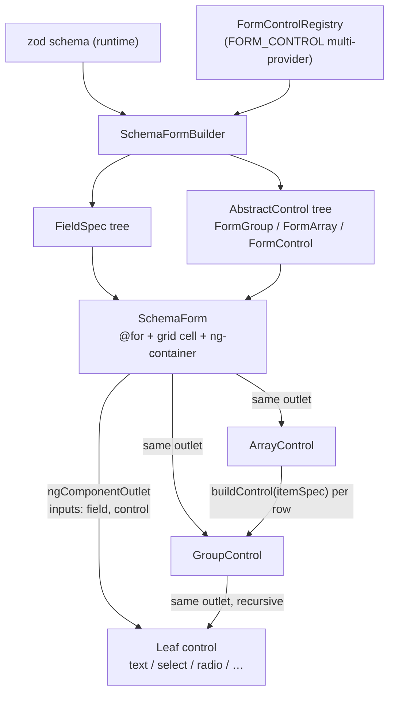
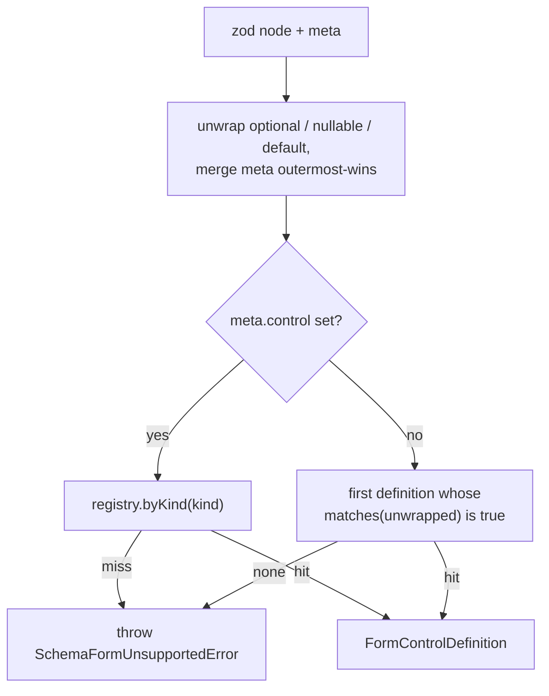

# SchemaForm: a control registry, type inference, nesting, and layout

**Date:** 2026-09-09
**Branch:** `feat(forms)/dynamic-control-registry`
**Status:** approved design, not yet implemented

## Problem

`frontend/src/app/forms/schema-form.ts` renders a runtime zod schema through a six-arm `@switch` on `meta.control`. Three limits now bind at once.

**It cannot be extended without editing it.** Every new control kind means editing a stable component and its `defaultFor()` helper. That is the Open/Closed half of the SOLID non-negotiable in `CLAUDE.md` ("new behavior by extension, not by editing stable code"), broken by design.

**It restates facts the schema already owns.** `FormFieldMeta.options` hand-lists the values of a field that is declared `z.string()`, so validity and the offered choices are two independent statements of one fact. `frontend/src/app/showcase/pages/schema-form.page.ts:32` is the live example: `tier: z.string()` with `options: [{value:'free'},{value:'pro'}]` accepts `"banana"` on parse. That is the DRY non-negotiable, breached in the reference example every clone of this template copies.

**It is flat.** `FieldSpec` carries a `name`, the form is a `FormGroup` of `FormControl`, and `applyZodIssues` addresses errors with `issue.path[0]`. Nested objects and arrays of objects are unreachable.

A fourth defect surfaced while designing and must be fixed here because nesting makes it unavoidable. zod's `.meta()` binds to the schema instance, so wrapping discards it:

```
z.string().meta({ label: 'B' }).optional()   ->  .meta() === undefined
z.string().optional().meta({ label: 'C' })   ->  .meta() === { label: 'C' }
```

`formMeta()` returns `undefined` for the first form and the template dereferences `field.meta.label`, producing a `TypeError` at render with no indication that the fix is reordering two method calls. The app has no optional fields today, which is the only reason nobody has hit it. Nesting introduces wrapper types everywhere.

## Scope

**In:** control inference from the zod type; a registry that resolves a zod node to a control component; enum, radio, multi-select, and date controls; nested `z.object`; arrays of scalars and of objects; a four-column span layout; a loud, named failure for anything unsupported.

**Out, deliberately:** unions and discriminated unions, `allOf` and intersections, `if`/`then`/`else` conditional visibility, tuples, records and `additionalProperties`, and recursive `z.lazy` references. These are not deferred features with a placeholder; they throw `SchemaFormUnsupportedError`. Supporting them turns the renderer into a form engine with a dependency graph and a plugin architecture, which is out of proportion to a template repository and duplicates JSONForms and Formily.

**Out, with a recorded reason:** state-preserving reconciliation when the `schema` input changes. `form` is a `computed()` over `schema()`, so a schema swap rebuilds the form and discards user input, including added array rows. That is cheap today and becomes expensive with arrays, but the fix is a diffing subsystem and nothing in this codebase swaps a schema mid-edit. It gets a comment at the `computed` and a sentence in `docs/architecture/forms.md`.

## Decisions

### The type owns shape and valid values; the meta owns the human-facing words

`meta.control` becomes optional and acts only as an override. The control kind is inferred from the zod type by default. `options` is deleted from `FormFieldMeta` entirely; the values of a `select`, `radio`, or `multiselect` come from `z.enum`. A field whose display labels differ from its values says so with `optionLabels`, a `Record<string, string>` keyed by enum value.

`label` stays required, so a missing label remains a compile error under `satisfies FormFieldMeta`. Inferring a label from the key name would silently ship machine-generated words to a user, which is a guarantee worth keeping.

Deleting `options` is a breaking change to the one interface every clone builds on. It produces a compile error at the exact line, which is the correct failure for a template.

### Controls are a registry, not a switch

A control is registered as one definition carrying four facts: its kind name, the component that renders it, when to infer it, and what it defaults to.

```ts
export interface FormControlDefinition {
  readonly kind: string;
  readonly component: Type<SchemaFormControl>;
  readonly matches?: (schema: z.ZodType) => boolean;
  readonly defaultValue?: (schema: z.ZodType) => unknown;
}
```

Registration is a DI multi-provider, `provideFormControls(...)`, resolved at bootstrap. `SchemaForm` renders through `NgComponentOutlet` and gains no knowledge when a kind is added.

This is the second registry in the repository and the prime directive requires the non-reuse to be justified in writing. `menu/menu.service.ts` is a mutable, region-keyed registry whose `register()` ties a contribution's lifetime to the caller's `DestroyRef`, built for features contributing commands as they mount and unmount. Controls are known at bootstrap and must resolve before the first render, so they want an immutable DI multi-provider, not a mutable service with lifecycle scoping. The two solve different problems and neither generalizes onto the other without becoming worse at its own job. The accompanying ADR records this.

**Cost, accepted knowingly.** First-match-wins makes registration order semantic. `z.array(z.enum([...]))` is claimed by both `multiselect` and the generic `array` repeater, and both predicates are correct. The deleted `@switch` had its order visible in one file; the order is now a fact about an array in app configuration, and getting it wrong yields a working form with the wrong control. Mitigations: `provideDefaultFormControls()` ships the built-ins ordered specific-before-general, caller-supplied definitions resolve before the defaults so overriding needs no surgery, and a test asserts the shipped order. This does not eliminate the footgun.

### Registered controls extend an abstract base

```ts
export abstract class SchemaFormControl {
  readonly field = input.required<FieldSpec>();
  readonly control = input.required<AbstractControl>();
}
```

Angular inherits inputs from a base class, so a control that omits one is a compile error. `no-state-outside-view-model` bails outside the container tier and names `forms/schema-form.ts` as explicitly permitted, so `forms/` carrying component state is already sanctioned; the base class trips no lint rule.

### Unsupported schemas throw at build time

`fieldsFromSchema` throws `SchemaFormUnsupportedError` naming the dotted path and the zod type, for example `contacts[].kind: ZodUnion is not supported by SchemaForm`. A `supportsSchema(schema)` predicate lets a caller check before rendering, so an agent pipeline can reject a schema instead of crashing a view.

Rendering the field as a skipped placeholder was rejected. Submit runs `schema.safeParse(form.getRawValue())`; a skipped required field fails the parse permanently, producing a form that renders correctly and can never be submitted, with the error pointing at a field that is not on screen. That is a worse failure than a throw because it looks like it works.

### Layout is a four-column grid with static span bindings

`FormFieldMeta` gains `span?: 1 | 2 | 3 | 4`, alongside `order`, which is the existing precedent for presentation that is neither shape nor words. The default is **4**, a full row, so that existing single-column forms do not silently reflow on upgrade and the feature is opt-in.

**Each grid cell must re-declare `@container/field-group`.** `hlmFieldGroup` is `flex w-full flex-col` and declares `@container/field-group`; `hlm-field` keys off it with `@md/field-group:flex-row`, flipping from label-above-control to label-beside-control when the group is at least 448px. Placing a grid inside that group leaves the container query measuring the whole form, so a field in a 25%-wide cell renders its label side-by-side inside roughly 180px. Re-declaring the container on each cell makes a field measure its own column, which makes spartan's existing responsive behavior correct per field rather than per form.

**Spans are four static class bindings, not a computed string.** `no-ng-class-style` forbids `[ngClass]`, and `[class]="expr"` defeats the same static analysis for the same stated reason, so the cell carries `[class.col-span-2]="field.meta.span === 2"` and its three siblings. This also solves Tailwind's JIT scanning problem, which a constructed `col-span-${n}` would fail because the scanner never sees the literal.

Span is a closed set of four values and not an extension point, so these bindings live in `SchemaForm`'s own template. The ban on case statements applies to control-kind dispatch, which stays in the registry.

**`grid-auto-flow: dense` is forbidden.** Dense backfills holes by pulling later, smaller fields forward, which desynchronizes visual order from DOM order and therefore from tab order. That is an accessibility defect. Holes left by sparse placement are correct; a hole that bothers someone is fixed by changing a span.

**Narrow-width collapse is one container query, not per-cell breakpoint classes.** A responsive class such as `md:col-span-2` would need a colon inside an Angular `[class.…]` binding name, which is unverified. One rule in the grid's stylesheet flattens every span at once:

```css
[data-schema-grid] { container: schema-form / inline-size; }

@container schema-form (max-width: 32rem) {
  [data-schema-grid] > * { grid-column: auto; }
}
```

The grid element carries `data-schema-grid` and declares the `schema-form` container itself, so a nested group's grid establishes its own collapse point rather than inheriting the outer form's width. These two rules are the only hand-written CSS this design adds; everything else is a token-scale utility class.

**Containers never span partially.** A nested group or an array repeater always occupies a full row and opens its own four-column grid. A two-wide group containing a four-column grid is illegible, and the builder forbids it rather than the documentation discouraging it.

### Nesting is two more registered controls

`group` matches `def.type === 'object'` and `array` matches `def.type === 'array'`. Each renders its children through the same `NgComponentOutlet` its own parent used, so recursion falls out of the seam with no special cases in `SchemaForm`. This is the concrete reason the registry is worth its file count: a template `@switch` cannot recurse without a self-referencing `ngTemplateOutlet`, which is the exact construct the KISS gate exists to prevent.

## Architecture



Resolution order for a single node:



### Three trees

| zod schema | FieldSpec tree | control tree |
|---|---|---|
| `z.object({ … })` | `{ kind: 'group', children: [ … ] }` | `FormGroup` |
| `z.string()` | `{ kind: 'text' }` | `FormControl('')` |
| `z.array(z.enum([…]))` | `{ kind: 'multiselect' }` | `FormControl([])` |
| `z.array(z.object({ … }))` | `{ kind: 'array', children: [ itemSpec ] }` | `FormArray([])` |

An array's `children` holds exactly one entry, the **item template**, not an instance. `ArrayControl` calls `builder.buildControl(itemSpec)` to mint a row on Add. `FieldSpec` therefore carries no path and no index: a control receives its live `AbstractControl` as an input and never needs to know where it sits.

### Error folding

Angular's `AbstractControl.get()` accepts `Array<string | number>` and walks `FormGroup` and `FormArray` alike; zod hands back `issue.path` in that shape. `applyZodIssues` changes from `path[0]` to the whole path:

```ts
form.get(issue.path as (string | number)[])?.setErrors({ zod: issue.message });
```

`clearZodIssues` grows: it must recurse the control tree instead of iterating one level of `.controls`.

An issue can land on an array itself. `z.array(x).min(1)` yields path `['contacts']`, resolving to the `FormArray`; `setErrors` on it works and propagates invalidity upward, but `hlm-field-error` is built for a leaf, so `ArrayControl` renders its own error slot above the rows.

Removing a row splices the control instance, so an error set on it travels with its data rather than stranding on an index. No handling required.

`z.lazy` and other recursive references match no predicate and throw on the first pass, before any traversal, so infinite recursion is not reachable and no depth cap is needed.

## Files

```
frontend/src/app/forms/
  control-definition.ts    NEW  FormControlDefinition, FORM_CONTROL token, provideFormControls()
  control-registry.ts      NEW  resolve(schema, meta); throws SchemaFormUnsupportedError
  schema-form-control.ts   NEW  abstract base: field + control inputs
  schema-form-builder.ts   NEW  fieldsFromSchema / supportsSchema / buildControl (registry-aware)
  field-spec.ts            NEW  the FieldSpec tree type
  controls/
    text.control.ts        NEW  also serves email and number by kind
    textarea.control.ts    NEW
    checkbox.control.ts    NEW
    select.control.ts      NEW
    radio.control.ts       NEW
    multiselect.control.ts NEW
    date.control.ts        NEW
    group.control.ts       NEW
    array.control.ts       NEW
    index.ts               NEW  provideDefaultFormControls(), ordered specific-before-general
  schema-form.ts           MOD  @switch and defaultFor() deleted; grid + outlet
  zod-meta.ts              MOD  unwraps optional/nullable/default; merges meta; throws on missing label
  schema-form.util.ts      MOD  path-addressed applyZodIssues; recursive clearZodIssues
  form-field-meta.ts       MOD  control optional; span and optionLabels added; options deleted
```

`SchemaFormBuilder` is injectable rather than a set of free functions because all three of its jobs depend on the registry. That keeps `SchemaForm` thin and makes the whole resolution path unit-testable without rendering a component.

## Control catalog

Every primitive below is already installed in `libs/ui`. `tools/lint/vocabulary.ts` derives its vocabulary from `showcase/component-api.generated.ts`, so `no-unknown-primitive` and `no-raw-control` already accept them and no `ng g` step is required.

| kind | inferred from | primitive |
|---|---|---|
| `text` / `email` / `number` | `z.string()`, `z.email()`, `z.number()` | `hlmInput` |
| `textarea` | override only | `hlmTextarea` |
| `checkbox` | `z.boolean()` | `hlm-checkbox` |
| `select` | `z.enum()` | `hlm-native-select` |
| `radio` | override on an enum | `hlm-radio-group` |
| `multiselect` | `z.array(z.enum())` | `hlmComboboxMultiple` with chips |
| `date` | `z.date()` | `hlm-date-picker` |
| `group` | `z.object()` | `hlm-field` plus a nested grid |
| `array` | `z.array()` | `hlm-field`, add button, per-row remove |

`switch` and `slider` are deliberately excluded. Adding either later must be one new file plus one line in application configuration, touching nothing that exists. If that turns out to be false, the extension point did not work, and finding out on a fifteen-line control is cheaper than finding out on the twelfth.

Smaller behaviors, stated so they are not reinvented during implementation:

- Arrays start empty, except that `z.array(x).min(n)` seeds `n` rows, so a `.min(1)` array does not fail validation before the user has touched anything.
- A scalar array item renders a bare control with no label of its own; an object item labels its fields normally.
- `z.coerce.number()` reports `def.type === 'number'`, so coercion is transparent to inference.

## Testing

TDD, red-green-refactor, per the non-negotiables. Every production line below is demanded by a failing test first.

**`conformance.spec.ts` carries the design and is the one test that must not be skipped.** It iterates every definition in `provideDefaultFormControls()`, instantiates each with a synthetic `FieldSpec` and `FormControl`, and asserts the control renders an interactive element and writes back to its control on input. The abstract base class guarantees a control *declares* its inputs and guarantees nothing about whether it renders anything; without this test a control that renders an empty `div` passes every other test in the suite and fails only in front of a user. It restores the safety the `@switch` gave for free, where "does it render" was self-evident from one template.

| Spec | Covers |
|---|---|
| `control-registry.spec.ts` | `meta.control` beats inference; first match wins; caller definitions resolve before defaults; unsupported throws with a dotted path; shipped default order |
| `schema-form-builder.spec.ts` | field tree shape for nested objects and arrays; meta recovered through `.optional()`; missing label throws; `.min(n)` seeds rows; `supportsSchema` agrees with what `fieldsFromSchema` throws on |
| `controls/*.control.spec.ts` | one per control: renders its primitive, reflects the control value, writes back |
| `conformance.spec.ts` | every registered control renders something interactive and writes back |
| `schema-form.spec.ts` | integration: path-addressed error folding into a nested group and an array row; array add and remove; span classes present; `dense` absent; existing behaviors preserved |

`showcase/pages/schema-form.page.ts` gains examples for enum, radio, multi-select, a nested object, an array of objects, and the four-column layout. `npm run showcase:api` freshness is checked by `npm run verify`.

## Documentation and catalog debt

- `docs/architecture/forms.md` currently states "The zod-to-control mapping lives only in this component's `@switch`. Add a control kind there, never in a feature," and lists a matching smell. This design contradicts that line, and `CLAUDE.md`'s Open/Closed non-negotiable outranks a task-scoped document. The rule is rewritten to "a control kind is a registered `FormControlDefinition`, never a feature-local branch," the smell list is updated, and the schema-swap-resets-the-form caveat is added. This lands in the same change; shipping without it leaves the repository's own documentation forbidding the code in it.
- A new ADR under `.bob/adr/` records that form controls are a registry rather than a switch, why `MenuService` was not reused, that registration order is semantic, and where the supported boundary sits.
- `@capability` annotations on the registry, the builder, the base class, and each control, then `npm run catalog`.

## Kill switch

Evidence that this design is not working and needs revisiting:

- The conformance test cannot be written generically because controls need materially different inputs. That means the four-fact `FormControlDefinition` is the wrong contract, and the seam needs rethinking before more controls are added.
- Adding `switch` or `slider` after the fact requires editing any existing file. The extension point failed and the file count bought nothing.
- Nested error folding needs per-control path knowledge. That means `FieldSpec` genuinely does need a path, and the "controls receive their control and never know where they sit" simplification is wrong.
