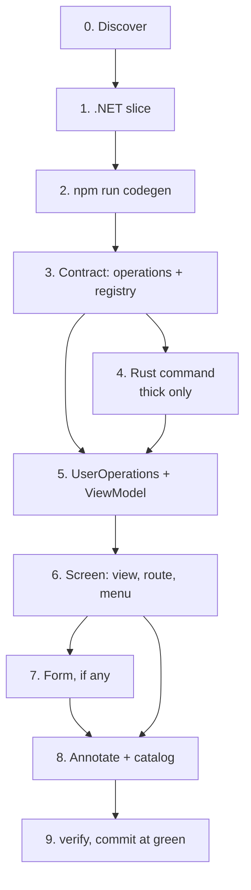

# Design: the feature hub and its spokes

**Date:** 2026-09-12
**Status:** approved, pending implementation plan
**Supersedes in part:** ADR 0003 (tiered docs, progressive disclosure)

## Context

Jig is a template. People clone it and add real functionality to it, which means the procedures an agent follows are not a convenience wrapper around the deliverable — they *are* the deliverable. A jig whose instructions live somewhere the tool never looks is not a jig.

Today the procedure for adding a feature lives in `.bob/prompts/new-feature.md`. It is accurate, end to end, and effectively dead. Nothing loads it. The CLAUDE.md routing table reaches it only through the row "Add a whole feature", which requires an agent to first classify the request as a whole feature. Real requests do not arrive in that vocabulary. A person says "add a settings screen" or "add a projects endpoint", the row never matches, and the recipe never opens.

That is not a missing-skills problem. It is a skill wearing a trench coat and calling itself a prompt file.

Two constraints shaped every decision below.

**Automatic invocation is not a setting.** There is no `autoInvoke` flag. The entire mechanism is the `description` field in a skill's frontmatter. The body is inert until the description matches what a person actually typed. `conduit` and the Angular service skill already demonstrate this — both are written as trigger lists. `jig-design` is written as a table of contents, and it does not fire.

**Hook awareness cuts the opposite way from the obvious reading.** The three hooks in `.claude/settings.json` already speak unprompted: `check-frontend` returns violations with the rule doc attached, `angular-service-guide` nudges on any new reusable unit, and `guard-ruleset` denies outright. A skill that says "remember to run lint" duplicates a hook that never forgets. The useful thing a skill carries is what the hook *will* emit and how to answer it.

## Decisions

### 1. Skills own procedure; docs own reasoning

Skills carry the *how*. `docs/architecture/` keeps the *why* — the reasoning, the rejected alternatives, the seam descriptions. `.bob/prompts/new-feature.md` is deleted and its content becomes skill bodies.

Rejected: keeping docs authoritative and writing thin skills that redirect to them. Thin skills fatten until they have quietly copied the doc, and every task pays an extra file read in the meantime. The optimism that thin skills stay thin is the same optimism that produced the orphaned prompt file.

### 2. Hub and spoke, not a monolith and not spokes alone

One hub skill owns the order and the cross-layer handoffs. Spokes are self-contained and stand alone.

The forcing constraint is a backwards dependency across a layer boundary. Response types must resolve to generated DTOs, so the API shapes are defined first, then `npm run codegen` runs, and only then can the frontend contract be written. Slice purely by layer and that ordering fact lives in nobody's file — each skill looks self-contained and is not. An agent writes the contract first, because that is the natural reading order, finds the DTO missing, and hand-types the interface. DRY broken, catalog stale, and it compiles.

Rejected: one end-to-end skill, which fires on "tweak this form's validation" and dumps the entire .NET slice on a two-line change, and which at 400 lines is a file people stop reading at line 80. Also rejected: spokes only, with the ordering repeated in each spoke's preamble — that states one fact five times by hand, which is the DRY gate breaking inside the fixture meant to enforce it.

### 3. Spokes are sliced by task, not by subsystem

`add-an-api-slice` and `add-a-tauri-command` look like subsystem slices, but they qualify because in this repo each is also a single coherent task with sharp vocabulary. The stack boundary and the task boundary coincide.

"Frontend" is where that coincidence ends. It is four tasks, two of which already have owners. A single frontend spoke rebuilds the rejected monolith in a smaller hat and puts it in a trigger conflict with `add-an-angular-service` and `spartan`. When two descriptions both plausibly match "add a settings page", which one loads is a coin flip.

The test for a spoke boundary is: **can you write a description that names the moment in the user's own words?** "Add an endpoint" passes. "Add a form" passes. "Do frontend work" is a topic, not a moment, and topics do not fire.

### 4. The frontend repository moves to `conduit` and gets renamed

`frontend/src/app/repositories/user.repository.ts` is twenty lines of `this.transport.request('users.list', {})`. It persists nothing, queries nothing, and holds no collection. It is a typed facade over the operations registry wearing the word "repository" because the word was available. `Jig.Application/IUserRepository.cs` is the real pattern — a persistence port over aggregates with an EF Core adapter.

The frontend file cannot be documented in `add-an-api-slice`. It is Angular code under `frontend/src/app/`, governed by the frontend lint rules, and `angular-service-guide` fires on precisely `frontend/src/app/**/*.{repository,service,transport}.ts`. The hook has already ruled on jurisdiction; documenting the file in a .NET skill produces a hook nudging toward a skill that does not cover the thing it nudged about.

Its home is `conduit`, whose territory is already the operations registry and the transport. The class is renamed `UserOperations` (`user.operations.ts`), because a template teaches its names to everyone who clones it.

### 5. `conduit` survives the thin cut

`conduit` is currently listed in `THIN_DELETE`. That was defensible when conduit meant "two wires" — no second wire, no skill. Its territory now includes the operations registry, the codegen ordering trap, and the operations-facade shape, all of which survive the thin cut intact. Deleting it leaves a thin clone with the contract seam undocumented, which is the exact seam where the one identified trap lives.

`conduit` stays in both shapes. Its IPC half moves into thick-start / thick-end marker blocks.

### 6. The skills area is gated, and is not inert

`tools/verify/select.ts` says `docs` is deliberately not a selectable area, because it is inert. That is correct for prose explaining why, and false for procedure that agents execute. A stale ADR misleads a human reading skeptically. A stale skill hands an agent a path and gets confidently wrong code written against it.

A new `skills` area is added, sibling to `docs`, and it is not inert. `docs` stays inert.

## The shape

### Hub: `add-a-feature`

Short on purpose. It owns the order and the handoff hazards, and repeats no spoke content. If the hub starts explaining how to write a zod schema, the spoke boundary has failed.

| Step | What | Owner |
|---|---|---|
| 0 | Discover: `CATALOG.md`, then `workspace/symbol` | CLAUDE.md prime directive |
| 1 | .NET slice: domain → application + `Result<T>` → infrastructure → endpoint, TDD at each step | `add-an-api-slice` |
| 2 | `npm run codegen` — DTOs regenerate. **The trap.** Nothing downstream exists without it | hub |
| 3 | Contract: `operations.ts` + `registry.ts` `ROUTES`, and `COMMANDS` when thick | `conduit` |
| 4 | Rust command matching the registry, TDD (thick only) | `add-a-tauri-command` |
| 5 | Data access: `UserOperations` facade, then a ViewModel exposing signals | `conduit`, `add-a-view-model` |
| 6 | Screen: view + route + menu command contribution | `add-a-screen` |
| 7 | Form, when the feature has one: zod schema → `z.infer` → `SchemaForm` | `add-a-form` |
| 8 | Annotate every reusable unit, then `npm run catalog` | hub |
| 9 | `npm run verify`, conventional commit, feature branch | hub |



### Spokes

| Skill | Status | Trigger vocabulary |
|---|---|---|
| `add-a-feature` | new, hub | add a feature, new slice, end to end, add X to the app |
| `add-an-api-slice` | new | endpoint, use-case, `Result<T>`, EF Core, validator, FastEndpoints |
| `add-a-tauri-command` | new, thick only | Tauri command, IPC, invoke, Rust store |
| `add-a-screen` | new | screen, page, route, sidebar entry, navigation |
| `add-a-form` | new | form, field, validation, zod, `SchemaForm` |
| `conduit` | retrofit | + operations registry, `UserOperations`, DTO, codegen |
| `add-an-angular-service` | renamed to `add-a-view-model`, rescoped | ViewModel, signals, provider scope, capability service |
| `spartan` | unchanged | components |

`add-a-form` stays separate from `add-a-screen` because it has its own ADR (0013), its own architecture doc, and five dedicated lint rules: `no-reactive-form`, `no-ng-model`, `no-raw-control`, `no-restated-validator`, `no-orphan-ng-submit`. That is a subsystem with teeth, not a section of a screen skill.

### Naming

Skill folders are verb-shaped and unprefixed: `add-a-screen`, not `jig-screen`. The description triggers on the moment, and a folder named for the moment keeps the author honest about what belongs in it. A `jig-` prefix would also be rewritten by `init`, so every clone would ship `acmeportal-screen` for no benefit. `jig-design` keeps its prefix; it is a brand asset and the rename is correct there.

The Angular service skill becomes `add-a-view-model`. It now owns ViewModels and services, and ViewModels are the larger half — four dedicated lint rules and one touched every feature.

## Skill anatomy

Every spoke follows the same seven-part body, so a stranger reading their second skill already knows where things are. The hub is the deliberate exception: it carries "Where you are", the ordered step table, the hook expectations that apply at the gate rather than per-step, and "Before you commit". It has no "Copy this" and no per-step sequence, because those belong to the spokes.

```markdown
---
name: add-a-screen
description: <trigger-dense, in the vocabulary a person types>
---

# <Title>

## Where you are
One line. If mid-feature, which hub step this is and what must already exist.

## Discover first
The prime-directive checklist, abbreviated. CATALOG.md, then workspace/symbol, then reuse or extend.

## Copy this
The users-slice exemplar, cited by exact path.

## The sequence (TDD)
Numbered checklist. Red, green, refactor, per step.

## What the hooks will say
Named hook, what it emits, the correct response.

## Rules that bite here
The lint rules by name, each with its doc path.

## Before you commit
npm run catalog, npm run verify, conventional commit, feature branch.
```

Four properties of that skeleton are load-bearing.

**The description is the product.** It is written in the vocabulary a person types, not the vocabulary the codebase uses. Nobody types "ViewModel provider scope"; they type "the page is blank" or "add a settings page". Body quality is worth nothing if the file never opens.

**The checklist is a lever.** The superpowers convention creates a todo per checklist item. Writing the TDD sequence as a numbered list converts "please do TDD" into tracked items whose absence is visible. Prose achieves nothing here.

**Hook awareness is predictive, not a reminder.** No skill says "remember to lint". Each says what the hook will emit and how to answer: a `guard-ruleset` denial means fix the flagged code and never the rule; `eslint-disable` is inert because `noInlineConfig` is on, and stylelint runs with `--ignore-disables`; an `angular-service-guide` nudge means run the discover checklist before writing another line. Without that, an agent spends three turns inventing workarounds for a wall that is not moving.

**Thick content is blocked, never inline.** `thin.ts` has two mechanisms with wildly different costs. A thick-start / thick-end block is free forever. A prose patch is a hand-maintained anchor that throws when someone rewords the sentence above it — safe, because `thin.test.ts` runs every patch against the real file in pre-commit, but a permanent maintenance tax. Skills get reworded constantly, so every thick-only passage must be a contiguous markable run. No thick clause lands mid-sentence.

`add-a-tauri-command` is wholly thick and goes in `THIN_DELETE` rather than carrying markers.

## The gate

`tools/verify/skills.ts`, a new step in the `skills` area, four checks.

1. **Every repo path cited in a `SKILL.md` resolves.** This is the rot mode that killed `new-feature.md`. Expect it to go red on first run — `conduit` and the Angular service skill have been through several refactors without anything checking their references.
2. **Every skill the hub names exists**, as a folder containing a `SKILL.md`. Referential integrity in both directions.
3. **Every lint rule a skill names is a real rule.** Free: `tools/hooks/rule-docs.ts` already imports the plugin object and resolves ids against `plugin.rules`. Same import, no second table.
4. **The post-thin skill corpus contains no thick vocabulary.** Run the existing pure `stripThickBlocks` and `toThin` over every skill body, then search the result for `Tauri`, `IPC`, `invoke`, and `src-tauri`. This catches a thick clause buried where a marker cannot reach it. `thin.ts` was kept pure precisely so this needs no disk access.

**What the gate cannot check: whether a description actually fires.** That is the property most likely to be wrong and there is no honest machine test for it. Every proxy — minimum length, "must contain a quoted phrase" — is gameable in one edit and would manufacture false confidence, which is worse than none. Trigger quality stays human-reviewed, and this document states that limitation rather than papering over it.

The gate is written first, red, and the skills are authored to turn it green. TDD does not carve out an exception for documents.

## Documentation changes

- **ADR 0014** records this decision and amends ADR 0003: procedure moves from `.bob/prompts/` to `.claude/skills/`, `docs/architecture/` keeps the reasoning, and the skills area is gated rather than inert.
- **CLAUDE.md** routing table: the "Add a whole feature" row points at the hub skill; the rows for services, forms and the transport seam point at their spokes.
- **CONTRIBUTING.md** "Adding a feature" repoints from `new-feature.md` to the hub.
- **`.bob/prompts/new-feature.md`** is deleted. `install-catalog-and-gates.md` is untouched; it is a one-time bootstrap recipe, not per-task procedure.

## Branch sequence

1. `refactor(contracts): rename UserRepository to UserOperations` — file, class, spec, the `angular-service-guide` regex, `thin.ts` anchors, catalog regeneration.
2. `test(tools): gate skill integrity` — the verify step, the `skills` area, unit tests, and fixes for whatever check 1 finds in the two existing skills.
3. `docs(skills): add the feature hub and its spokes` — five new skills, two retrofits, `new-feature.md` deleted, CLAUDE.md and CONTRIBUTING repointed, ADR 0014, `thin.ts` entries. Splits in two if the diff becomes unreadable.

The rename lands first because documenting a name with a known expiry date builds the fixture around a part being replaced, and "we will sweep it afterwards" is how the orphaned prompt file happened.

### A defect this spec exposed

Writing this document tripped `thin.test.ts`'s "neither cut leaves a thick marker in the initialized app" check, because the prose names the markers literally. The test walks every tracked file and skips only `tools/init/`, with the comment "deleted by init". But `init.ts` deletes all four `TEMPLATE_ONLY` paths — `.bob/adr/0000-origin-prompt.md`, `docs/superpowers`, `tools/init`, and `.claude/hook-firings.jsonl` — so the exclusion is narrower than its own stated rationale. A file that init removes cannot leave a marker in an initialized app.

This document works around it by not naming the markers literally. Branch 2 should fix the exclusion to cover `TEMPLATE_ONLY`, because ADR 0014 and the skill-integrity gate's own documentation will hit the same wall, and a workaround repeated three times is a defect being managed rather than fixed.

## Out of scope

- `jig-design`'s description, which is written as a table of contents and does not reliably fire. Real, deferred by explicit decision, and tracked separately.
- Any change to the 26 lint rules or the ruleset guard.
- Any new feature slice. The `users` slice remains the one worked example.

## Evidence this is not working

Name the signals now, so the pivot is not a matter of taste later.

- A spoke is invoked and the agent still has to read `docs/architecture/` to complete the task. The split between how and why is in the wrong place.
- The hub is invoked and a spoke is skipped, repeatedly. Hub-to-spoke delegation is too weak and the content belongs inline.
- Check 1 goes red more than once a quarter from ordinary refactoring. The skills cite paths at too fine a grain.
- Someone asks for a screen or a form and no skill fires. The descriptions are written in codebase vocabulary, which is the failure the gate explicitly cannot catch.
